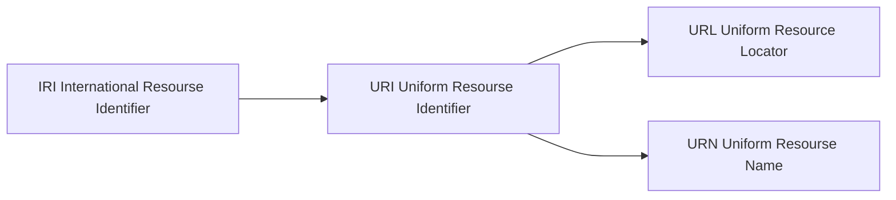

# SparQL入门


**@ author： Shuxin-Wang**

**@ time： 2022.08.02**

------

***目录***

- [什么是SPARQL？](#什么是SPARQL？)
- [什么是RDF？](#什么是RDF？)
- [URI和URL](#URI和URL)
- [SPARQL语法入门](#SPARQL语法入门)
- [一、引言](#一、引言)
  - [1.1 文档大纲](#1.1-文档大纲)
  - [1.2 文档约定](#1.2-文档约定)
  	- [1.2.1 命名空间(Namespaces)](#1.2.1-命名空间(Namespaces))
  	- [1.2.2 数据描述](#1.2.2-数据描述)
  	- [1.2.3 结果说明](#1.2.3-结果说明)
  	- [1.2.4 术语](#1.2.4-术语)
- [二、 简单SPARQL查询](#二、-简单SPARQL查询)
  - [2.1 编写简单查询](#2.1-编写简单查询)
  - [2.2 多重匹配](#2.2-多重匹配)
  - [2.3 匹配RDF文本(RDF literal)](#2.3-匹配RDF文本(RDF-literal))
    - [2.3.1 将文本与语言标记匹配](#2.3.1-将文本与语言标记匹配)
    - [2.3.2 将文本与数字类型匹配](#2.3.2-将文本与数字类型匹配)
    - [2.3.4 将文本与任意数据类型匹配](#2.3.4-将文本与任意数据类型匹配)
  - [2.4 查询结果中的空白节点标签](#2.4-查询结果中的空白节点标签)
  - [2.5 用表达式创建值](#2.5-用表达式创建值)
  - [2.6 构建RDF图](#2.6-构建RDF图)
- [三、RDF术语约束 (RDF Term Constraints)](#三、RDF术语约束-(RDF-Term-Constraints))
  - [3.1 筛选字符串值](#3.1-筛选字符串值)
  - [3.2 限制数值](#3.2-限制数值)


# 什么是SPARQL？

`SPARQL`的英文全称为*SPARQL Protocol and RDF Query Language*，是为`RDF`开发的一种查询语言和数据获取协议，它是为***W3C***所开发的RDF数据模型所定义，但是**<u>可以用于任何可以用RDF来表示的信息资源</u>**。它于2008年1月15日正式成为一项W3C推荐标准，于2013年3月发布SPARQL1.1。


# 什么是RDF？

***首先，RDF不是一种数据格式。***

`RDF`的英语全称为*Resource Description Framework*，中文名称为**<u>资源描述框架</u>**。RDF是一种描述数据文件储存的数据模型，该数据模型**<u>通常</u>描述由三个部分组成的事实，被称为三元组（triples）**。三元组由主语（*subject*）、谓语（*predicate*）和宾语（*object*）组成，看上去很像一个简单的句子。比如：

| subject | predicte | object           |
| ------- | -------- | ---------------- |
| richard | homeTel  | (229)276-5135    |
| cindy   | email    | cindym@gmail.com |

以下为Turtle RDF格式的RDF文件，文件名为ex002.ttl:

```turtle
# filename: ex002.ttl

@prefix ab: <http://learningsparql.com/ns/addressbook#> .

ab:richard ab:homeTel "(229) 276-5135" . 
ab:richard ab:email   "richard49@hotmail.com" . 

ab:cindy ab:homeTel "(245) 646-5488" . 
ab:cindy ab:email   "cindym@gmail.com" . 

ab:craig ab:homeTel "(194) 966-1505" . 
ab:craig ab:email   "craigellis@yahoo.com" . 
ab:craig ab:email   "c.ellis@usairwaysgroup.com" .
```

\#表示注释，@prefix行为前缀行，即为<http://learningsparql.com/ns/addressbook#>取一个**前缀**ab:，也就是别名，避免每次命名时都要写这个长长的字符，**句子最后的`.`可写可不写**，写上后便于阅读。另外，<http://learningsparql.com/ns/addressbook#>是`URI`，这个后面会介绍。

之后的每一行，都是一个三元组，分别是主语、谓语和宾语，***带有前缀`ab:`***。


# URI和URL



- `URI`和`URL`是两个相近的概念，但`URL`只是`URI`的一种。

- `URL`就是我们常说的网址，英文全称为`Uniform Resource Locators`，是**统一资源定位符**，对可以从互联网上得到的资源的位置和访问方法的一种简洁的表示，是***互联网上标准资源的地址***。

- `URI`的英语全称为`Uniform Resource Identifier`，是**统一资源标识符**。在RDF三元组中，主语、谓语必须属于某个特定的命名空间，**<u>避免相似的名字发生混淆</u>，因此需要使用`URI`**。


# SPARQL语法入门

- ***<u>W3C</u>***[原文链接](https://www.w3.org/TR/sparql11-query/)


# 一、引言

RDF 是一种有向的、带标签的图形数据格式，用于表示 Web 中的信息。RDF通常用于表示个人信息，社交网络，有关数字工件的元数据，以及提供一种对不同信息源的集成方式。此规范定义了 RDF 的 SPARQL 查询语言的语法和语义。

>RDF is a directed, labeled graph data format for representing information in the Web. RDF is often used to represent, among other things, personal information, social networks, metadata about digital artifacts, as well as to provide a means of integration over disparate sources of information. This specification defines the syntax and semantics of the SPARQL query language for RDF.


## 1.1 文档大纲

略


## 1.2 文档约定


### 1.2.1 命名空间(Namespaces)

在本文档中，除非另有说明，否则示例假定使用以下命名空间前缀绑定：

> In this document, examples assume the following namespace prefix bindings unless otherwise stated:

| Prefix(前缀) |                   IRI/URI                   |
| :----------: | :-----------------------------------------: |
|    `rdf:`    | http://www.w3.org/1999/02/22-rdf-syntax-ns# |
|    `rdfs`    |    http://www.w3.org/2000/01/rdf-schema#    |
|    `xsd`     |      http://www.w3.org/2001/XMLSchema#      |
|     `fn`     |   http://www.w3.org/2005/xpath-functions#   |
|    `sfn`     |        http://www.w3.org/ns/sparql#         |


### 1.2.2 数据描述

本文档使用 [Turtle](http://www.w3.org/TR/turtle/) [[TURTLE](https://www.w3.org/TR/sparql11-query/#TURTLE)] 数据格式显式显示每个三元组。Turtle 允许使用前缀缩写 IRI：

> This document uses the [Turtle](http://www.w3.org/TR/turtle/) [[TURTLE](https://www.w3.org/TR/sparql11-query/#TURTLE)] data format to show each triple explicitly. Turtle allows IRIs to be abbreviated with prefixes:

```turtle
@prefix dc:   <http://purl.org/dc/elements/1.1/> .
@prefix :     <http://example.org/book/> .
:book1  dc:title  "SPARQL Tutorial" .
```


### 1.2.3 结果说明

结果集以表格形式说明。

> Result sets are illustrated in tabular form.


### 1.2.4 术语

- [IRI](http://www.w3.org/TR/2004/REC-rdf-concepts-20040210/#dfn-URI-reference)（对应于概念和抽象语法术语”`RDF URI reference`")
- [字面值（literal）](http://www.w3.org/TR/2004/REC-rdf-concepts-20040210/#dfn-literal)
- [词汇形式（lexical form）](http://www.w3.org/TR/rdf-concepts/#dfn-lexical-form)
- [纯文本（plain literal）](http://www.w3.org/TR/2004/REC-rdf-concepts-20040210/#dfn-plain-literal)
- [语言标签（language tag）](http://www.w3.org/TR/2004/REC-rdf-concepts-20040210/#dfn-language-identifier)
- [键入的文字（typed literal）](http://www.w3.org/TR/2004/REC-rdf-concepts-20040210/#dfn-typed-literal)
- [数据类型 IRI](http://www.w3.org/TR/2004/REC-rdf-concepts-20040210/#dfn-datatype-URI)（对应于概念和抽象语法术语”`datatype URI`")
- [空白节点（blank node）](http://www.w3.org/TR/2004/REC-rdf-concepts-20040210/#dfn-blank-node)


# 二、 简单SPARQL查询

大多数形式的SPARQL查询都包含一组称为*基本图形*模式的三重模式。三重模式类似于RDF三元组，除了每个主语，谓词和宾语都可以是一个变量。当来自该子图的***RDF项***可以替换为变量并且结果是RDF图等效于子图时，基本图形模式与RDF数据的子图*匹配*。

> Most forms of SPARQL query contain a set of triple patterns called a *basic graph pattern*. Triple patterns are like RDF triples except that each of the subject, predicate and object may be a variable. A basic graph pattern *matches* a subgraph of the RDF data when [RDF terms](https://www.w3.org/TR/sparql11-query/#defn_RDFTerm) from that subgraph may be substituted for the variables and the result is RDF graph equivalent to the subgraph.


## 2.1 编写简单查询

下面的示例显示了一个 `SPARQL` 查询，用于从给定的数据图中查找书籍的标题。查询由两部分组成：子句标识要显示在查询结果中的变量，子句提供与数据图匹配的基本图形模式。此示例中的基本图形模式由单个三重模式组成，对象位置有单个变量 (`?title`)

Data:

```turtle
<http://example.org/book/book1> <http://purl.org/dc/elements/1.1/title> "SPARQL Tutorial" .
```

Query:

```SPARQL
SELECT ?title
WHERE
{
  <http://example.org/book/book1> <http://purl.org/dc/elements/1.1/title> ?title .
}
```

Query Result:

|       title       |
| :---------------: |
| "SPARQL Tutorial" |


## 2.2 多重匹配

查询的结果是一个***求解序列***，对应于查询的图形模式与数据匹配的方式。一个查询可能有零个、一个或多个解决方案。

Data:

```turtle
@prefix foaf:  <http://xmlns.com/foaf/0.1/> .

_:a  foaf:name   "Johnny Lee Outlaw" .
_:a  foaf:mbox   <mailto:jlow@example.com> .
_:b  foaf:name   "Peter Goodguy" .
_:b  foaf:mbox   <mailto:peter@example.org> .
_:c  foaf:mbox   <mailto:carol@example.org> .
```

Query:

```SPARQL
PREFIX foaf:   <http://xmlns.com/foaf/0.1/>

SELECT ?name ?mbox
WHERE
  { ?x foaf:name ?name .
    ?x foaf:mbox ?mbox }
```

Query Result:

|        name         |            mbox             |
| :-----------------: | :-------------------------: |
| "Johnny Lee Outlaw" | \<mailto:jlow@example.com>  |
|   "Peter Goodguy"   | \<mailto:peter@example.org> |

每个解决方案都提供了一种方法，其中所选变量可以绑定到 RDF 项，以便查询模式与数据匹配。结果集给出了所有可能的解决方案。在上面的示例中，以下两个数据子集提供了两个匹配项。

```turtle
_:a foaf:name  "Johnny Lee Outlaw" .
_:a foaf:box   <mailto:jlow@example.com> .
```

```turtle
_:b foaf:name  "Peter Goodguy" .
_:b foaf:box   <mailto:peter@example.org> .
```

这是一个[基本的图形模式匹配](https://www.w3.org/TR/sparql11-query/#BGPsparql);查询模式中使用的所有变量都必须绑定到每个解决方案中。


## 2.3 匹配RDF文本(RDF literal)

下面的数据包含三个 RDF 文本：

```turtle
@prefix dt:   <http://example.org/datatype#> .
@prefix ns:   <http://example.org/ns#> .
@prefix :     <http://example.org/ns#> .
@prefix xsd:  <http://www.w3.org/2001/XMLSchema#> .

:x   ns:p     "cat"@en .
:y   ns:p     "42"^^xsd:integer .
:z   ns:p     "abc"^^dt:specialDatatype .
```

请注意，在Turtle中，`"cat"@en`是一个RDF文字，具有词汇形式“cat”和语言标签“en”; `"42"^^xsd:integer`是数据类型为`http://www.w3.org/2001/XMLSchema#integer` 的类型化文本 ;`"abc"^^dt:specialDatatype`是数据类型为`http://example.org/datatype#specialDatatype`的类型化文本。

> Note that, in Turtle, `"cat"@en` is an RDF literal with a lexical form "cat" and a language tag "en"; `"42"^^xsd:integer` is a typed literal with the datatype `http://www.w3.org/2001/XMLSchema#integer`; and `"abc"^^dt:specialDatatype` is a typed literal with the datatype `http://example.org/datatype#specialDatatype`.
>
> This RDF data is the data graph for the query examples in sections 2.3.1–2.3.3.


### 2.3.1 将文本与语言标记匹配

以下查询没有解决方案，因为 RDF 文本`"cat"`与`"cat"@en`不同：

```turtle
SELECT ?v WHERE { ?v ?p "cat" }
```

|  v   |
| :--: |

但是下面的查询将找到一个解决方案，其中变量`v`被绑定到`:x`，因为语言标记被指定并且与给定数据匹配：

```turtle
SELECT ?v WHERE { ?v ?p "cat"@en }
```

|             v             |
| :-----------------------: |
| <http://example.org/ns#x> |


### 2.3.2 将文本与数字类型匹配

SPARQL 查询中的整数指示数据类型为`xsd:integer` 的 RDF 类型文本。例如：`42`是`"42"^^<http://www.w3.org/2001/XMLSchema#integer>` 的缩写形式。

以下查询中的模式具有将变量`v`绑定到`:y`的解决方案。

```turtle
SELECT ?v WHERE { ?v ?p 42 }
```


|             v             |
| :-----------------------: |
| <http://example.org/ns#y> |

***第 4.1.2节*** 定义了`xsd:float`和`xsd:double` 的 SPARQL 缩写形式。


### 2.3.4 将文本与任意数据类型匹配

以下查询具有将变量`v`绑定到`:z`的解决方案。查询处理器不必对数据类型空间中的值有任何了解。由于词法形式和数据类型 IRI 都匹配，因此文本匹配。

```turtle
SELECT ?v 
WHERE 
{ 
    ?v ?p "abc"^^<http://example.org/datatype#specialDatatype> 
}
```


|             v             |
| :-----------------------: |
| <http://example.org/ns#z> |


## 2.4 查询结果中的空白节点标签

查询结果可以包含空白节点。本文档中的示例结果集中的空白节点以“_：”的形式编写，后跟空白节点标签。

空白节点标签的作用域为结果集（请参阅“[SPARQL 查询结果 XML 格式](http://www.w3.org/TR/rdf-sparql-XMLres/)”和“[SPARQL 1.1 查询结果 JSON 格式](http://www.w3.org/TR/sparql11-results-json/)”），或者，对于查询表单，`CONSTRUCT`则为结果图。在结果集中使用相同的标签表示相同的空白节点。

Data:

```turtle
@prefix foaf:  <http://xmlns.com/foaf/0.1/> .

_:a  foaf:name   "Alice" .
_:b  foaf:name   "Bob" .
```

Query:

```SPARQL
PREFIX foaf:   <http://xmlns.com/foaf/0.1/>
SELECT ?x ?name
WHERE  { ?x foaf:name ?name }
```

Query Result:

|  x   |  name   |
| :--: | :-----: |
| _:c  | "Alice" |
| _:d  |  "Bob"  |


## 2.5 用表达式创建值

SPARQL 1.1 允许从复杂表达式创建值。下面的查询显示了如何使用 [`CONCAT`](https://www.w3.org/TR/sparql11-query/#func-concat) 函数来连接 `foaf:` 数据中的名字和姓氏，然后使用 [`SELECT` 子句中的表达式](https://www.w3.org/TR/sparql11-query/#selectExpressions)赋值；或者使用 [`BIND`](https://www.w3.org/TR/sparql11-query/#bind) 表单赋值。

> SPARQL 1.1 allows to create values from complex expressions. The queries below show how to the [CONCAT](https://www.w3.org/TR/sparql11-query/#func-concat) function can be used to concatenate first names and last names from foaf data, then assign the value using an [expression in the `SELECT` clause](https://www.w3.org/TR/sparql11-query/#selectExpressions) and also assign the value by using the [BIND](https://www.w3.org/TR/sparql11-query/#bind) form.

Data:

```turtle
@prefix foaf:  <http://xmlns.com/foaf/0.1/> .
          
_:a  foaf:givenName   "John" .
_:a  foaf:surname  "Doe" .
```

Query:

```SPARQL
PREFIX foaf:   <http://xmlns.com/foaf/0.1/>

SELECT ( CONCAT(?G, " ", ?S) AS ?name )
WHERE  
{ 
    ?P foaf:givenName ?G ; 
       foaf:surname ?S
}
```

Query:

```SPARQL
PREFIX foaf:   <http://xmlns.com/foaf/0.1/>

SELECT ?name
WHERE  
{ 
   ?P foaf:givenName ?G ; 
      foaf:surname ?S
   BIND(CONCAT(?G, " ", ?S) AS ?name)
}
```

Query Result:

|    name    |
| :--------: |
| "John Doe" |


## 2.6 构建RDF图

SPARQL有几个[查询表单](https://www.w3.org/TR/sparql11-query/#QueryForms)。`SELECT`查询表单返回变量绑定。`CONSTRUCT`查询表单返回 RDF 图。该图基于模板构建，该模板用于根据查询的图形模式匹配的结果生成RDF三元组。

> SPARQL has several [query forms](https://www.w3.org/TR/sparql11-query/#QueryForms). The `SELECT` query form returns variable bindings. The `CONSTRUCT` query form returns an RDF graph. The graph is built based on a template which is used to generate RDF triples based on the results of matching the graph pattern of the query.

Data:

```turtle
@prefix org:    <http://example.com/ns#> .

_:a  org:employeeName   "Alice" .
_:a  org:employeeId     12345 .

_:b  org:employeeName   "Bob" .
_:b  org:employeeId     67890 .
```

Query:

```SPARQL
PREFIX foaf:   <http://xmlns.com/foaf/0.1/>
PREFIX org:    <http://example.com/ns#>

CONSTRUCT { ?x foaf:name ?name }
WHERE  { ?x org:employeeName ?name }
```

Results:

```SPARQL
@prefix foaf: <http://xmlns.com/foaf/0.1/> .
      
_:x foaf:name "Alice" .
_:y foaf:name "Bob" .
```


# 三、RDF术语约束 (RDF Term Constraints)

图模式匹配生成一个解序列，其中每个解都有一组与 RDF 项的变量绑定。SPARQL `FILTER`将解决方案限制为`TRUE`过滤器表达式计算结果 。

本节提供对SPARQL `FILTER`的非正式介绍;它们的语义在“[表达式和测试值](https://www.w3.org/TR/sparql11-query/#expressions)”一节中定义，其中有一个[全面的函数库](https://www.w3.org/TR/sparql11-query/#SparqlOps)。本节中的示例共享一个输入图：

> Graph pattern matching produces a solution sequence, where each solution has a set of bindings of variables to RDF terms. SPARQL `FILTER`s restrict solutions to those for which the filter expression evaluates to `TRUE`.
>
> This section provides an informal introduction to SPARQL `FILTER`s; their semantics are defined in section '[Expressions and Testing Values](https://www.w3.org/TR/sparql11-query/#expressions)' where there is a [comprehensive function library](https://www.w3.org/TR/sparql11-query/#SparqlOps). The examples in this section share one input graph:

Data:

```turtle
@prefix dc:   <http://purl.org/dc/elements/1.1/> .
@prefix :     <http://example.org/book/> .
@prefix ns:   <http://example.org/ns#> .

:book1  dc:title  "SPARQL Tutorial" .
:book1  ns:price  42 .
:book2  dc:title  "The Semantic Web" .
:book2  ns:price  23 .
```


## 3.1 筛选字符串值

SPARQL `FILTER`函数比如`regex`可以测试RDF文本。`regex`仅匹配[字符串文本](https://www.w3.org/TR/sparql11-query/#func-string)。`regex`可以使用 [str](https://www.w3.org/TR/sparql11-query/#func-str) 函数来匹配其他文本的词法形式。

> SPARQL `FILTER` functions like `regex` can test RDF literals. `regex` matches only [string literals](https://www.w3.org/TR/sparql11-query/#func-string). `regex` can be used to match the lexical forms of other literals by using the [str](https://www.w3.org/TR/sparql11-query/#func-str) function.

Query:

```SPARQL
PREFIX  dc:  <http://purl.org/dc/elements/1.1/>
SELECT  ?title
WHERE   { ?x dc:title ?title
          FILTER regex(?title, "^SPARQL") 
        }
```

Query Result:

|       title       |
| :---------------: |
| "SPARQL Tutorial" |

正则表达式匹配可以使用 “`i`” 标志变得不区分大小写。

Query:

```SPARQL
PREFIX  dc:  <http://purl.org/dc/elements/1.1/>
SELECT  ?title
WHERE   { ?x dc:title ?title
          FILTER regex(?title, "web", "i" ) 
        }
```

Query Result:

|       title        |
| :----------------: |
| "The Semantic Web" |

正则表达式语言[由 XQuery 1.0 和 XPath 2.0 函数和运算符定义](http://www.w3.org/TR/xpath-functions/#regex-syntax)，并且基于 [XML 架构正则表达式](http://www.w3.org/TR/xmlschema-2/#regexs)。

> The regular expression language is [defined by XQuery 1.0 and XPath 2.0 Functions and Operators](http://www.w3.org/TR/xpath-functions/#regex-syntax) and is based on [XML Schema Regular Expressions](http://www.w3.org/TR/xmlschema-2/#regexs).


## 3.2 限制数值

Query:

```SPARQL
PREFIX  dc:  <http://purl.org/dc/elements/1.1/>
PREFIX  ns:  <http://example.org/ns#>

SELECT  ?title ?price
WHERE   { ?x ns:price ?price .
          FILTER (?price < 30.5)
          ?x dc:title ?title . }
```

Query Result:

|       title        | price |
| :----------------: | :---: |
| "The Semantic Web" |  23   |

