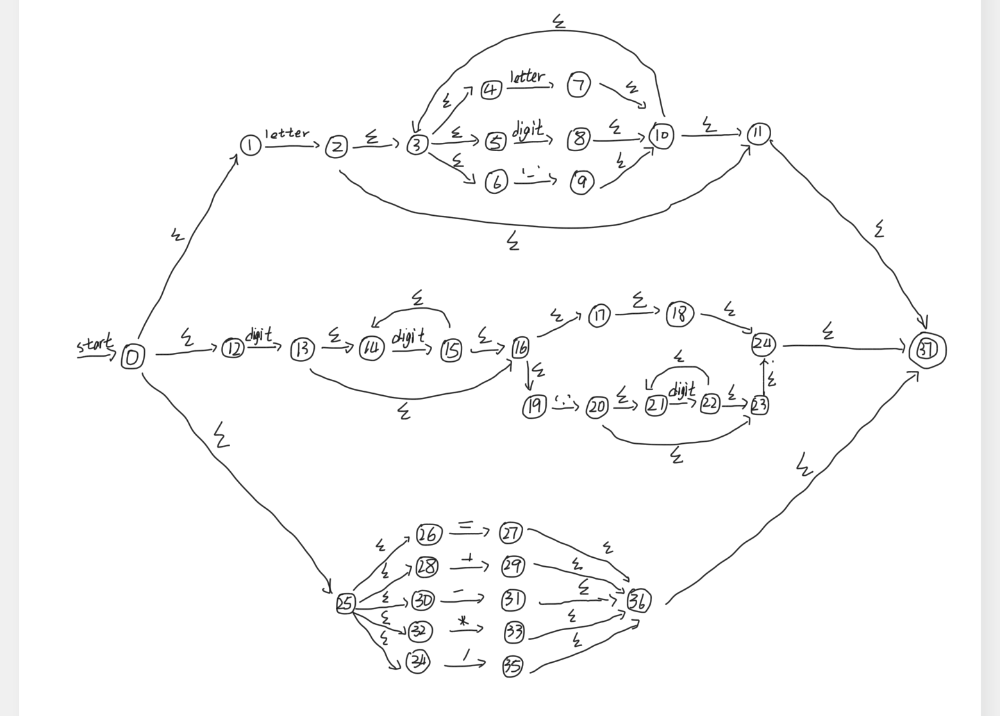
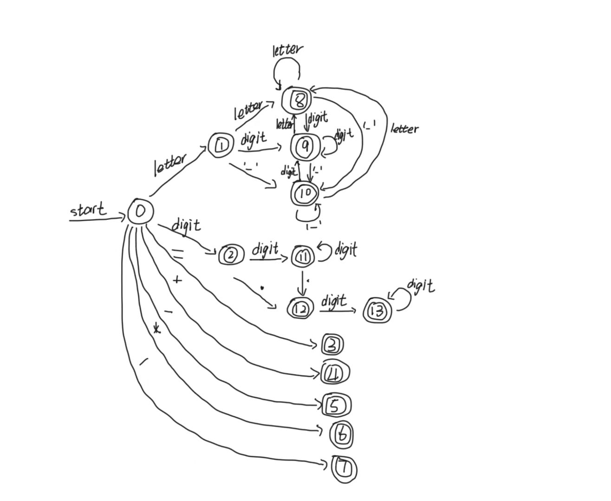
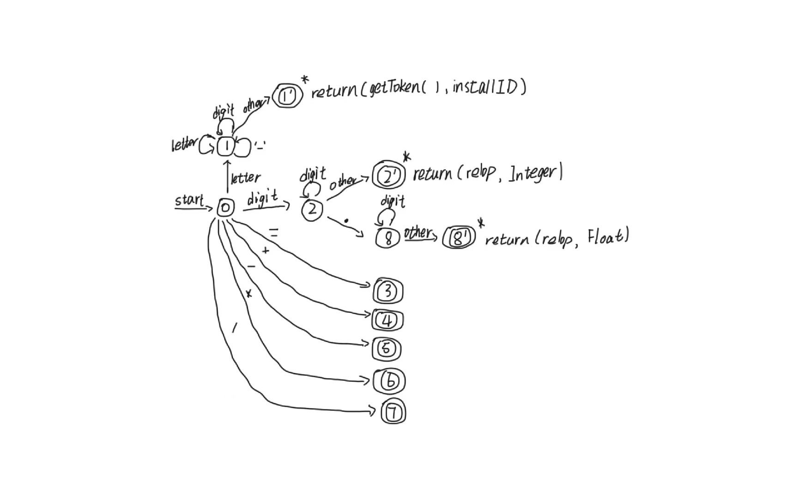

# 编译原理实验

- **@Author: Shuxin-Wang**
- **@Time: 2022.12.24**

------

[TOC]

# 一、词法分析程序

## 1.1 实验要求

1. Input

   - Stream of characters

   - REs(The number of REs is decided by yourself)

2. Output
   - Sequence of tokens

3. Classes of words are defined by yourself

4. Error handling may be included

## 1.2 设计思路

实现桌面简单计算器的词法分析，其中包括词串如下：

- 自定义变量：开头为字母，后面可为数字、字母或下划线；$\rightarrow letter(letter\ |\ digit\ |\ '\_')^*$
- 整数：一串数字；$\rightarrow digit\ digit^*$
- 浮点数：一串数字中存在`.`；$\rightarrow digit\ digit^*.digit^*$
- 运算符：简单运算符；$\rightarrow '='\ |\ '+'\ |\ '-'\ |\ '*'\ |\ '/' $

### 1.2.1 正则表达式

由上面的思路将四种词串构建正则表达式如下：
$$
(letter(letter\ |\ digit\ |\ '\_')^*)\ |\ (digit\ digit^*(\varepsilon\ |\ .digit^*))\ |\ ('='\ |\ '+'\ |\ '-'\ |\ '*'\ |\ '/')
$$

### 1.2.2 RE构造NFA

使用Thumpson算法构造NFA结果如下：

### 1.2.3 NFA构造DFA

计算空串闭包$\varepsilon-closure(s)$如下：
$$
\begin{aligned}
&\varepsilon-closure(0)=\{0,1,12,25,26,28,30,32,34\}=I_0\\
&I_0:\\
&\varepsilon-closure(move(I_0,letter))=\varepsilon-closure(2)=\{2,3,4,5,6,11,37\}=I_1\\
&\varepsilon-closure(move(I_0,digit))=\varepsilon-closure(13)=\{13,14,16,17,18,19,24,37\}=I_2\\
&\varepsilon-closure(move(I_0,'='))=\varepsilon-closure(27)=\{27,36,37\}=I_3\\
&\varepsilon-closure(move(I_0,'+'))=\varepsilon-closure(29)=\{29,36,37\}=I_4\\
&\varepsilon-closure(move(I_0,'-'))=\varepsilon-closure(31)=\{31,36,37\}=I_5\\
&\varepsilon-closure(move(I_0,'*'))=\varepsilon-closure(33)=\{33,36,37\}=I_6\\
&\varepsilon-closure(move(I_0,'/'))=\varepsilon-closure(35)=\{35,36,37\}=I_7\\
&I_1:\\
&\varepsilon-closure(move(I_1,letter))=\varepsilon-closure(7)=\{3,4,5,6,7,10,11,37\}=I_8\\
&\varepsilon-closure(move(I_1,digit))=\varepsilon-closure(8)=\{3,4,5,6,8,10,11,37\}=I_9\\
&\varepsilon-closure(move(I_1,'\_'))=\varepsilon-closure(9)=\{3,4,5,6,9,10,11,37\}=I_{10}\\
&I_2:\\
&\varepsilon-closure(move(I_2,digit))=\varepsilon-closure(15)=\{14,15,16,17,18,19,24,37\}=I_{11}\\
&\varepsilon-closure(move(I_2,'.'))=\varepsilon-closure(20)=\{20,21,23,24,37\}=I_{12}\\
&I_8:\\
&\varepsilon-closure(move(I_8,letter))=\varepsilon-closure(7)=I_8\\
&\varepsilon-closure(move(I_8,digit))=\varepsilon-closure(8)=I_9\\
&\varepsilon-closure(move(I_8,'\_'))=\varepsilon-closure(9)=I_{10}\\
&I_9:\\
&\varepsilon-closure(move(I_9,letter))=\varepsilon-closure(7)=I_8\\
&\varepsilon-closure(move(I_9,digit))=\varepsilon-closure(8)=I_9\\
&\varepsilon-closure(move(I_9,'\_'))=\varepsilon-closure(9)=I_{10}\\
&I_{10}:\\
&\varepsilon-closure(move(I_{10},letter))=\varepsilon-closure(7)=I_8\\
&\varepsilon-closure(move(I_{10},digit))=\varepsilon-closure(8)=I_9\\
&\varepsilon-closure(move(I_{10},'\_'))=\varepsilon-closure(9)=I_{10}\\
&I_{11}:\\
&\varepsilon-closure(move(I_{11},digit))=\varepsilon-closure(15)=I_{11}\\
&\varepsilon-closure(move(I_{11},'.'))=\varepsilon-closure(20)=I_{12}\\
&I_{12}:\\
&\varepsilon-closure(move(I_{12},digit))=\varepsilon-closure(22)=\{21,22,23,24,37\}=I_{13}\\
&I_{13}:\\
&\varepsilon-closure(move(I_{13},digit))=\varepsilon-closure(22)=I_{13}
\end{aligned}
$$
构建转换表如下：
$$
\begin{array}{c|c|c|c|c|c|c}
状态&letter&digit&'\_'&.&=&+&-&*&/\\
\hline
I_0&I_1&I_2&&&I_3&I_4&I_5&I_6&I_7\\
\hline
I_1&I_8&I_9&I_{10}\\
\hline
I_2&&I_{11}&&I_{12}\\
\hline
I_3\\
\hline
I_4\\
\hline
I_5\\
\hline
I_6\\
\hline
I_7\\
\hline
I_8&I_8&I_9&I_{10}\\
\hline
I_9&I_8&I_9&I_{10}\\
\hline
I_{10}&I_8&I_9&I_{10}\\
\hline
I_{11}&&I_{11}&&I_{12}\\
\hline
I_{12}&&I_{13}\\
\hline
I_{13}&&I_{13}
\end{array}
$$

DFA状态转换图如下：

### 1.2.4 DFA最小化

使用状态最小化算法，最终我们将状态分为以下组：
$$
\begin{aligned}
&I^{'}_0=\{I_0\}\\
&I^{'}_1=\{I_1,I_8,I_9,I_{10}\}\\
&I^{'}_2=\{I_2,I_{11}\}\\
&I^{'}_3=\{I_3\}\\
&I^{'}_4=\{I_4\}\\
&I^{'}_5=\{I_5\}\\
&I^{'}_6=\{I_6\}\\
&I^{'}_7=\{I_7\}\\
&I^{'}_8=\{I_{12},I_{13}\}\\
\end{aligned}
$$
转换图如下：
$$
\begin{array}{c|c|c|c|c|c|c}
状态&letter&digit&'\_'&.&=&+&-&*&/\\
\hline
I^{'}_0&I^{'}_1&I^{'}_2&&&I^{'}_3&I^{'}_4&I^{'}_5&I^{'}_6&I^{'}_7\\
\hline
I^{'}_1&I^{'}_1&I^{'}_1&I^{'}_{1}\\
\hline
I^{'}_2&&I^{'}_{2}&&I^{'}_{8}\\
\hline
I^{'}_3\\
\hline
I^{'}_4\\
\hline
I^{'}_5\\
\hline
I^{'}_6\\
\hline
I^{'}_7\\
\hline
I^{'}_8&&I^{'}_8&\\

\end{array}
$$
加入接收状态的状态转换图如下：

