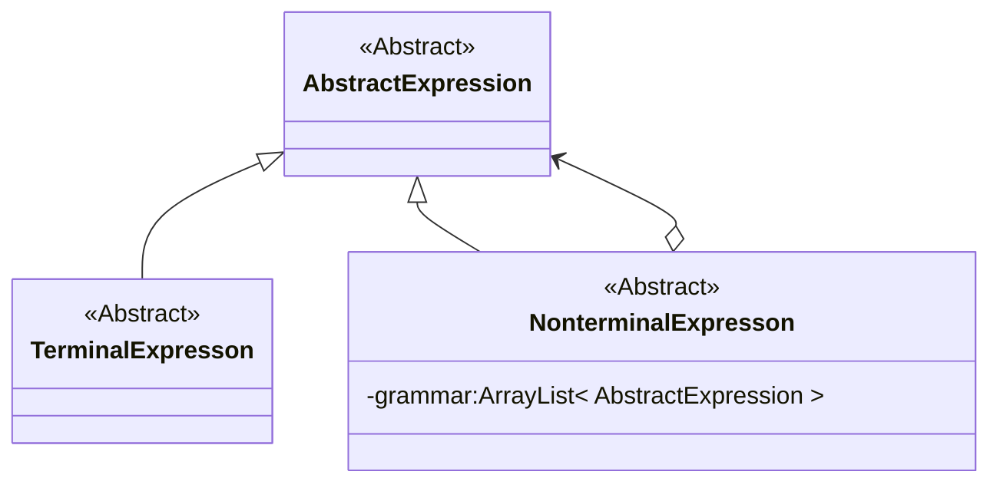
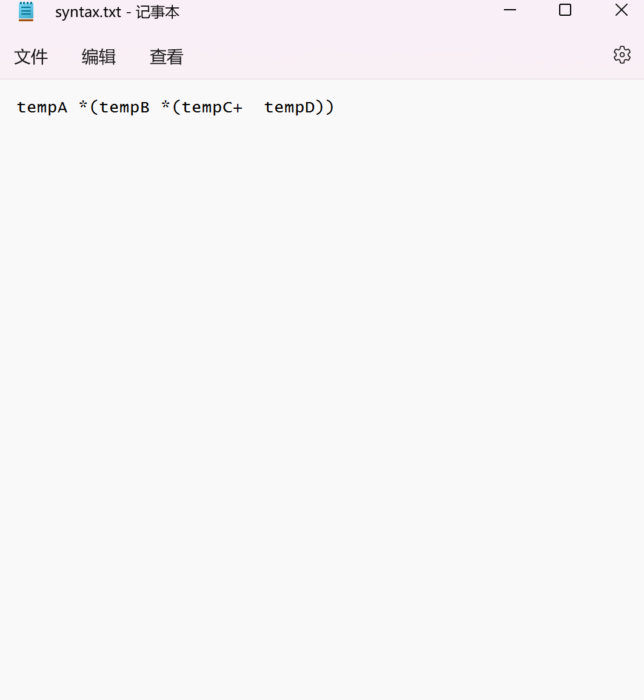
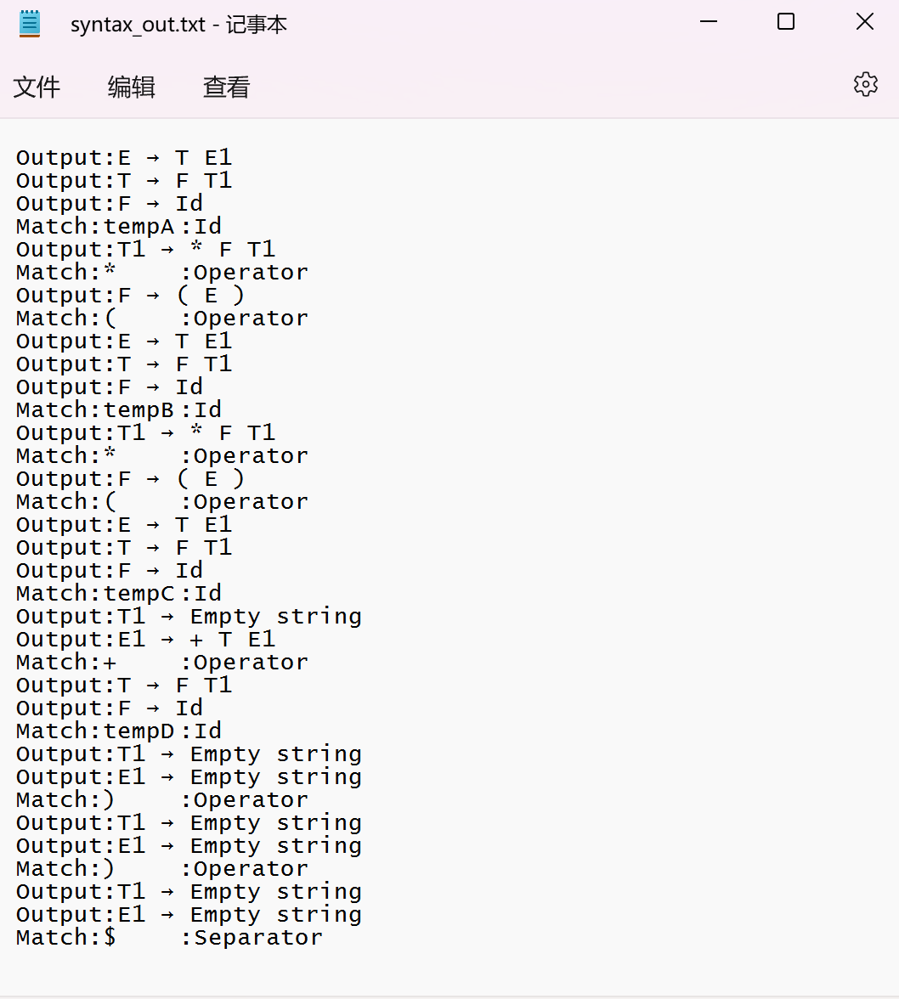

# 编译原理实验

- **@Author: Shuxin-Wang**
- **@Time: 2022.12.24**

------

[TOC]

# 一、词法分析程序

## 1.1 实验要求

1. Input

   - Stream of characters

   - REs(The number of REs is decided by yourself)

2. Output
   - Sequence of tokens

3. Classes of words are defined by yourself

4. Error handling may be included


## 1.2 设计思路

实现桌面简单计算器的词法分析，其中包括词串如下：

- 自定义变量：开头为字母，后面可为数字、字母或下划线；$\rightarrow letter(letter\ |\ digit\ |\ '\_')^*$
- 整数：一串数字；$\rightarrow digit\ digit^*$
- 浮点数：一串数字中存在`.`；$\rightarrow digit\ digit^*.digit^*$
- 运算符：简单运算符；$\rightarrow '='\ |\ '+'\ |\ '-'\ |\ '*'\ |\ '/' $


### 1.2.1 正则表达式

由上面的思路将四种词串构建正则表达式如下：
$$
(letter(letter\ |\ digit\ |\ '\_')^*)\ |\ (digit\ digit^*(\varepsilon\ |\ .digit^*))\ |\ ('='\ |\ '+'\ |\ '-'\ |\ '*'\ |\ '/')
$$


### 1.2.2 RE构造NFA

使用Thumpson算法构造NFA结果如下：


### 1.2.3 NFA构造DFA

计算空串闭包$\varepsilon-closure(s)$如下：
$$
\begin{aligned}
&\varepsilon-closure(0)=\{0,1,12,25,26,28,30,32,34\}=I_0\\
&I_0:\\
&\varepsilon-closure(move(I_0,letter))=\varepsilon-closure(2)=\{2,3,4,5,6,11,37\}=I_1\\
&\varepsilon-closure(move(I_0,digit))=\varepsilon-closure(13)=\{13,14,16,17,18,19,24,37\}=I_2\\
&\varepsilon-closure(move(I_0,'='))=\varepsilon-closure(27)=\{27,36,37\}=I_3\\
&\varepsilon-closure(move(I_0,'+'))=\varepsilon-closure(29)=\{29,36,37\}=I_4\\
&\varepsilon-closure(move(I_0,'-'))=\varepsilon-closure(31)=\{31,36,37\}=I_5\\
&\varepsilon-closure(move(I_0,'*'))=\varepsilon-closure(33)=\{33,36,37\}=I_6\\
&\varepsilon-closure(move(I_0,'/'))=\varepsilon-closure(35)=\{35,36,37\}=I_7\\
&I_1:\\
&\varepsilon-closure(move(I_1,letter))=\varepsilon-closure(7)=\{3,4,5,6,7,10,11,37\}=I_8\\
&\varepsilon-closure(move(I_1,digit))=\varepsilon-closure(8)=\{3,4,5,6,8,10,11,37\}=I_9\\
&\varepsilon-closure(move(I_1,'\_'))=\varepsilon-closure(9)=\{3,4,5,6,9,10,11,37\}=I_{10}\\
&I_2:\\
&\varepsilon-closure(move(I_2,digit))=\varepsilon-closure(15)=\{14,15,16,17,18,19,24,37\}=I_{11}\\
&\varepsilon-closure(move(I_2,'.'))=\varepsilon-closure(20)=\{20,21,23,24,37\}=I_{12}\\
&I_8:\\
&\varepsilon-closure(move(I_8,letter))=\varepsilon-closure(7)=I_8\\
&\varepsilon-closure(move(I_8,digit))=\varepsilon-closure(8)=I_9\\
&\varepsilon-closure(move(I_8,'\_'))=\varepsilon-closure(9)=I_{10}\\
&I_9:\\
&\varepsilon-closure(move(I_9,letter))=\varepsilon-closure(7)=I_8\\
&\varepsilon-closure(move(I_9,digit))=\varepsilon-closure(8)=I_9\\
&\varepsilon-closure(move(I_9,'\_'))=\varepsilon-closure(9)=I_{10}\\
&I_{10}:\\
&\varepsilon-closure(move(I_{10},letter))=\varepsilon-closure(7)=I_8\\
&\varepsilon-closure(move(I_{10},digit))=\varepsilon-closure(8)=I_9\\
&\varepsilon-closure(move(I_{10},'\_'))=\varepsilon-closure(9)=I_{10}\\
&I_{11}:\\
&\varepsilon-closure(move(I_{11},digit))=\varepsilon-closure(15)=I_{11}\\
&\varepsilon-closure(move(I_{11},'.'))=\varepsilon-closure(20)=I_{12}\\
&I_{12}:\\
&\varepsilon-closure(move(I_{12},digit))=\varepsilon-closure(22)=\{21,22,23,24,37\}=I_{13}\\
&I_{13}:\\
&\varepsilon-closure(move(I_{13},digit))=\varepsilon-closure(22)=I_{13}
\end{aligned}
$$
构建转换表如下：
$$
\begin{array}{c|c|c|c|c|c|c}
状态&letter&digit&'\_'&.&=&+&-&*&/\\
\hline
I_0&I_1&I_2&&&I_3&I_4&I_5&I_6&I_7\\
\hline
I_1&I_8&I_9&I_{10}\\
\hline
I_2&&I_{11}&&I_{12}\\
\hline
I_3\\
\hline
I_4\\
\hline
I_5\\
\hline
I_6\\
\hline
I_7\\
\hline
I_8&I_8&I_9&I_{10}\\
\hline
I_9&I_8&I_9&I_{10}\\
\hline
I_{10}&I_8&I_9&I_{10}\\
\hline
I_{11}&&I_{11}&&I_{12}\\
\hline
I_{12}&&I_{13}\\
\hline
I_{13}&&I_{13}
\end{array}
$$

DFA状态转换图如下：


### 1.2.4 DFA最小化

使用状态最小化算法，最终我们将状态分为以下组：
$$
\begin{aligned}
&I^{'}_0=\{I_0\}\\
&I^{'}_1=\{I_1,I_8,I_9,I_{10}\}\\
&I^{'}_2=\{I_2,I_{11}\}\\
&I^{'}_3=\{I_3\}\\
&I^{'}_4=\{I_4\}\\
&I^{'}_5=\{I_5\}\\
&I^{'}_6=\{I_6\}\\
&I^{'}_7=\{I_7\}\\
&I^{'}_8=\{I_{12},I_{13}\}\\
\end{aligned}
$$
转换图如下：
$$
\begin{array}{c|c|c|c|c|c|c}
状态&letter&digit&'\_'&.&=&+&-&*&/\\
\hline
I^{'}_0&I^{'}_1&I^{'}_2&&&I^{'}_3&I^{'}_4&I^{'}_5&I^{'}_6&I^{'}_7\\
\hline
I^{'}_1&I^{'}_1&I^{'}_1&I^{'}_{1}\\
\hline
I^{'}_2&&I^{'}_{2}&&I^{'}_{8}\\
\hline
I^{'}_3\\
\hline
I^{'}_4\\
\hline
I^{'}_5\\
\hline
I^{'}_6\\
\hline
I^{'}_7\\
\hline
I^{'}_8&&I^{'}_8&\\

\end{array}
$$
加入接收状态的状态转换图如下：


## 1.3 代码设计

程序基于Java语言进行设计，主要分为输入字符表、返回结果与状态、状态转换表和词法分析。


### 1.3.1 输入字符表

具体输入字符类都继承于抽象输入字符，方便后续输入字符扩展；抽象字符类重写了`equals()`和`hashCode()`函数使其可以作为`HashMap`d的键值，抽象方法`isCharacter(char c)`让具体子类可以对输入字符进行判断，具体如下：

```java
public abstract class InputCharacter {
    private final String characterName;

    public InputCharacter(String characterName){
        this.characterName = characterName;
    }

    @Override
    public boolean equals(Object o){
        if(this == o){
            return true;
        }
        if(o==null ||getClass() != o.getClass()){
            return false;
        }
        InputCharacter character = (InputCharacter) o;
        return characterName.equals(character.characterName);
    }

    @Override
    public int hashCode(){
        return characterName.hashCode();
    }

    public abstract boolean isCharacter(char c);
}
```

具体输入字符以输入字母为例，具体实现如下：

```java
public class Letter extends InputCharacter{
    public Letter() {
        super("letter");
    }

    @Override
    public boolean isCharacter(char c) {
        return ((int)c >= 65 && (int)c <= 90) || ((int)c >= 97 && (int)c <= 122);
    }
}
```


### 1.3.2 返回结果与状态

因为每个返回串都有一个结果状态，为了减少系统内存使用，这里使用**享元模式**的枚举使用，状态枚举类如下：

```java
public enum AcceptState {
    ID("Id"),
    INTEGER("Integer"),
    FLOAT("Float"),
    OPERATOR("Operator"),
    SEPARATOR("Separator");
    
    private final String acceptName;

    AcceptState(String acceptName){
        this.acceptName = acceptName;
    }

    public String getAcceptName() {
        return acceptName;
    }
}
```

串的结果包含串的具体字符和结束状态，具体实现如下：

```java
public class Token {
    private AcceptState state;
    private final StringBuilder token;

    public Token() {
        token = new StringBuilder();
    }

    public void setState(AcceptState state) {
        this.state = state;
    }

    public AcceptState getState() {
        return state;
    }

    public void addChar(char c) {
        token.append(c);
    }

    public String getToken(){
        return token.toString();
    }

    @Override
    public String toString() {
        return token.toString() + "\t:" + state.getAcceptName();
    }
}
```


### 1.3.3 构建状态转换表

输入字符表为`ArrayList<InputCharacter>`的列表，状态转换表为嵌套列表的`HashMap`，同时为了兼容输入的更多情况，输入符号在分析的基础上添加了分隔符`;`和空格` `，具体构建如下：

```java
import java.util.ArrayList;
import java.util.HashMap;

public class ConstructionTable {
    //记录输入符号
    private static final ArrayList<InputCharacter> characters = new ArrayList<>();
    //状态转换表
    private static final ArrayList<HashMap<InputCharacter, Integer>> constructionTable = new ArrayList<>();

    /*
     * 初始化输入符号表
     */
    private static void initInputCharacter() {
        characters.add(new Letter());
        characters.add(new Digit());
        characters.add(new Underline());
        characters.add(new Point());
        characters.add(new Equal());
        characters.add(new Plus());
        characters.add(new Minus());
        characters.add(new Multiple());
        characters.add(new Division());
        characters.add(new Semicolon());
        characters.add(new Space());
    }

    /*
     * 初始化状态转换表
     */
    private static void initConstructionTable() {
        //状态0:
        HashMap<InputCharacter, Integer> I0 = new HashMap<>();
        I0.put(characters.get(0), 1);
        I0.put(characters.get(1), 2);
        I0.put(characters.get(2), -3);
        I0.put(characters.get(3), -3);
        I0.put(characters.get(4), 3);
        I0.put(characters.get(5), 4);
        I0.put(characters.get(6), 5);
        I0.put(characters.get(7), 6);
        I0.put(characters.get(8), 7);
        I0.put(characters.get(9), 9);
        I0.put(characters.get(10), -2);
        constructionTable.add(I0);
        //状态1:
        HashMap<InputCharacter, Integer> I1 = new HashMap<>();
        I1.put(characters.get(0), 1);
        I1.put(characters.get(1), 1);
        I1.put(characters.get(2), 1);
        I1.put(characters.get(3), -1);
        I1.put(characters.get(4), -1);
        I1.put(characters.get(5), -1);
        I1.put(characters.get(6), -1);
        I1.put(characters.get(7), -1);
        I1.put(characters.get(8), -1);
        I1.put(characters.get(9), -1);
        I1.put(characters.get(10), -1);
        constructionTable.add(I1);
        //状态2:
        HashMap<InputCharacter, Integer> I2 = new HashMap<>();
        I2.put(characters.get(0), -1);
        I2.put(characters.get(1), 2);
        I2.put(characters.get(2), -1);
        I2.put(characters.get(3), 8);
        I2.put(characters.get(4), -1);
        I2.put(characters.get(5), -1);
        I2.put(characters.get(6), -1);
        I2.put(characters.get(7), -1);
        I2.put(characters.get(8), -1);
        I2.put(characters.get(9), -1);
        I2.put(characters.get(10), -1);
        constructionTable.add(I2);
        //状态3:
        HashMap<InputCharacter, Integer> I3 = new HashMap<>();
        for (InputCharacter character : characters) {
            I3.put(character, -1);
        }
        constructionTable.add(I3);
        //状态4:
        HashMap<InputCharacter, Integer> I4 = new HashMap<>();
        for (InputCharacter character : characters) {
            I4.put(character, -1);
        }
        constructionTable.add(I4);
        //状态5:
        HashMap<InputCharacter, Integer> I5 = new HashMap<>();
        for (InputCharacter character : characters) {
            I5.put(character, -1);
        }
        constructionTable.add(I5);
        //状态6:
        HashMap<InputCharacter, Integer> I6 = new HashMap<>();
        for (InputCharacter character : characters) {
            I6.put(character, -1);
        }
        constructionTable.add(I6);
        //状态7:
        HashMap<InputCharacter, Integer> I7 = new HashMap<>();
        for (InputCharacter character : characters) {
            I7.put(character, -1);
        }
        constructionTable.add(I7);
        //状态8:
        HashMap<InputCharacter, Integer> I8 = new HashMap<>();
        I8.put(characters.get(0), -1);
        I8.put(characters.get(1), 8);
        I8.put(characters.get(2), -1);
        I8.put(characters.get(3), -1);
        I8.put(characters.get(4), -1);
        I8.put(characters.get(5), -1);
        I8.put(characters.get(6), -1);
        I8.put(characters.get(7), -1);
        I8.put(characters.get(8), -1);
        I8.put(characters.get(9), -1);
        I8.put(characters.get(10), -1);
        constructionTable.add(I8);
        //状态9:
        HashMap<InputCharacter, Integer> I9 = new HashMap<>();
        for (InputCharacter character : characters) {
            I9.put(character, -1);
        }
        constructionTable.add(I9);
    }
}
```

同时封装了状态转换动作，具体实现如下：

```java
public class ConstructionTable {
    //记录输入符号
    private static final ArrayList<InputCharacter> characters = new ArrayList<>();
    //状态转换表
    private static final ArrayList<HashMap<InputCharacter, Integer>> constructionTable = new ArrayList<>();

	//...

    /*
     * 初始化运行动作
     */
    public static void init() {
        initInputCharacter();
        initConstructionTable();
    }

    /*
     * 根据状态与输入符号确定下一动作状态
     */
    public static int move(int state, char c) throws ValueException {
        InputCharacter character = null;
        for (InputCharacter inputCharacter : characters) {
            character = inputCharacter;
            if(character.isCharacter(c)){
                break;
            }else {
                character = null;
            }
        }
        if(character == null){
            throw new ValueException("No Input Character value: " + c);
        }
        return constructionTable.get(state).get(character);
    }
}
```


### 1.3.4 词法分析过程

其中封装了文件的读写与词法分析的具体过程，具体实现如下：

```java
public class LexicalAnalyzer {
    private static FileReader fileReader;
    private static FileWriter fileWriter;
    
    public static void analysisLexical(String text){
        //字符预处理
        String context = text + " ";
        //字符指针
        int forward = 0;
        //当前状态
        int state = 0;
        //当前目标串
        Token token = new Token();
        while(forward < context.length()){
            int temp;
            try{
                temp = ConstructionTable.move(state, context.charAt(forward));
            }catch (Exception e) {
                e.printStackTrace();
                System.out.println("Error:" + forward + ":\n" + context.substring(forward));
                return;
            }
            if(temp == -1){
                switch (state){
                    case 1:
                        token.setState(AcceptState.ID);
                        break;
                    case 2:
                        token.setState(AcceptState.INTEGER);
                        break;
                    case 3:
                    case 4:
                    case 5:
                    case 6:
                    case 7:
                        token.setState(AcceptState.OPERATOR);
                        break;
                    case 8:
                        token.setState(AcceptState.FLOAT);
                        break;
                    case 9:
                        token.setState(AcceptState.SEPARATOR);
                        break;
                }
                System.out.println(token);
                try {
                    fileWriter.write(token + "\n");
                } catch (IOException e) {
                    e.printStackTrace();
                }
                state = 0;
                token = new Token();
            }else if(temp == -2){
                forward++;
            }else if(temp == -3){
                System.out.println("Error:" + forward + ":\n" + context.substring(forward));
                return;
            }else{
                token.addChar(context.charAt(forward));
                state = temp;
                forward++;
            }
        }
        if(fileWriter != null){
            try{
                fileWriter.close();
            } catch (IOException e) {
                e.printStackTrace();
            }
        }
    }
}
```


## 1.4 结果展示

主函数如下：

```java
public class Main {
    public static void main(String[] args) {
        LexicalAnalyzer.init("data/lexical.txt", "data/lexical_out.txt");
        LexicalAnalyzer.analysisLexical();
    }
}
```

输入文件：


输出文件：


错误处理：


## 1.5 实验体会

熟悉正则表达式、NFA与DFA之间的转换和DFA最优化过程，可以正确使用到自己构建的问题中去；在使用程序语言具体实现的时候，对词法分析过程有了更深刻的理解。


# 二、语法分析程序


## 2.1 实验要求

1. Input
   - Stream of characters 
   - CFG(Combination of CFGs of some classes of sentences)

2. Output(Syntax tree)
   - Sequence of derivations if top-down syntax analyzing methods are used.
   - Sequence of reductions if bottom-up syntax analyzing methods are used.

3. Classes of sentences are defined by yourself

4. Error handling may be included


## 2.2 设计思路

实现简单桌面计算器的自顶向下的语法分析，通过实现LL(1)文法预测分析表对输入字串进行分析，具体文法如下：
$$
\begin{aligned}
&0.E\rightarrow E+T|T\\
&1.T\rightarrow T*F|F\\
&2.F\rightarrow (E)|id
\end{aligned}
$$

### 2.2.1 消除左递归

由内到外，从左到右顺序：

1. 产生式2无左递归；
2. 产生式1存在左递归，进行消除

$$
T\rightarrow FT'\\
T'\rightarrow *FT'|\varepsilon
$$

3. 产生式0存在左递归，进行消除

$$
E\rightarrow TE'\\
E'\rightarrow +TE'|\varepsilon
$$

综上，消除左递归后产生文法G'为： 
$$
\begin{aligned}
&(0)E\rightarrow TE'\\
&(1)E'\rightarrow +TE'|\varepsilon\\
&(2)T\rightarrow FT'\\
&(3)T'\rightarrow *FT'|\varepsilon\\
&(4)F\rightarrow (E)|id
\end{aligned}
$$

将每个产生式拆分并编号：
$$
\begin{aligned}
&(0)E\rightarrow TE'\\
&(1)E'\rightarrow +TE'\\
&(2)E'\rightarrow \varepsilon\\
&(3)T\rightarrow FT'\\
&(4)T'\rightarrow *FT'\\
&(5)T'\rightarrow\varepsilon\\
&(6)F\rightarrow (E)\\
&(7)F\rightarrow id
\end{aligned}
$$

### 2.2.2 构建First和Follow集

对每个产生式可以很容易得到每个产生式的**FIRST集**，如下表所示：
$$
\begin{array}{cc}
产生式&FIRST\\
\hline
E\rightarrow TE' &\{(,id\} \\
\hline
E'\rightarrow +TE' &\{+\} \\

E'\rightarrow \varepsilon &\{\varepsilon\} \\
\hline
T\rightarrow FT' &\{(,id\} \\
\hline
T'\rightarrow *FT' &\{*\} \\

T'\rightarrow \varepsilon &\{\varepsilon\}\\
\hline
F\rightarrow (E) &\{(\} \\

F\rightarrow id &\{id\} \\
\hline
\end{array}
$$
下面获取**FOLLOW集**：

`FOLLOW(E)`:

- E为开始符号，所以加入\$；根据产生式$F\rightarrow (E)$得，FOLLOW(E)中加入`(`；
- $FOLLOW(E)=\{(,\$\}$；

`FOLLOW(E')`

- E'只出现在E产生式的右部尾部，所以FOLLOW(E')=FOLLOW(E)；
- $FOLLOW(E’)=\{(,\$\}$；

`FOLLOW(T)`

- 产生式$E'\rightarrow +TE'$，E'在T后面，所以加入FIRST(E')-{ε}，即`+`；又$\varepsilon\in FIRST(E')$，所以FOLLOW(E')加入FOLLOW(T)中；
- $FOLLOW(T)=\{+,(,\$\}$；

`FOLLOW(T')`

- T'只出现在T产生式右部尾部，所以FOLLOW(T')=FOLLOW(T)；
- $FOLLOW(T')=\{+,(,\$\}$；

`FOLLOW(F)`

- 产生式$T'\rightarrow *FT'$，T'在F后面，所以加入FIRST(T')-{ε}，即`*`；又$\varepsilon\in FIRST(T')$，所以FOLLOW(T')加入FOLLOW(F)中；
- $FOLLOW(T)=\{*,+,(,\$\}$；

构建FIRST和FOLLOW表：
$$
\begin{array}{c|c|c}
产生式&FIRST&FOLLOW\\
\hline
E\rightarrow TE' &\{(,id\}&\{(,\$\} \\
\hline
E'\rightarrow +TE' &\{+\} &\{(,\$\} \\

E'\rightarrow \varepsilon &\{\varepsilon\}&\{(,\$\} \\
\hline
T\rightarrow FT' &\{(,id\}&\{+,(,\$\} \\
\hline
T'\rightarrow *FT' &\{*\} &\{+,(,\$\}\\

T'\rightarrow \varepsilon &\{\varepsilon\}&\{+,(,\$\}\\
\hline
F\rightarrow (E) &\{(\} & \{*,+,(,\$\}\\

F\rightarrow id &\{id\} & \{*,+,(,\$\}\\
\hline
\end{array}
$$

### 2.2.3 构建预测分析表

根据构建规则，构建预测分析表如下：
$$
\begin{array}{c|c|c|c|c|c|c}
(非)终结符&id&+&*&(&)&\$\\
\hline
E&E\rightarrow TE' &  & &E\rightarrow TE' & &\\
\hline
E'& &E'\rightarrow +TE'  & & &E'\rightarrow \varepsilon & E'\rightarrow \varepsilon\\
\hline
T&T\rightarrow FT' &  & &T\rightarrow FT' & &\\
\hline
T'& &T'\rightarrow \varepsilon  &T'\rightarrow *FT' & &T'\rightarrow \varepsilon &T'\rightarrow \varepsilon\\
\hline
F&F\rightarrow id &  & &F\rightarrow (E) & &\\

\end{array}
$$


## 2.3 代码设计

终结符与非终结符同时继承于一个抽象符号，同时非终结符中包含该抽象符号的列表用来表示生成文法，类间关系如下图：



### 2.3.1 符号表示

- 抽象基类具体实现如下：

```java
public abstract class AbstractExpression {
    private final String name;

    public AbstractExpression(String name){
        this.name = name;
    }

    public String getName() {
        return name;
    }

    public abstract boolean isToken(Token token);
}
```

- 终结符抽象基类

```java
public abstract class TerminalExpression extends AbstractExpression{
    public TerminalExpression(String name) {
        super(name);
    }

    @Override
    public boolean equals(Object o){
        if(this == o){
            return true;
        }
        if(o==null ||getClass() != o.getClass()){
            return false;
        }
        AbstractExpression expression = (AbstractExpression) o;
        return this.getName().equals(expression.getName());
    }

    @Override
    public int hashCode(){
        return getName().hashCode();
    }
}
```

- 非终结符抽象基类


```java
public abstract class NonterminalExpression extends AbstractExpression {
    private ArrayList<AbstractExpression> grammar;
    private boolean isEmptyString = false;

    public NonterminalExpression(String name) {
        super(name);
    }

    public void setGrammar(ArrayList<AbstractExpression> grammar) {
        this.grammar = grammar;
    }

    public ArrayList<AbstractExpression> getGrammar() {
        return grammar;
    }

    public void setEmptyString(boolean emptyString) {
        isEmptyString = emptyString;
    }

    public boolean isEmptyString() {
        return isEmptyString;
    }

    @Override
    public String toString() {
        StringBuilder builder = new StringBuilder();
        builder.append(getName()).append(" → ");
        for (AbstractExpression expression : grammar) {
            builder.append(expression.getName()).append(" ");
        }
        return builder.toString();
    }
}
```


### 2.3.2 构建预测分析表

用一个终结符列表表示输入终结符，一个非终结符列表表示文法，一个嵌套`HashMap`表示预测分析表，具体表示如下：

```java
public class ForecastTable {
    //文法表
    public static ArrayList<NonterminalExpression> grammars = new ArrayList<>();
    //输入终结符记录表
    private static final ArrayList<TerminalExpression> terminals = new ArrayList<>();
    //预测分析表
    private static final HashMap<String, HashMap<TerminalExpression, Integer>> forecastTable = new HashMap<>();

    //初始化终结符
    private static void initTerminals() {
        terminals.add(new Id()); //0
        terminals.add(new Plus()); //1
        terminals.add(new Multiple()); //2
        terminals.add(new LeftBracket()); //3
        terminals.add(new RightBracket()); //4
        terminals.add(new Terminator()); //5
    }

    private static void initGrammars() {
        //初始化非终结符
        NonterminalExpression E = new ExpressionE(),
                E1 = new ExpressionE1(),
                T = new ExpressionT(),
                T1 = new ExpressionT1(),
                F = new ExpressionF();
        //文法0：
        NonterminalExpression grammar0 = new ExpressionE();
        ArrayList<AbstractExpression> g0 = new ArrayList<>();
        g0.add(T);
        g0.add(E1);
        grammar0.setGrammar(g0);
        grammars.add(grammar0);
        //文法1：
        NonterminalExpression grammar1 = new ExpressionE1();
        ArrayList<AbstractExpression> g1 = new ArrayList<>();
        g1.add(terminals.get(1));
        g1.add(T);
        g1.add(E1);
        grammar1.setGrammar(g1);
        grammars.add(grammar1);
        //文法2：
        NonterminalExpression grammar2 = new ExpressionE1();
        ArrayList<AbstractExpression> g2 = new ArrayList<>();
        g2.add(new EmptyString());
        grammar2.setGrammar(g2);
        grammar2.setEmptyString(true);
        grammars.add(grammar2);
        //文法3：
        NonterminalExpression grammar3 = new ExpressionT();
        ArrayList<AbstractExpression> g3 = new ArrayList<>();
        g3.add(F);
        g3.add(T1);
        grammar3.setGrammar(g3);
        grammars.add(grammar3);
        //文法4：
        NonterminalExpression grammar4 = new ExpressionT1();
        ArrayList<AbstractExpression> g4 = new ArrayList<>();
        g4.add(terminals.get(2));
        g4.add(F);
        g4.add(T1);
        grammar4.setGrammar(g4);
        grammars.add(grammar4);
        //文法5：
        NonterminalExpression grammar5 = new ExpressionT1();
        ArrayList<AbstractExpression> g5 = new ArrayList<>();
        g5.add(new EmptyString());
        grammar5.setGrammar(g5);
        grammar5.setEmptyString(true);
        grammars.add(grammar5);
        //文法6：
        NonterminalExpression grammar6 = new ExpressionF();
        ArrayList<AbstractExpression> g6 = new ArrayList<>();
        g6.add(terminals.get(3));
        g6.add(E);
        g6.add(terminals.get(4));
        grammar6.setGrammar(g6);
        grammars.add(grammar6);
        //文法7：
        NonterminalExpression grammar7 = new ExpressionF();
        ArrayList<AbstractExpression> g7 = new ArrayList<>();
        g7.add(terminals.get(0));
        grammar7.setGrammar(g7);
        grammars.add(grammar7);
    }

    private static void initForecastTable(){
        //非终结符E：
        HashMap<TerminalExpression, Integer> exE = new HashMap<>();
        exE.put(terminals.get(0), 0);
        exE.put(terminals.get(1), -1);
        exE.put(terminals.get(2), -1);
        exE.put(terminals.get(3), 0);
        exE.put(terminals.get(4), -1);
        exE.put(terminals.get(5), -1);
        forecastTable.put("E",exE);
        //非终结符E‘：
        HashMap<TerminalExpression, Integer> exE1 = new HashMap<>();
        exE1.put(terminals.get(0), -1);
        exE1.put(terminals.get(1), 1);
        exE1.put(terminals.get(2), -1);
        exE1.put(terminals.get(3), -1);
        exE1.put(terminals.get(4), 2);
        exE1.put(terminals.get(5), 2);
        forecastTable.put("E1",exE1);
        //非终结符T：
        HashMap<TerminalExpression, Integer> exT = new HashMap<>();
        exT.put(terminals.get(0), 3);
        exT.put(terminals.get(1), -1);
        exT.put(terminals.get(2), -1);
        exT.put(terminals.get(3), 3);
        exT.put(terminals.get(4), -1);
        exT.put(terminals.get(5), -1);
        forecastTable.put("T", exT);
        //非终结符T'：
        HashMap<TerminalExpression, Integer> exT1 = new HashMap<>();
        exT1.put(terminals.get(0), -1);
        exT1.put(terminals.get(1), 5);
        exT1.put(terminals.get(2), 4);
        exT1.put(terminals.get(3), -1);
        exT1.put(terminals.get(4), 5);
        exT1.put(terminals.get(5), 5);
        forecastTable.put("T1", exT1);
        //非终结符F：
        HashMap<TerminalExpression, Integer> exF = new HashMap<>();
        exF.put(terminals.get(0), 7);
        exF.put(terminals.get(1), -1);
        exF.put(terminals.get(2), -1);
        exF.put(terminals.get(3), 6);
        exF.put(terminals.get(4), -1);
        exF.put(terminals.get(5), -1);
        forecastTable.put("F", exF);
    }
```

- 具体动作同时封装在函数中，返回自然数表示输出编号第几个文法，-1表示出现错误，-2表示终结符匹配，具体实现如下：

```java
public class ForecastTable {
    //文法表
    public static ArrayList<NonterminalExpression> grammars = new ArrayList<>();
    //输入终结符记录表
    private static final ArrayList<TerminalExpression> terminals = new ArrayList<>();
    //预测分析表
    private static final HashMap<String, HashMap<TerminalExpression, Integer>> forecastTable = new HashMap<>();

    //...
	
    public static int forecastAnalysis(AbstractExpression expression, Token token) throws Exception {
        //匹配动作
        if (expression.isToken(token)){
            return -2;
        }
        //寻找归约
        TerminalExpression terminalExpression = null;
        for(TerminalExpression terminal: terminals){
            terminalExpression = terminal;
            if(terminalExpression.isToken(token)){
                break;
            }else{
                terminalExpression = null;
            }
        }
        if(terminalExpression == null){
            throw new Exception("No Input Token:" + token.toString());
        }
        return forecastTable.get(expression.getName()).get(terminalExpression);
    }
}
```

### 2.3.3 语法分析过程

使用栈来存储分析状态，具体实现如下：

```java
public class SyntaxParser {
	//...
    public static void syntaxParser(ArrayList<Token> tokens){
        System.out.println("\nSyntax Parser:\n");
        //token预处理
        Token terminator = new Token();
        terminator.addChar('$');
        terminator.setState(AcceptState.SEPARATOR);
        tokens.add(terminator);
        System.out.println(tokens);
        //栈预处理
        Stack<AbstractExpression> stack = new Stack<>();
        stack.push(new Terminator());
        stack.push(new ExpressionE());
        //token串指针
        int forward = 0;
        //开始归约
        while(forward < tokens.size()){
            AbstractExpression expression = stack.peek();
            int temp;
            try{
                temp = ForecastTable.forecastAnalysis(expression, tokens.get(forward));
            } catch (Exception e) {
                System.out.println("Error: " + forward + ":");
                for(int i = forward; i < tokens.size() - 1; i++){
                    System.out.print(tokens.get(i).getToken() + " ");
                }
                System.out.print('\n');
                e.printStackTrace();
                return;
            }
            if(temp == -1){//出现错误
                System.out.println("Error: " + forward + ":");
                for(int i = forward; i < tokens.size() - 1; i++){
                    System.out.print(tokens.get(i).getToken() + " ");
                }
                System.out.print('\n');
                return;
            }else if (temp == -2){//匹配动作
                try {
                    fileWriter.write("Match:" + tokens.get(forward).toString() + "\n");
                } catch (IOException e) {
                    e.printStackTrace();
                }
                System.out.println("Match:" + tokens.get(forward).toString());
                stack.pop();
                forward++;
            }else {//输出动作
                NonterminalExpression grammar = ForecastTable.grammars.get(temp);
                System.out.println("Output:" + grammar.toString());
                try {
                    fileWriter.write("Output:" + grammar + "\n");
                } catch (IOException e) {
                    e.printStackTrace();
                }
                if(grammar.isEmptyString()){//空串输出
                    stack.pop();
                }else{
                    stack.pop();
                    for(int i = grammar.getGrammar().size() - 1; i >= 0; i--){
                        stack.push(grammar.getGrammar().get(i));
                    }
                }
            }
        }
        if (fileWriter != null) {
            try {
                fileWriter.close();
            } catch (IOException e) {
                e.printStackTrace();
            }
        }
    }
}
```

## 2.4 结果展示

主函数如下：

```java
public class Main {
    public static void main(String[] args) {
        System.out.println("======================================================");
        LexicalAnalyzer.init("data/syntax.txt", "data/lexical_out.txt");
        LexicalAnalyzer.analysisLexical();
        System.out.println("======================================================");
        ArrayList<Token> tokens = LexicalAnalyzer.getTokens();
        SyntaxParser.init("data/syntax_out.txt");
        SyntaxParser.syntaxParser(tokens);
    }
}
```

- 输入文件：



- 输出文件：



## 2.5 实验体会

熟悉并掌握了LL(1)文法的的构造方法，包括消除左递归、构建First集和Follow集并构建预测分析表，通过语法分析程序的上手操作，对自顶向上的语法分析过程有了进一步了解
