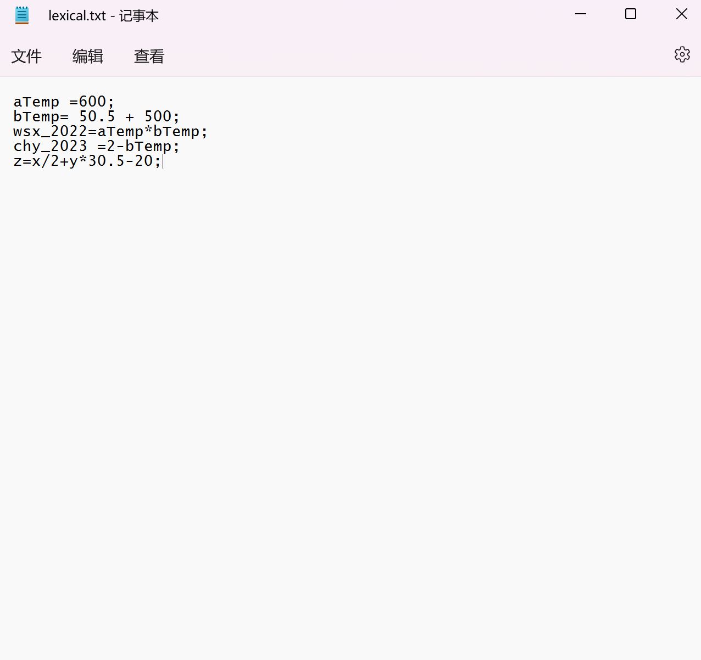
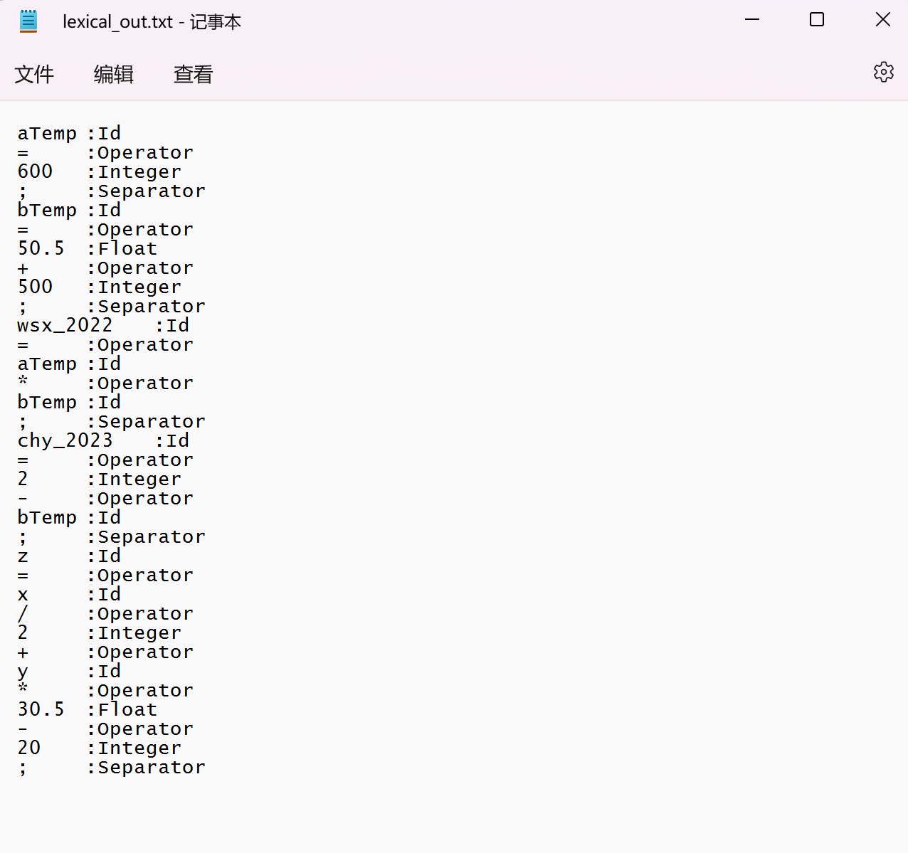
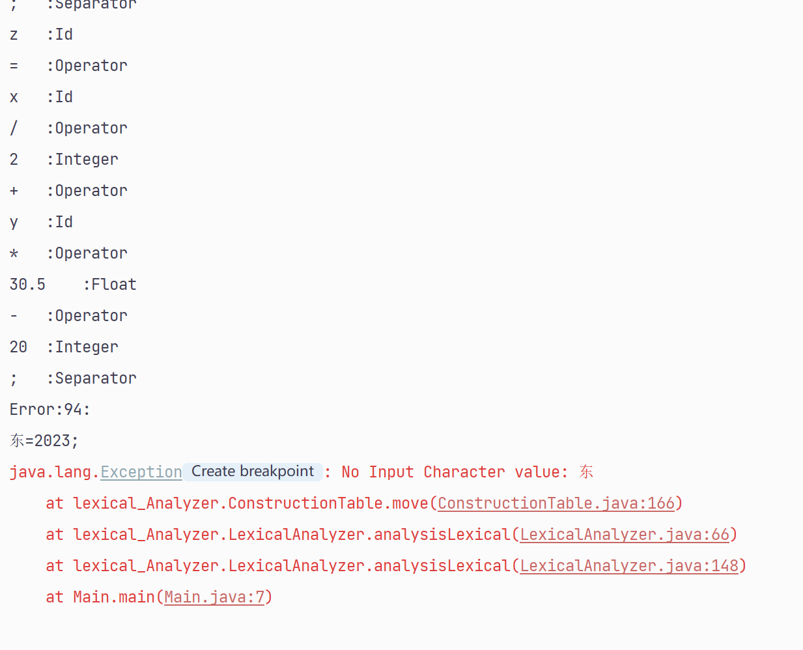

# 编译原理实验

- **@Author: Shuxin-Wang**
- **@Time: 2022.12.24**

------

[TOC]

# 一、词法分析程序

## 1.1 实验要求

1. Input

   - Stream of characters

   - REs(The number of REs is decided by yourself)

2. Output
   - Sequence of tokens

3. Classes of words are defined by yourself

4. Error handling may be included


## 1.2 设计思路

实现桌面简单计算器的词法分析，其中包括词串如下：

- 自定义变量：开头为字母，后面可为数字、字母或下划线；$\rightarrow letter(letter\ |\ digit\ |\ '\_')^*$
- 整数：一串数字；$\rightarrow digit\ digit^*$
- 浮点数：一串数字中存在`.`；$\rightarrow digit\ digit^*.digit^*$
- 运算符：简单运算符；$\rightarrow '='\ |\ '+'\ |\ '-'\ |\ '*'\ |\ '/' $


### 1.2.1 正则表达式

由上面的思路将四种词串构建正则表达式如下：
$$
(letter(letter\ |\ digit\ |\ '\_')^*)\ |\ (digit\ digit^*(\varepsilon\ |\ .digit^*))\ |\ ('='\ |\ '+'\ |\ '-'\ |\ '*'\ |\ '/')
$$


### 1.2.2 RE构造NFA

使用Thumpson算法构造NFA结果如下：


### 1.2.3 NFA构造DFA

计算空串闭包$\varepsilon-closure(s)$如下：
$$
\begin{aligned}
&\varepsilon-closure(0)=\{0,1,12,25,26,28,30,32,34\}=I_0\\
&I_0:\\
&\varepsilon-closure(move(I_0,letter))=\varepsilon-closure(2)=\{2,3,4,5,6,11,37\}=I_1\\
&\varepsilon-closure(move(I_0,digit))=\varepsilon-closure(13)=\{13,14,16,17,18,19,24,37\}=I_2\\
&\varepsilon-closure(move(I_0,'='))=\varepsilon-closure(27)=\{27,36,37\}=I_3\\
&\varepsilon-closure(move(I_0,'+'))=\varepsilon-closure(29)=\{29,36,37\}=I_4\\
&\varepsilon-closure(move(I_0,'-'))=\varepsilon-closure(31)=\{31,36,37\}=I_5\\
&\varepsilon-closure(move(I_0,'*'))=\varepsilon-closure(33)=\{33,36,37\}=I_6\\
&\varepsilon-closure(move(I_0,'/'))=\varepsilon-closure(35)=\{35,36,37\}=I_7\\
&I_1:\\
&\varepsilon-closure(move(I_1,letter))=\varepsilon-closure(7)=\{3,4,5,6,7,10,11,37\}=I_8\\
&\varepsilon-closure(move(I_1,digit))=\varepsilon-closure(8)=\{3,4,5,6,8,10,11,37\}=I_9\\
&\varepsilon-closure(move(I_1,'\_'))=\varepsilon-closure(9)=\{3,4,5,6,9,10,11,37\}=I_{10}\\
&I_2:\\
&\varepsilon-closure(move(I_2,digit))=\varepsilon-closure(15)=\{14,15,16,17,18,19,24,37\}=I_{11}\\
&\varepsilon-closure(move(I_2,'.'))=\varepsilon-closure(20)=\{20,21,23,24,37\}=I_{12}\\
&I_8:\\
&\varepsilon-closure(move(I_8,letter))=\varepsilon-closure(7)=I_8\\
&\varepsilon-closure(move(I_8,digit))=\varepsilon-closure(8)=I_9\\
&\varepsilon-closure(move(I_8,'\_'))=\varepsilon-closure(9)=I_{10}\\
&I_9:\\
&\varepsilon-closure(move(I_9,letter))=\varepsilon-closure(7)=I_8\\
&\varepsilon-closure(move(I_9,digit))=\varepsilon-closure(8)=I_9\\
&\varepsilon-closure(move(I_9,'\_'))=\varepsilon-closure(9)=I_{10}\\
&I_{10}:\\
&\varepsilon-closure(move(I_{10},letter))=\varepsilon-closure(7)=I_8\\
&\varepsilon-closure(move(I_{10},digit))=\varepsilon-closure(8)=I_9\\
&\varepsilon-closure(move(I_{10},'\_'))=\varepsilon-closure(9)=I_{10}\\
&I_{11}:\\
&\varepsilon-closure(move(I_{11},digit))=\varepsilon-closure(15)=I_{11}\\
&\varepsilon-closure(move(I_{11},'.'))=\varepsilon-closure(20)=I_{12}\\
&I_{12}:\\
&\varepsilon-closure(move(I_{12},digit))=\varepsilon-closure(22)=\{21,22,23,24,37\}=I_{13}\\
&I_{13}:\\
&\varepsilon-closure(move(I_{13},digit))=\varepsilon-closure(22)=I_{13}
\end{aligned}
$$
构建转换表如下：
$$
\begin{array}{c|c|c|c|c|c|c}
状态&letter&digit&'\_'&.&=&+&-&*&/\\
\hline
I_0&I_1&I_2&&&I_3&I_4&I_5&I_6&I_7\\
\hline
I_1&I_8&I_9&I_{10}\\
\hline
I_2&&I_{11}&&I_{12}\\
\hline
I_3\\
\hline
I_4\\
\hline
I_5\\
\hline
I_6\\
\hline
I_7\\
\hline
I_8&I_8&I_9&I_{10}\\
\hline
I_9&I_8&I_9&I_{10}\\
\hline
I_{10}&I_8&I_9&I_{10}\\
\hline
I_{11}&&I_{11}&&I_{12}\\
\hline
I_{12}&&I_{13}\\
\hline
I_{13}&&I_{13}
\end{array}
$$

DFA状态转换图如下：


### 1.2.4 DFA最小化

使用状态最小化算法，最终我们将状态分为以下组：
$$
\begin{aligned}
&I^{'}_0=\{I_0\}\\
&I^{'}_1=\{I_1,I_8,I_9,I_{10}\}\\
&I^{'}_2=\{I_2,I_{11}\}\\
&I^{'}_3=\{I_3\}\\
&I^{'}_4=\{I_4\}\\
&I^{'}_5=\{I_5\}\\
&I^{'}_6=\{I_6\}\\
&I^{'}_7=\{I_7\}\\
&I^{'}_8=\{I_{12},I_{13}\}\\
\end{aligned}
$$
转换图如下：
$$
\begin{array}{c|c|c|c|c|c|c}
状态&letter&digit&'\_'&.&=&+&-&*&/\\
\hline
I^{'}_0&I^{'}_1&I^{'}_2&&&I^{'}_3&I^{'}_4&I^{'}_5&I^{'}_6&I^{'}_7\\
\hline
I^{'}_1&I^{'}_1&I^{'}_1&I^{'}_{1}\\
\hline
I^{'}_2&&I^{'}_{2}&&I^{'}_{8}\\
\hline
I^{'}_3\\
\hline
I^{'}_4\\
\hline
I^{'}_5\\
\hline
I^{'}_6\\
\hline
I^{'}_7\\
\hline
I^{'}_8&&I^{'}_8&\\

\end{array}
$$
加入接收状态的状态转换图如下：


## 1.3 代码设计

程序基于Java语言进行设计，主要分为输入字符表、返回结果与状态、状态转换表和词法分析。


### 1.3.1 输入字符表

具体输入字符类都继承于抽象输入字符，方便后续输入字符扩展；抽象字符类重写了`equals()`和`hashCode()`函数使其可以作为`HashMap`d的键值，抽象方法`isCharacter(char c)`让具体子类可以对输入字符进行判断，具体如下：

```java
public abstract class InputCharacter {
    private final String characterName;

    public InputCharacter(String characterName){
        this.characterName = characterName;
    }

    @Override
    public boolean equals(Object o){
        if(this == o){
            return true;
        }
        if(o==null ||getClass() != o.getClass()){
            return false;
        }
        InputCharacter character = (InputCharacter) o;
        return characterName.equals(character.characterName);
    }

    @Override
    public int hashCode(){
        return characterName.hashCode();
    }

    public abstract boolean isCharacter(char c);
}
```

具体输入字符以输入字母为例，具体实现如下：

```java
public class Letter extends InputCharacter{
    public Letter() {
        super("letter");
    }

    @Override
    public boolean isCharacter(char c) {
        return ((int)c >= 65 && (int)c <= 90) || ((int)c >= 97 && (int)c <= 122);
    }
}
```


### 1.3.2 返回结果与状态

因为每个返回串都有一个结果状态，为了减少系统内存使用，这里使用享元模式的枚举使用，状态枚举类如下：

```java
public enum AcceptState {
    ID("Id"),
    INTEGER("Integer"),
    FLOAT("Float"),
    OPERATOR("Operator"),
    SEPARATOR("Separator");
    
    private final String acceptName;

    AcceptState(String acceptName){
        this.acceptName = acceptName;
    }

    public String getAcceptName() {
        return acceptName;
    }
}
```

串的结果包含串的具体字符和结束状态，具体实现如下：

```java
public class Token {
    private AcceptState state;
    private final StringBuilder token;

    public Token() {
        token = new StringBuilder();
    }

    public void setState(AcceptState state) {
        this.state = state;
    }

    public AcceptState getState() {
        return state;
    }

    public void addChar(char c) {
        token.append(c);
    }

    public String getToken(){
        return token.toString();
    }

    @Override
    public String toString() {
        return token.toString() + "\t:" + state.getAcceptName();
    }
}
```


### 1.3.3 构建状态转换表

输入字符表为`ArrayList<InputCharacter>`的列表，状态转换表为嵌套列表的`HashMap`，同时为了兼容输入的更多情况，输入符号在分析的基础上添加了分隔符`;`和空格` `，具体构建如下：

```java
import java.util.ArrayList;
import java.util.HashMap;

public class ConstructionTable {
    //记录输入符号
    private static final ArrayList<InputCharacter> characters = new ArrayList<>();
    //状态转换表
    private static final ArrayList<HashMap<InputCharacter, Integer>> constructionTable = new ArrayList<>();

    /*
     * 初始化输入符号表
     */
    private static void initInputCharacter() {
        characters.add(new Letter());
        characters.add(new Digit());
        characters.add(new Underline());
        characters.add(new Point());
        characters.add(new Equal());
        characters.add(new Plus());
        characters.add(new Minus());
        characters.add(new Multiple());
        characters.add(new Division());
        characters.add(new Semicolon());
        characters.add(new Space());
    }

    /*
     * 初始化状态转换表
     */
    private static void initConstructionTable() {
        //状态0:
        HashMap<InputCharacter, Integer> I0 = new HashMap<>();
        I0.put(characters.get(0), 1);
        I0.put(characters.get(1), 2);
        I0.put(characters.get(2), -3);
        I0.put(characters.get(3), -3);
        I0.put(characters.get(4), 3);
        I0.put(characters.get(5), 4);
        I0.put(characters.get(6), 5);
        I0.put(characters.get(7), 6);
        I0.put(characters.get(8), 7);
        I0.put(characters.get(9), 9);
        I0.put(characters.get(10), -2);
        constructionTable.add(I0);
        //状态1:
        HashMap<InputCharacter, Integer> I1 = new HashMap<>();
        I1.put(characters.get(0), 1);
        I1.put(characters.get(1), 1);
        I1.put(characters.get(2), 1);
        I1.put(characters.get(3), -1);
        I1.put(characters.get(4), -1);
        I1.put(characters.get(5), -1);
        I1.put(characters.get(6), -1);
        I1.put(characters.get(7), -1);
        I1.put(characters.get(8), -1);
        I1.put(characters.get(9), -1);
        I1.put(characters.get(10), -1);
        constructionTable.add(I1);
        //状态2:
        HashMap<InputCharacter, Integer> I2 = new HashMap<>();
        I2.put(characters.get(0), -1);
        I2.put(characters.get(1), 2);
        I2.put(characters.get(2), -1);
        I2.put(characters.get(3), 8);
        I2.put(characters.get(4), -1);
        I2.put(characters.get(5), -1);
        I2.put(characters.get(6), -1);
        I2.put(characters.get(7), -1);
        I2.put(characters.get(8), -1);
        I2.put(characters.get(9), -1);
        I2.put(characters.get(10), -1);
        constructionTable.add(I2);
        //状态3:
        HashMap<InputCharacter, Integer> I3 = new HashMap<>();
        for (InputCharacter character : characters) {
            I3.put(character, -1);
        }
        constructionTable.add(I3);
        //状态4:
        HashMap<InputCharacter, Integer> I4 = new HashMap<>();
        for (InputCharacter character : characters) {
            I4.put(character, -1);
        }
        constructionTable.add(I4);
        //状态5:
        HashMap<InputCharacter, Integer> I5 = new HashMap<>();
        for (InputCharacter character : characters) {
            I5.put(character, -1);
        }
        constructionTable.add(I5);
        //状态6:
        HashMap<InputCharacter, Integer> I6 = new HashMap<>();
        for (InputCharacter character : characters) {
            I6.put(character, -1);
        }
        constructionTable.add(I6);
        //状态7:
        HashMap<InputCharacter, Integer> I7 = new HashMap<>();
        for (InputCharacter character : characters) {
            I7.put(character, -1);
        }
        constructionTable.add(I7);
        //状态8:
        HashMap<InputCharacter, Integer> I8 = new HashMap<>();
        I8.put(characters.get(0), -1);
        I8.put(characters.get(1), 8);
        I8.put(characters.get(2), -1);
        I8.put(characters.get(3), -1);
        I8.put(characters.get(4), -1);
        I8.put(characters.get(5), -1);
        I8.put(characters.get(6), -1);
        I8.put(characters.get(7), -1);
        I8.put(characters.get(8), -1);
        I8.put(characters.get(9), -1);
        I8.put(characters.get(10), -1);
        constructionTable.add(I8);
        //状态9:
        HashMap<InputCharacter, Integer> I9 = new HashMap<>();
        for (InputCharacter character : characters) {
            I9.put(character, -1);
        }
        constructionTable.add(I9);
    }
}
```

同时封装了状态转换动作，具体实现如下：

```java
public class ConstructionTable {
    //记录输入符号
    private static final ArrayList<InputCharacter> characters = new ArrayList<>();
    //状态转换表
    private static final ArrayList<HashMap<InputCharacter, Integer>> constructionTable = new ArrayList<>();

	//...

    /*
     * 初始化运行动作
     */
    public static void init() {
        initInputCharacter();
        initConstructionTable();
    }

    /*
     * 根据状态与输入符号确定下一动作状态
     */
    public static int move(int state, char c) throws ValueException {
        InputCharacter character = null;
        for (InputCharacter inputCharacter : characters) {
            character = inputCharacter;
            if(character.isCharacter(c)){
                break;
            }else {
                character = null;
            }
        }
        if(character == null){
            throw new ValueException("No Input Character value: " + c);
        }
        return constructionTable.get(state).get(character);
    }
}
```


### 1.3.4 词法分析过程

其中封装了文件的读写与词法分析的具体过程，具体实现如下：

```java
public class LexicalAnalyzer {
    private static FileReader fileReader;
    private static FileWriter fileWriter;
    
    public static void analysisLexical(String text){
        //字符预处理
        String context = text + " ";
        //字符指针
        int forward = 0;
        //当前状态
        int state = 0;
        //当前目标串
        Token token = new Token();
        while(forward < context.length()){
            int temp;
            try{
                temp = ConstructionTable.move(state, context.charAt(forward));
            }catch (Exception e) {
                e.printStackTrace();
                System.out.println("Error:" + forward + ":\n" + context.substring(forward));
                return;
            }
            if(temp == -1){
                switch (state){
                    case 1:
                        token.setState(AcceptState.ID);
                        break;
                    case 2:
                        token.setState(AcceptState.INTEGER);
                        break;
                    case 3:
                    case 4:
                    case 5:
                    case 6:
                    case 7:
                        token.setState(AcceptState.OPERATOR);
                        break;
                    case 8:
                        token.setState(AcceptState.FLOAT);
                        break;
                    case 9:
                        token.setState(AcceptState.SEPARATOR);
                        break;
                }
                System.out.println(token);
                try {
                    fileWriter.write(token + "\n");
                } catch (IOException e) {
                    e.printStackTrace();
                }
                state = 0;
                token = new Token();
            }else if(temp == -2){
                forward++;
            }else if(temp == -3){
                System.out.println("Error:" + forward + ":\n" + context.substring(forward));
                return;
            }else{
                token.addChar(context.charAt(forward));
                state = temp;
                forward++;
            }
        }
        if(fileWriter != null){
            try{
                fileWriter.close();
            } catch (IOException e) {
                e.printStackTrace();
            }
        }
    }
}
```


## 1.4 结果展示

主函数如下：

```java
public class Main {
    public static void main(String[] args) {
        LexicalAnalyzer.init("data/lexical.txt", "data/lexical_out.txt");
        LexicalAnalyzer.analysisLexical();
    }
}
```

输入文件：



输出文件：



错误处理：



## 1.5 实验体会

熟悉正则表达式、NFA与DFA之间的转换和DFA最优化过程，可以正确使用到自己构建的问题中去；在使用程序语言具体实现的时候，对词法分析过程有了更深刻的理解。


# 二、语法分析程序


## 2.1 实验要求

1. Input
   - Stream of characters 
   - CFG(Combination of CFGs of some classes of sentences)

2. Output(Syntax tree)
   - Sequence of derivations if top-down syntax analyzing methods are used.
   - Sequence of reductions if bottom-up syntax analyzing methods are used.

3. Classes of sentences are defined by yourself

4. Error handling may be included


## 2.2 设计思路

