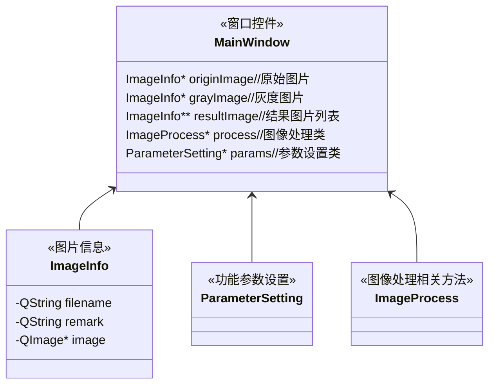

- **author：Shuxin_Wang**
- **email:shuxinwang662@gmail.com**
- **time：2022.09.27**

# 一、模块框架

- 图片信息类`ImageInfo`
  - 文件名称
  - 图片信息备注
  - 图片对象
- 全局参数设置类`ParameterSetting`
  - 调整图像处理相关方法的参数以观察不同结果
- 图像处理相关方法类`ImageProcess`
  - 封装了图像相关方法

# 二、模块详述

## 2.1 图片信息类`ImageInfo`

该类封装了图片的文件名称、图片的备注信息（比如图片来源与操作结果是否成功），并封装了相关操作函数；

## 2.2 图像处理相关方法类`ImageProcess`

封装了图像处理相关方法

## 2.3 UI窗口类`MainWindow`

- 可以实现不同格式图片的读取，同时显示图像灰度图；
- 对于后续运行不同参数的功能时，可以实现**动态数目的结果图片**显示；

具体框架如下：

