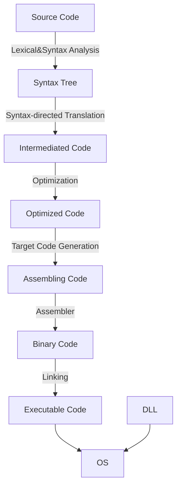
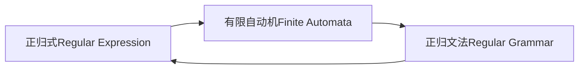

# 编译原理

**@ author: Shuxin-Wang**

**@ time: 2022-09-18**

[TOC]

# 1 Introduction to Compiling

## 1.1 The Phases of a Compiler

# 2 语言与语法

## 2.1 基本术语与概念

### 2.1.1 字母表和符号

- 符号：语言中***<u>不可再分</u>***的单位；
- 字母表：符号的***非空有穷***集合；

> $\sum,V$或其他大写字母；
>
> $V_1=\{a,b,c\}$
>
> $V_2= \{+,-,0,1,...,9\}$
>
> $\sum = \{x|x\in ASCII字符\}$

### 2.1.2 符号串

- 某**字母表上**的符号的***有穷集合***

>a, b, c, abc, bc,…：V1上的符号串
>
>1250, +2, -1835,…：V2上的符号串
>
>空串（ε）：不含任何符号的串

### 2.1.3 语句

- 字符表上符合某种***<u>构成规则</u>***的符号串序列
- 用$a,b,c,...$表示符号；用$\alpha,\beta,\gamma,...$表示符号串；用$A,B,C,...$表示符号或符号串的集合

### 2.1.4 语言

- 某字母表上的句子集合

### 2.1.5 符号串集合的积

- 设串集$A=\{\alpha_1,\alpha_2,...\},B=\{\beta_1,\beta_2,...\},$二者的笛卡尔积$AB=\{\alpha\beta|\alpha\in A, \beta\in B\}$

> 若$A=\{a,b\},B=\{c,e,d\},$那么$AB=\{ac,ae,ad,bc,be,bd\}$

### 2.1.6 字符串集合的幂

- $A^0=\{\epsilon\},$
- $A^n=AA^{n-1}$

> 若$|A| = m,$那么，$|A^0|=1,|A^1|=m,|A^n|=m^n$

### 2.1.7 Kleene闭包和正闭包

- Kleene闭包：$A^*=A^0\cup A^1\cup A^2\cup...$
- 正闭包：$A^+=A^*-\{\epsilon\}$
- 一个语言是其字母表上闭包的子集

### 2.1.8 文法Grammar

- 表达语言构成规则的形式化方法$G=(V_N,V_T,S,P)$

> $V_N$：非终结符集
>
> $V_T$：终结符集
>
> $S$：文法开始符号
>
> $P$：产生式     $A→\alpha$
>
> $<句子> → <主语><谓语><宾语>$

### 2.1.9 推导与规约

- 推导：使用产生式的右部取代左部的过程；
- 归约：推导的逆过程，用产生式的左部取代右部的过程；

- 最左推导和最右推导称为规范推导；
- 最左归约和最右归约称为规范归约。

### 2.1.10 句型、句子与语言

- 句型：从文法开始符号S开始，每步推导（包括0步推导）所得到的字符串$\alpha$,$S→\alpha,\text{其中}\alpha\in(V_N,V_T)^*$；
- 句子：***<u>仅含终结符</u>***的句型；
- 语言：由S推导所得的句子的集合

> $L(G)=\{\alpha|S→\alpha,且\alpha\in V_T^*\}$,G为文法

### 2.1.11文法规则的递归定义

- 非终结符的定义中包含了非终结符自身

> $设\sum = \{0,1\}$
>
> $<S>\rightarrow<D><S><D>$
>
> $<D>\rightarrow0|1$

- 使用递归定义时要谨慎，要有递归出口，否则，可能永远产生不出句子

  

### 2.1.12 扩充的BNF表示

- $()$——提因子

> $U\rightarrow ax|ay|az改写成U\rightarrow a(x|y|z)$

- $\{\}$——重复次数指定

> $<标识符>\rightarrow<字母>\{<字母>|<数字>\}_{(0)}^{(5)}$

- $[\ \ ]$——任选符号

> $<整数>\rightarrow[+|-]<数字>\{<数字>\}$

## 2.2 文法与语言的形式定义

- 表达语言构成规则的形式化方法$G=(V_N,V_T,S,P)$

> $V_N$：非终结符集
>
> $V_T$：终结符集
>
> $S$：文法开始符号
>
> $P$：产生式     $A→\alpha$

$V=(V_N\cup V_T)$，称作文法符号集合

### 2.2.1 Chomsky 0型文法

- $P中产生式\alpha\rightarrow\beta,其中\alpha\in V^+并且至少含有一个非终结符,\beta\in V^*$

> 是对产生式限制最少的文法；识别0型语言的自动机称为图灵机(TM)；对0型文法的产生式作某些限制，可以得到其他类型的文法;

### 2.2.2 Chomsky 1型文法

- $1.\ \alpha\rightarrow\beta,除可能有S\rightarrow\epsilon外均有|\beta|\ge|\alpha|,若有S\rightarrow\epsilon,规定S不得出现在产生式右部$;
- $1^`.\ \alpha\rightarrow\beta,除可能有S\rightarrow\epsilon外均有\alpha A\beta \rightarrow\alpha\gamma\beta, 其中\alpha,\beta\in V^*,A\in V_N,\gamma\in V^+ $;

> 长度增加文法（上下文有关文法）
>
> 1型文法对非终结符进行替换时必须考虑上下文；
>
> 除文法开始符号外不允许将其它的非终结符替换成$\epsilon$；识别1型语言的自动机称为线性界限自动机(LBA)；

### 2.2.3 Chomsky 2型文法

- $P中产生式具有形式A\rightarrow\beta,其中A\in V_N,\beta\in V^*$；

> 产生式左部一定是非终结符，产生式右部可以是$V_N 、V_T或\epsilon$
>
> 非终结符的替换不必考虑上下文，故也称作上下文无关文法；识别2型语言的自动机称为下推自动机(PDA)。

### 2.2.4 Chomsky 3型文法

- $P中产生式具体形式A\rightarrow\alpha B,A\rightarrow\alpha.或者A\rightarrow B\alpha,A\rightarrow \alpha,其中A,B\in V_N,\alpha\in V^+$

> 也称为正规文法RG、线性文法：若所有产生式均是左线性，则称为左线性文法；若所有产生式均是右线性，则称为右线性文法。
>
> 产生式要么均是右线性产生式，要么是左线性产生式，不能既有左线性产生式，又有右线性产生式；识别3型语言的自动机称为有限状态自动机。

### 2.2.5 文法产生语言

> 例1- 3型

$$
设G_1=(\{S\},\{a,b\},S,P),其中P为：\\
(0)S\rightarrow aS\\
(1)S\rightarrow a\\
(2)S\rightarrow b
$$

- $L(G_1)=\{a^i(a|b)|i\ge0\}$\

> 例2 - 2型

$$
设G_1=(\{S\},\{a,b\},S,P),其中P为：\\
(0)S\rightarrow aSb\\
(1)S\rightarrow ab
$$

- $L(G_2)=\{a^nb^n|n\ge1\}$

> 例3 - 1型

$$
设G_1=(\{S,A,B\},\{a,b,c\},S,P),其中P为：\\
(0)S\rightarrow aSAB\\
(1)S\rightarrow abB\\
(2)BA\rightarrow AB\\
(3)bA\rightarrow bb\\
(4)bB\rightarrow bc\\
(5)cB\rightarrow cc
$$

- $L(G_3)=\{a^nb^nc^n|n\ge 1\}$

## 2.3 文法构造与文法简化

### 2.3.1 文法构造例子

- 构造形如$a^{mi}b^{ni}$的语言的文法

$$
S\rightarrow a...aSb...b | \epsilon
$$

- $a^ib^j,(i\ge 2j,j\ge 1)$

$$
\rightarrow a^{i-2j}a^{2j}b^j
$$

- $S\in\{a,b\}^*,限制a,b个数$

> 利用状态机方法解决

### 2.3.2 文法的简化

***简化步骤：***

1. 删除形如P→P的产生式；
2. 删除永不被使用的产生式，即由文法的开始符号无法推导出其左部；
3. 删除不能从中导出终结符串的产生式；
4. 整理产生式；

> 简化示例

| (0)S  →  Be | (5)B →Ce    |
| ----------- | ----------- |
| (1)S  →  Ec | (6)B  → Af  |
| (2)A → Ae   | (7)C  →  Cf |
| (3)A → e    | (8)D →  f   |
| (4)A → A    |             |

- ***<u>简化后：</u>***

| (0)  S →  Be | (2)A  → e  |
| ------------ | ---------- |
| (1)A  →  Ae  | (3)B  → Af |

### 2.3.3 构造无$\epsilon$产生式的上下文无关文法

***<u>满足条件：</u>***

- 若P中含$S \rightarrow \epsilon$ ，则S不出现在任何产生式右部，其中S为文法的开始符号；
- P中不再含有其它任何e产生式。

***<u>变换算法：</u>***

$G = (V_N, V_T, P, S)\Rightarrow G^`=(V_N^`, V_T^`,P^`,S^`)$

1. G满足如下定义的非终结符集合

$$
V_0=\{A|A\in V_N,A\rightarrow^+\epsilon\}
$$

2. 构造产生式集合$P^`$
   1. 若产生式$B\rightarrow a_0B_1a_1B_2…B_ka_k$属于P，其中$a_j \in V^* (0 \le j \le k)，B_i \in V_0$，那么将这些$B_i$分别以$\epsilon$和$B_i$本身这两种形式替代，然后将有关B的所有产生式扣除$\epsilon$产生式后加入到P’中
   2. 其它产生式扣除$\epsilon$产生式后（原来就有，或者由步骤1产生）也投入到P’中
   3. n如果P中有产生式$S\rightarrow\epsilon$（原来就有，或者由步骤1产生），且S出现在产生式的右部，则将它扣除并增加如下产生式： $S’ \rightarrow \epsilon|S$，将S’加入VN’，文法开始符号变为S’

> 例题

$$
设G_1=(\{S\},\{a,b\},P,S),其中\\
P:\\
(0)S\rightarrow \epsilon\\
(1)S\rightarrow aSbS\\
(2)S\rightarrow bSaS
$$

- $V_0={S}$
- $P':S\rightarrow abS|aSbS|aSb|ab\\S\rightarrow baS|bSaS|bSa|ba\\S'\rightarrow\epsilon|S$
- $G'_1=(\{S',S\},\{a,b\},P',S')$

## 2.4 语法树与文法的二义性

### 2.4.1 语法树

> (0) S→aB
>
> (1)S→bA
>
> (2)A → a
>
> (3)A → aS
>
> (4)A → bAA
>
> (5)B → aBB
>
> (6)B → bS
>
> (7)B →b

### 2.4.2 基本术语

- 子树：除叶子结点之外的任意结点连同它的所有子孙结点构成子树；
- 修剪子树：剪去子树树根的所有子孙节点，对应于归约（一步或多步）；
- 句型：由树的末端符（叶结点）从左至右连成的串是文法的一个句型；
- 短语：子树的末端符号自左到右连成串，相对于子树树根而言称为短语；
- 简单短语(直接短语)：若短语是某子树根经过1步推导得到的，则称之为该子树根的简单短语；
- 句型的短语：某句型中的短语（属于某子树）；
- 句柄：句型中的最左简单短语。是最左归约时要寻找的简单短语；

### 2.4.3 文法的二义性

- 如果文法的一个句子存在对应的两棵或两棵以上的语法树，则该句子是二义的；
- 包含二义性句子的文法是二义文法；

***<u>评论：</u>***

- 二义性会给语法分析带来不确定性；
- 文法的二义性是不可判定的，即不存在算法，能够在有限步数内确切判定一个文法是否为二义文法；
- 若要证明是二义性，只要举出一例；
- 二义文法并非绝对必需去除的；

# 语言构造文法的方法⭐

# 3 词法分析 Lexical Analysis

## 3.1 正规文法和有限自动机

### 3.1.1 正规文法、正规集与正规式

由正规文法产生的语言称作正规集。正规集是集合，可以是有穷的也可以是无穷的，用一种形式化的方法——正规式（Regular Expression **Re**）进行描述。

#### 1.正规式Re规则

设$A$是非空的有限字母表，$A =\{a_i|i=1,2,\dots,n\}$，则：

- $\varepsilon,\varnothing,a_i(i=1,2,\dots,n)$都是Re；
- 若$\alpha,\beta$是Re，则$\alpha|\beta,\alpha\beta,\alpha^*,\beta^*$也是Re；
- Re只能通过有限次使用1，2规则来获得。

