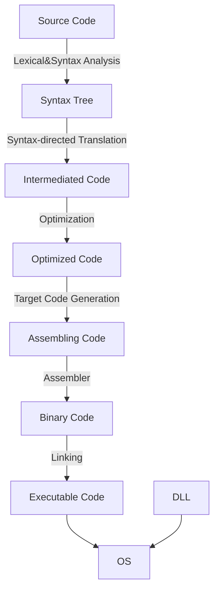

# 编译原理

**@ author: Shuxin-Wang**

**@ time: 2022-09-18**

[TOC]

# 1 Introduction to Compiling

## 1.1 The Phases of a Compiler

# 2 语言与语法

## 2.1 基本术语与概念

### 2.1.1 字母表和符号

- 符号：语言中***<u>不可再分</u>***的单位；
- 字母表：符号的***非空有穷***集合；

> $\sum,V$或其他大写字母；
>
> $V_1=\{a,b,c\}$
>
> $V_2= \{+,-,0,1,...,9\}$
>
> $\sum = \{x|x\in ASCII字符\}$

### 2.1.2 符号串

- 某**字母表上**的符号的***有穷集合***

>a, b, c, abc, bc,…：V1上的符号串
>
>1250, +2, -1835,…：V2上的符号串
>
>空串（ε）：不含任何符号的串

### 2.1.3 语句

- 字符表上符合某种***<u>构成规则</u>***的符号串序列
- 用$a,b,c,...$表示符号；用$\alpha,\beta,\gamma,...$表示符号串；用$A,B,C,...$表示符号或符号串的集合

### 2.1.4 语言

- 某字母表上的句子集合

### 2.1.5 符号串集合的积

- 设串集$A=\{\alpha_1,\alpha_2,...\},B=\{\beta_1,\beta_2,...\},$二者的笛卡尔积$AB=\{\alpha\beta|\alpha\in A, \beta\in B\}$

> 若$A=\{a,b\},B=\{c,e,d\},$那么$AB=\{ac,ae,ad,bc,be,bd\}$

### 2.1.6 字符串集合的幂

- $A^0=\{\epsilon\},$
- $A^n=AA^{n-1}$

> 若$|A| = m,$那么，$|A^0|=1,|A^1|=m,|A^n|=m^n$

### 2.1.7 Kleene闭包和正闭包

- Kleene闭包：$A^*=A^0\cup A^1\cup A^2\cup...$
- 正闭包：$A^+=A^*-\{\epsilon\}$
- 一个语言是其字母表上闭包的子集

### 2.1.8 文法Grammar

- 表达语言构成规则的形式化方法$G=(V_N,V_T,S,P)$

> $V_N$：非终结符集
>
> $V_T$：终结符集
>
> $S$：文法开始符号
>
> $P$：产生式     $A→\alpha$
>
> $<句子> → <主语><谓语><宾语>$

### 2.1.9 推导与规约

- 推导：使用产生式的右部取代左部的过程；
- 归约：推导的逆过程，用产生式的左部取代右部的过程；

- 最左推导和最右推导称为规范推导；
- 最左归约和最右归约称为规范归约。

### 2.1.10 句型、句子与语言

- 句型：从文法开始符号S开始，每步推导（包括0步推导）所得到的字符串$\alpha$,$S→\alpha,\text{其中}\alpha\in(V_N,V_T)^*$；
- 句子：***<u>仅含终结符</u>***的句型；
- 语言：由S推导所得的句子的集合

> $L(G)=\{\alpha|S→\alpha,且\alpha\in V_T^*\}$,G为文法

### 2.1.11文法规则的递归定义

- 非终结符的定义中包含了非终结符自身

> $设\sum = \{0,1\}$
>
> $<S>\rightarrow<D><S><D>$
>
> $<D>\rightarrow0|1$

- 使用递归定义时要谨慎，要有递归出口，否则，可能永远产生不出句子

  

### 2.1.12 扩充的BNF表示

- $()$——提因子

> $U\rightarrow ax|ay|az改写成U\rightarrow a(x|y|z)$

- $\{\}$——重复次数指定

> $<标识符>\rightarrow<字母>\{<字母>|<数字>\}_{(0)}^{(5)}$

- $[\ \ ]$——任选符号

> $<整数>\rightarrow[+|-]<数字>\{<数字>\}$

## 2.2 文法与语言的形式定义

- 表达语言构成规则的形式化方法$G=(V_N,V_T,S,P)$

> $V_N$：非终结符集
>
> $V_T$：终结符集
>
> $S$：文法开始符号
>
> $P$：产生式     $A→\alpha$

$V=(V_N\cup V_T)$，称作文法符号集合

### 2.2.1 Chomsky 0型文法

- $P中产生式\alpha\rightarrow\beta,其中\alpha\in V^+并且至少含有一个非终结符,\beta\in V^*$

> 是对产生式限制最少的文法；识别0型语言的自动机称为图灵机(TM)；对0型文法的产生式作某些限制，可以得到其他类型的文法;

### 2.2.2 Chomsky 1型文法

- $1.\ \alpha\rightarrow\beta,除可能有S\rightarrow\epsilon外均有|\beta|\ge|\alpha|,若有S\rightarrow\epsilon,规定S不得出现在产生式右部$;
- $1^`.\ \alpha\rightarrow\beta,除可能有S\rightarrow\epsilon外均有\alpha A\beta \rightarrow\alpha\gamma\beta, 其中\alpha,\beta\in V^*,A\in V_N,\gamma\in V^+ $;

> 长度增加文法（上下文有关文法）
>
> 1型文法对非终结符进行替换时必须考虑上下文；
>
> 除文法开始符号外不允许将其它的非终结符替换成$\epsilon$；识别1型语言的自动机称为线性界限自动机(LBA)；

### 2.2.3 Chomsky 2型文法

- $P中产生式具有形式A\rightarrow\beta,其中A\in V_N,\beta\in V^*$；

> 产生式左部一定是非终结符，产生式右部可以是$V_N 、V_T或\epsilon$
>
> 非终结符的替换不必考虑上下文，故也称作上下文无关文法；识别2型语言的自动机称为下推自动机(PDA)。

### 2.2.4 Chomsky 3型文法

- $P中产生式具体形式A\rightarrow\alpha B,A\rightarrow\alpha.或者A\rightarrow B\alpha,A\rightarrow \alpha,其中A,B\in V_N,\alpha\in V^+$

> 也称为正规文法RG、线性文法：若所有产生式均是左线性，则称为左线性文法；若所有产生式均是右线性，则称为右线性文法。
>
> 产生式要么均是右线性产生式，要么是左线性产生式，不能既有左线性产生式，又有右线性产生式；识别3型语言的自动机称为有限状态自动机。

### 2.2.5 文法产生语言

> 例1- 3型

$$
设G_1=(\{S\},\{a,b\},S,P),其中P为：\\
(0)S\rightarrow aS\\
(1)S\rightarrow a\\
(2)S\rightarrow b
$$

- $L(G_1)=\{a^i(a|b)|i\ge0\}$\

> 例2 - 2型

$$
设G_1=(\{S\},\{a,b\},S,P),其中P为：\\
(0)S\rightarrow aSb\\
(1)S\rightarrow ab
$$

- $L(G_2)=\{a^nb^n|n\ge1\}$

> 例3 - 1型

$$
设G_1=(\{S,A,B\},\{a,b,c\},S,P),其中P为：\\
(0)S\rightarrow aSAB\\
(1)S\rightarrow abB\\
(2)BA\rightarrow AB\\
(3)bA\rightarrow bb\\
(4)bB\rightarrow bc\\
(5)cB\rightarrow cc
$$

- $L(G_3)=\{a^nb^nc^n|n\ge 1\}$

## 2.3 文法构造与文法简化

### 2.3.1 文法构造例子

- 构造形如$a^{mi}b^{ni}$的语言的文法

$$
S\rightarrow a...aSb...b | \epsilon
$$

- $a^ib^j,(i\ge 2j,j\ge 1)$

$$
\rightarrow a^{i-2j}a^{2j}b^j
$$

- $S\in\{a,b\}^*,限制a,b个数$

> 利用状态机方法解决

### 2.3.2 文法的简化

***简化步骤：***

1. 删除形如P→P的产生式；
2. 删除永不被使用的产生式，即由文法的开始符号无法推导出其左部；
3. 删除不能从中导出终结符串的产生式；
4. 整理产生式；

> 简化示例

| (0)S  →  Be | (5)B →Ce    |
| ----------- | ----------- |
| (1)S  →  Ec | (6)B  → Af  |
| (2)A → Ae   | (7)C  →  Cf |
| (3)A → e    | (8)D →  f   |
| (4)A → A    |             |

- ***<u>简化后：</u>***

| (0)  S →  Be | (2)A  → e  |
| ------------ | ---------- |
| (1)A  →  Ae  | (3)B  → Af |

### 2.3.3 构造无$\epsilon$产生式的上下文无关文法

***<u>满足条件：</u>***

- 若P中含$S \rightarrow \epsilon$ ，则S不出现在任何产生式右部，其中S为文法的开始符号；
- P中不再含有其它任何e产生式。

***<u>变换算法：</u>***

$G = (V_N, V_T, P, S)\Rightarrow G^`=(V_N^`, V_T^`,P^`,S^`)$

1. G满足如下定义的非终结符集合

$$
V_0=\{A|A\in V_N,A\rightarrow^+\epsilon\}
$$

2. 构造产生式集合$P^`$
   1. 若产生式$B\rightarrow a_0B_1a_1B_2…B_ka_k$属于P，其中$a_j \in V^* (0 \le j \le k)，B_i \in V_0$，那么将这些$B_i$分别以$\epsilon$和$B_i$本身这两种形式替代，然后将有关B的所有产生式扣除$\epsilon$产生式后加入到P’中
   2. 其它产生式扣除$\epsilon$产生式后（原来就有，或者由步骤1产生）也投入到P’中
   3. n如果P中有产生式$S\rightarrow\epsilon$（原来就有，或者由步骤1产生），且S出现在产生式的右部，则将它扣除并增加如下产生式： $S’ \rightarrow \epsilon|S$，将S’加入VN’，文法开始符号变为S’

> 例题

$$
设G_1=(\{S\},\{a,b\},P,S),其中\\
P:\\
(0)S\rightarrow \epsilon\\
(1)S\rightarrow aSbS\\
(2)S\rightarrow bSaS
$$

- $V_0={S}$
- $P':S\rightarrow abS|aSbS|aSb|ab\\S\rightarrow baS|bSaS|bSa|ba\\S'\rightarrow\epsilon|S$
- $G'_1=(\{S',S\},\{a,b\},P',S')$

## 2.4 语法树与文法的二义性

### 2.4.1 语法树

> (0) S→aB
>
> (1)S→bA
>
> (2)A → a
>
> (3)A → aS
>
> (4)A → bAA
>
> (5)B → aBB
>
> (6)B → bS
>
> (7)B →b

### 2.4.2 基本术语

- 子树：除叶子结点之外的任意结点连同它的所有子孙结点构成子树；
- 修剪子树：剪去子树树根的所有子孙节点，对应于归约（一步或多步）；
- 句型：由树的末端符（叶结点）从左至右连成的串是文法的一个句型；
- 短语：子树的末端符号自左到右连成串，相对于子树树根而言称为短语；
- 简单短语(直接短语)：若短语是某子树根经过1步推导得到的，则称之为该子树根的简单短语；
- 句型的短语：某句型中的短语（属于某子树）；
- 句柄：句型中的最左简单短语。是最左归约时要寻找的简单短语；

### 2.4.3 文法的二义性

- 如果文法的一个句子存在对应的两棵或两棵以上的语法树，则该句子是二义的；
- 包含二义性句子的文法是二义文法；

***<u>评论：</u>***

- 二义性会给语法分析带来不确定性；
- 文法的二义性是不可判定的，即不存在算法，能够在有限步数内确切判定一个文法是否为二义文法；
- 若要证明是二义性，只要举出一例；
- 二义文法并非绝对必需去除的；

# 语言构造文法的方法⭐

由语言构造文法的常用方法有4个：

- 对称法
- 逐步求精法（分解法）
- 等价法
- 电路状态转换法

## 对称法

适用于存在对称性的语言，方法如下：

1. 找出对称轴
2. 找出对称性

**<u>*列题：*</u>**
$$
L=\{a^{2n}b^n|n>1\ and\ a,b\in V_T\}
$$
观察可得：

- $n=1时，L=aab$；
- $n=2时，L=aaaab\Rightarrow L=aa\mathbf{aab}b $

我们可以推出以下文法：
$$
(1)S\Rightarrow aaSb\\
(2)S\Rightarrow aab
$$

## 逐步求精法（分解法）

1. 两种方法：**自上而下**或者**从左到右**；

2. 使用条件：语言各成分之间没有关联；

**<u>*例题：*</u>**
$$
L_2=\{a^ib^jc^k|i,j,k\ge 1\ and\ a,b \in V_T\}
$$

- 自上而下求精法：

分析：

我们把$a^i,b^j,c^k$各自看成一个整体，由$i\ge 1$，语言中最少存在一个$a$，所以可以写成这样的文法：$A\Rightarrow aA|a$。同理可以得到其他两个，推出以下文法：
$$
(1)S\Rightarrow ABC\\
(2)A\Rightarrow aA|a\\
(3)B\Rightarrow bB|b\\
(4)C\Rightarrow cC|c
$$

- 从左向右求精法：

分析：

$a^ib^jc^k = a^*a^{i-1}b^jc^k$，其中$i-1\ge 0$。当$i-1\ge1$时，$S\Rightarrow aS$；当$i-1=0时，S\Rightarrow aA$。$A$对应语言是$b^jc^k$，同理可以推出以下文法：
$$
(1)S\Rightarrow aS|aA\\
(2)A\Rightarrow bA|bB\\
(3)B\Rightarrow cB|c
$$

## 等价法

**产生式两边具有相同特性**

**<u>*例题：*</u>**
$$
L_3 =\{\omega|\omega\in(a,b)^*\ and\ a,b数量相同\}
$$
分析：

首先我们写出下面三个产生式：

- 当以$a$开头时，$S\Rightarrow aA$
- 当以$b$开头时，$S\Rightarrow bB$
- $S$可以为空，$S\Rightarrow \epsilon$

在$S、A、B$中，$a，b$的数量满足：

- $S:\ |a|=|b|$
- $A:\ |a|+1=|b|$
- $B:\ |b|+1=|a|$

在$A$中，若以$b$开头：$A\Rightarrow bS|b$；若以$a$开头：$A\Rightarrow aAA$

同理推出以下文法：
$$
(1)S\Rightarrow aA|bB|\epsilon\\
(2)A\Rightarrow bS|b|aAA\\
(3)B\Rightarrow aS|a|bBB
$$

## 电路状态转换法

**语言中对元素有奇偶要求**

电路状态概念：0代表偶，1代表奇；

比如000代表语言中a，b，c的个数都是偶数，现在增加一个a，那么电路状态就转换成100，同理b，c如下图：

**<u>*结题步骤：*</u>**

1. 构造电路状态转换图

   首先确定状态，如果有n个元素，则存在$2^n$个状态，然后链接状态。下图为3个元素的所有状态转换：

   

2. 确定开始状态和结束状态

   开始状态和结束状态是相对的，视题目具体情况确定：

   - 以全是0作为结束状态，以题目要求作为开始状态；
   - 以题目要求作为结束状态，以全是0作为开始状态；
   - 比如对于某种语言，以a或b开头，以c结尾，abc的数量皆是偶数，那么开始状态就不是唯一的，就不能用全是0作为开始状态。而结束状态是唯一的，所以可以拿全是0作为结束状态；

3. 命名各个状态

   初始状态用$S$命名，其他状态用$A,B,C\dots$命名；

4. 写出相应的产生式

   每条边的变化都对应一条产生式，对结束状态要增加一条产生式：$G\Rightarrow \epsilon$，严格来说，最后可以写出$2^{n}(n+1)+1$条产生式；

**<u>*例题：*</u>**
$$
L_4=\{\omega|\omega\in(0,1)^*,1的数量为偶数\}
$$
电路状态转换图如下所示：

由题可得，共有两个状态：

- $S$：1的数量为偶数，$A$：1的数量为奇数；
- $S$作为终止状态；

根据状态转换图推出以下产生式：
$$
(1)S\Rightarrow 0S|1A|\epsilon\\
(2)A\Rightarrow 0A|1S
$$

# 3 词法分析 Lexical Analysis

## 3.1 正规文法

### 3.1.1 正规文法、正规集与正规式

由正规文法产生的语言称作正规集。正规集是集合，可以是有穷的也可以是无穷的，用一种形式化的方法——正规式（Regular Expression **Re**）进行描述。

设$A$是非空的有限字母表，$A =\{a_i|i=1,2,\dots,n\}$，则：

- $\varepsilon,\varnothing,a_i(i=1,2,\dots,n)$都是Re；
- 若$\alpha,\beta$是Re，则$\alpha|\beta,\alpha\beta,\alpha^*,\beta^*$也是Re；
- Re只能通过有限次使用1，2规则来获得。

### 3.1.2 正则规则

1. $\varepsilon$是基本的正规表达式；

2. 构成符号：

   - $|$：或；

   - $\cdot$：连接connect；

   - $*$：闭包closure；

     优先级：$*>\cdot>|$

3. 代数定律

|              定律              |            描述             |
| :----------------------------: | :-------------------------: |
|           $r|s=s|r$            |          $|$可交换          |
|       $r|(s|t)=(r|s)|t$        |          $|$可结合          |
|         $r(st)=(rs)t$          |         连接可结合          |
|  $r(s|t)=rs|rt;(s|t)r=sr|tr$   |       连接对$|$可分配       |
| $\varepsilon r=r\varepsilon=r$ | $\varepsilon$是连接的单元位 |
|    $r^*=(r|\varepsilon)^*$     | 闭包中一定包含$\varepsilon$ |
|          $r^{**}=r^*$          |      $^*$具有灯幂等性       |

4. 正规定义

如果$\sum$是基本符号的集合，那么一个正则定义（regular definition）是具有如下形式的定义序列：
$$
d_1\Rightarrow r_1\\
d_2\Rightarrow r_2\\
\dots\\
d_n\Rightarrow r_n\\
$$
其中：

- 每个$d_i$都是一个新符号，它们不在$\sum$中，并且各不相同；
- 每个$r_i$是字母表$\sum\cup\{d_1,d_2,\dots,d_{i-1}\}$上的正则表达式；

5. 其他简化符号

- `+`：一个或多个；
- `?`：零个或一个，$r?$是$r|\varepsilon$的简写；
- `[a-z]`：字符类；

## 3.2 有穷自动机Finaite Automata

### 3.2.1 状态转换图

- 状态state，用节点或圆圈表示。状态包括开始状态和最终状态
  - 最终状态：又称接收状态，用双圈圆圈表示；
  - 开始状态：又称起始状态，该状态用一条没有出发节点、标号为start的边知名；
- 边edge，从一个状态指向另一个状态，每个标号包括一个或多个符号；

### 3.2.2 有穷自动机

有穷自动机Finite automata，简称FA，是识别器，它们只能对每个可能的输入串简单地回答“是”或“否”。有穷自动机分为不确定的有穷自动机（NFA）和确定的有穷自动机（DFA）。

FA范式表达：$FA(S,s_0,F,\sum,map/move)$

- $S$：有穷状态集合；
- $s_0$：开始状态；
- $F$：终止状态集合；
- $\sum$：输入符号集合；
- $map/move$：映射；

### 3.2.3 不确定的有穷自动机

**不确定的有穷自动机(Nondeterministic Finite Automata，NFA)**对其边上的标号没有任何限制。每个符号标记离开同一状态的多于边，并且空串$\varepsilon$也可以作为标号。

NFA范式表达：$M(S,\sum,move,s_0,F)$

- $S$：有穷状态集合；
- $\sum$：输入符号集合；
- $move$：转换函数，它为每个状态中的每个符号都会给出相应的后继状态的集合；

>A mapping $from\ S\times\sum\ to\ 2^S,move(s,a)=2^S,2^S\in S$

- $s_0$：开始状态；
- $F$：终止状态集合；

### 3.2.4 确定的有穷自动机

**确定的有穷自动机(Deterministic Finite Automata，DFA)**中每个状态及自动机输入字母表中的每个符号有且只有一条离开该状态、以该符号为标号的边。

DFA范式表达：$M(S,\sum,move,s_0,F)$

- $S$：有穷状态集合；
- $\sum$：输入符号集合；
- $move$：转换函数，它为每个状态中的每个符号都会给出相应的后继状态的集合；

> A mapping $from\ S\times\sum\ to\ S,move(s,a)=s'$

- $s_0$：开始状态；
- $F$：终止状态集合；

## 3.3 从正则表达式到自动机

### 3.3.1 从正则表达式构造NFA

#### 分解法

较为简介，但这种方法**计算机没法使用**。

1. 引入开始状态和结束状态；
2. 逐步分解；

**<u>*基本组合：*</u>**

#### Thumpson算法

1. 把正则表达式的中缀形式转化为后缀表达式；
2. 将后缀表达式从左向右依次做组合；

**<u>*基本组合*</u>**

- 终结符

- $|$操作：$N(s|t)$

- 连接操作：$N(st)$

- 闭包操作：$N(s^*)$

**<u>*例题：*</u>**
$$
N:=(a^*|b^*)^*ab
$$
Thumpson算法构造NFA结果如下：

### 3.3.2 从NFA构造DFA

#### 空串闭包$\varepsilon-closure(s)$

$\varepsilon-closure(s)$表示由状态$s$经由条件$\varepsilon$可以到达的所有状态的集合。

以上面得到的NFA结果为例，各状态的的空串闭包如下：

- $\varepsilon-closure(0)=\{0,1,2,4,7\}$
- $\varepsilon-closure(1)=\{1,2,4\}$
- $\varepsilon-closure(2)=\{2\}$
- $\varepsilon-closure(3)=\{1,2,3,4,6,7\}$
- $\varepsilon-closure(4)=\{4\}$
- $\varepsilon-closure(5)=\{1,2,4,5,6,7\}$
- $\varepsilon-closure(6)=\{1,2,4,6,7\}$
- $\varepsilon-closure(7)=\{7\}$
- $\varepsilon-closure(8)=\{8\}$
- $\varepsilon-closure(9)=\{9\}$

#### 构建转换表

**<u>*构造步骤：*</u>**

1. 求出初始状态集合$I_0=\varepsilon-closure(\{x\})，x为初始状态s_0$；
2. 根据$I_i求move(I_i,输入)$；
3. 根据$move(I_i,输入),求闭包I_{i+1}=\varepsilon-closure(move(I_i,输入))$；
4. 重复2，3，直到**不出现新的状态集合**；

**<u>*以上面的为例：*</u>**

初始状态集合$I_0=\varepsilon-closure(0)=\{0,1,2,4,7\}$；

$move(I_0,a)$表示从状态$I_0$，经过a到达的状态，即对$I_0=\{0,1,2,4,7\}$里每个元素都考虑是否通过a到达某个状态，从NFA图中我们可以发现，只有状态2和7记过a，分别到达了3和8，所以$move(I_0,a)=\{3,8\}$；

闭包$\varepsilon-closure(move(I_0,a))=\varepsilon-closure(\{3,8\})$，该闭包为状态3和状态8闭包的**<u>并集</u>**，即$\varepsilon-closure(3)\cup\varepsilon-closure(8)=\{1,2,3,4,6,7,8\}$，该状态从未出现过，我们将其作为$I_1$；

整个过程如下

- $ε-closure(0)=\{0,1,2,4,7\}=I_0$;
- $ε-c l o s u r e ( m o v e ( I_0 , a ) ) = ε-c l o s u r e ( \{ 3 , 8 \} ) = \{ 1 , 2 , 3 , 4 , 6 , 7 , 8 \} = I_1 $;
- $ε - c l o s u r e ( m o v e ( I_0 , b ) ) = ε-c l o s u r e ( 5 ) = \{ 1 , 2 , 4 , 5 , 6 , 7 \} = I_2$;
- $ε - c l o s u r e ( m o v e ( I_1 , a ) ) = ε - c l o s u r e ( \{ 3 , 8 \} ) = \{ 1 , 2 , 3 , 4 , 6 , 7 , 8 \} = I_1 $;
- $ε - c l o s u r e ( m o v e ( I_1 , b ) ) = ε - c l o s u r e ( \{ 5 , 9 \} ) = \{ 1 , 2 , 4 , 5 , 6 , 7 , 9 \} = I_3 $;
- $ε - c l o s u r e ( m o v e ( I_2 , a ) ) = ε - c l o s u r e ( \{ 3 , 8 \} ) = \{ 1 , 2 , 3 , 4 , 6 , 7 , 8 \} = I_1 $;
- $ε - c l o s u r e ( m o v e ( I_2 , b ) ) = ε - c l o s u r e ( 5 ) = \{ 1 , 2 , 4 , 5 , 6 , 7 \} = I_2 $;
- $ε - c l o s u r e ( m o v e ( I_3, a ) ) = ε - c l o s u r e ( \{ 3 , 8 \} ) = \{ 1 , 2 , 3 , 4 , 6 , 7 , 8 \} = I_1 $;
- $ε - c l o s u r e ( m o v e ( I_3 , b ) ) = ε - c l o s u r e ( 5 ) = \{ 1 , 2 , 4 , 5 , 6 , 7 \} = I_2 $;

构建DFA转换表：

| 状态  | 输入a | 输入b |
| :---: | :---: | :---: |
| $I_0$ | $I_1$ | $I_2$ |
| $I_1$ | $I_1$ | $I_3$ |
| $I_2$ | $I_1$ | $I_2$ |
| $I_3$ | $I_1$ | $I_2$ |

- 如何判断DFA**终止状态**？

  如果$I_i\cap F \not= \varnothing,F为NFA终止状态集合$，则$I_i$为DFA终止状态；

该例中，NFA终止状态为{9}，所以DFA终止状态为$\{I_3\}$；

所以得到的DFA范式表达为：
$$
DFA:=(S=\{I_0,I_1,I_2,I_3\},\sum=\{a,b\},move,s_0=I_0,F=\{I_3\})\\
move(I_i,s),I_i\in S,s\in \sum,即刚刚构建的DFA转换表
$$

### 3.3.3 DFA简化

#### 消除多余状态

**<u>*多余状态：*</u>**

- 从该状态出发没有通路到达最终状态；
- 从开始状态出发，任何输入串也不能到达的那个状态；

处理方法：直接删除

#### 合并等价状态

**<u>*等价状态：*</u>**

- **一致性条件**：状态s和状态t必须同时为终态或非终态；
- **蔓延性条件**：对于所有输入符号，状态s和状态t必须转化到等价的状态里；

处理方法：可通过状态转换表判断是否为等价状态（不适合复杂DFA）

#### 状态最小化算法

对于一个$DFA:=(S,\sum,move,s_0,F)$：

1. 构造包含两个组F和S-F的初始划分$\Pi$，两个组分别是DFA的最终状态组和非最终状态组；
2. 最初，令$\Pi_{new}=\Pi$；**对于$\Pi$中的每个组G**：将G分划为更小的组，使得两个状态s和t在同一组中当且仅当所有的输入符号a，状态s和t在a上的转换都到达$\Pi$中同一组；（最坏情况下，每个状态各成一组）在$\Pi_{new}$中将G替换为对G进行分划得到的那些小组，下面处理$\Pi$中的下一组；
3. 如果$\Pi_{new}=\Pi$，令$\Pi_{final}=\Pi$并进行步骤4；否则，将$\Pi_{new}$代替$\Pi$并重复步骤2；
4. 在分划$\Pi_{final}$的每个组中选取一个状态作为改组的代表。这些代表构成最少DFA'的状态。DFA'的其他部分按如下步骤构建：
   - DFA'的开始状态是包含DFA的开始状态的代表；
   - DFA'的接受状态是那些包含了DFA的接受状态组的代表；
   - 令s是$\Pi_{final}$中某个组G的代表，并令DFA中在输入a上离开s的转换到达t。令r为t所在组H的代表。那么DFA'中存在一个从s到r在输入a上的转换。
5. 消除DFA'上的多余状态

**<u>*示例：*</u>**

最小化下面的DFA

1. 初始化：$\Pi=\{\{0,1,2\},\{3,4,5,6\}\}$；
2. 1 对与$\Pi$中组{0，1，2}
   - 我们将其分为{0，2}、{1}
     - 对于输入a，$move(\{0,2\},a)=\{1\},move(\{1\},a)=\{3\}$，1与3不在$\Pi$的同一组里，继续划分；
     - 我们将{0,2}分为{0}、{2}
       - 对于输入b:$move(\{0\},b)=\{2\},move(\{2\},b)=\{5\}$，2与5不在$\Pi$的同一组里，组中各个状态已成一组；
   - $\Pi_{new}=\{\{0\},\{1\},\{2\},\{3,4,5,6\}\}$；

2. 2对与$\Pi$中组{3，4，5，6}
   - 对于输入a：$move(\{3,4,5,6\},a)=\{3,6\}$，3与6在同一组里；
   - 对于输入b：$move(\{3,4,5,6\},b)=\{4,5\}$，4与5在同一组里；
   - 不需划分；
   - $\Pi_{new}=\{\{0\},\{1\},\{2\},\{3,4,5,6\}\}$；
3. $\Pi_{new}\not=\Pi,令\Pi=\Pi_{new}$执行步骤2，已不可划分，得到$\Pi_{new2}$
   - $\Pi_{new2}=\{\{0\},\{1\},\{2\},\{3,4,5,6\}\}=\Pi_{new}$；
   - $\Pi_{final}=\Pi_{new}$；
4. 状态3代替{3,4,5,6}，得到最小化结果：

# 4 语法分析Syntax Analysis——自顶向下

## 4.0 概述

语法分析器是编译器的核心，语法分析器从词法分析器获得一个由词法单元组成的串，并验证这个串可以由源语言的文法生成。

语法分析器大体上可以分为三种类型：通用的、**<u>自顶向下</u>**的和**<u>自底向上</u>**的。

编译器中常用的方法可以分为自顶向下的和自底向上的，**<u>*自顶向下的方法从语法分析树的顶部（根节点）开始向底部（叶子节点）构造语法分析树，自底向上则相反*</u>**。语法分析器的输入总是按照从左向右的方式被扫描，每次扫描一个符号。

自顶向下处理文法典型为**LL(1)文法**，自下而上处理文法典型为LR文法。其中LR文法包括SLR、LR(1)、LALR(1)文法。

### 4.0.1 语法错误处理

程序可能有不同层次的错误：

- 词法错误（Lexical）；
- 语法错误（Syntactic）；
- 语义错误（Semantic）；
- 逻辑错误（Logical）；

错误处理目标：

- 清晰精准地报告出现的错误；
- 能很快地从各个错误中恢复，以继续检测后面的错误；
- 尽可能少地增加处理正确程序时的开销；

错误恢复策略：

- 恐慌模式的恢复；
- 短语层次的恢复；
- 错误产生式；

## 4.1 LL(1)文法

### 4.1.1 文法简介

自顶向下语法分析可以被看作是为输入串构造语法分析树的问题，它从语法分析树的根节点开始，按照先跟次序（**深度优先**地）创建这棵语法分析树的各个结点，可以被看作寻找输入串最左推导的过程。

在一个自顶向下语法分析的每一步中，关键问题是确定对一个非终结符号应用哪个产生式。一旦选择了某个产生式，语法分析过程的其余部分负责将相应产生式体中的终结符号和输入相匹配。

**预测分析技术**通过在输入中向前看固定多个符号来选择正确的A的产生式。对于有些文法，**我们可以构造出向前看<u>k个输入符号</u>的预测分析器，这类文法有时也称为LL(k)文法类**。通常情况下我们只需要向前看一个符号（即只看下一个输入符号），即我们讨论研究的**LL(1)**文法。

### 4.1.2 LL(1)文法定义

一个文法G是LL(1)的，当且仅当G的任意两个不同的产生式$A\rightarrow \alpha|\beta$满足下面的条件：

1. **<u>不存在</u>**终结符号a使得$\alpha和\beta$**都能**够推导出以a开头的串；
2. $\alpha和\beta$最多只有一个可以推导出空串；
3. 如果$\beta\Rightarrow^*\varepsilon$，那么$\alpha$不能推导出任何以$FOLLOW(A)$中某个终结符号开头的串，反之亦然；

==**注意：**==

- 条件1，2等价于说$FIRST(\alpha)和FIRST(\beta)$是不相交的集合；
- 条件3等价于，如果$\varepsilon在FIRST(\beta)$中，那么$FIRST(\alpha)$和$FOLLOW(A)$是不相交的集合，反之亦然成立；

$FIRST集与FOLLOW集$将在后面进行介绍；

## 4.2 LL(1)文法判断⭐

LL(1)文法判断有两种方法，一种是根据以上LL(1)文**法定义进行判断**；另一种更常用的方法是**<u>*构造出预测分析表*</u>**进行判断。

LL(1)文法表驱动分析过程：

1. 预处理，对文法进行消除左递归和提取左公因子；
2. 写出预处理文法的First集和Follow集；
3. 构造LL(1)预测分析表(Predictive Parsing Table, PPT)；

后面讲对各个步骤进行详细介绍

### 4.2.1 消除左递归

#### 立即左递归(Immediate left recursion)

存在形如$A\rightarrow A\alpha$的产生式，这是我们认为该产生式存在左递归，该左递归为**立即左递归**，自顶向下语法分析方法不能处理左递归的文法，因此需要一个转换方法来消除左递归。

**<u>*通用消除立即左递归方法：*</u>**

首先将A**全部**产生式分组如下：
$$
A\rightarrow A\alpha_1|A\alpha_2|\dots|A\alpha_m|\beta_1|\beta_2|\dots|\beta_n
$$
其中$\beta_i$**都不是**以$A$开头。然后将这些A产生式替换为：
$$
A\rightarrow \beta_1A'|\beta_2|A'|\dots|\beta_nA'\\
A'\rightarrow \alpha_1A'|\alpha_2A'|\dots|\alpha_mA'|\varepsilon
$$
**<u>*例子：*</u>**
$$
A\rightarrow Aa|ab|b
$$
消除左递归为：
$$
(1)A\rightarrow abA'|bA'\\
(2)A'\rightarrow aA'|\varepsilon
$$

#### 非立即左递归(Indirect left recursion)

形如$P\rightarrow Aa,A\rightarrow Pb|c$的两个产生式，两个非终结符间**构成一个环**，这是我们认为产生式存在非立即左递归（间接左递归）。

**<u>*消除左递归算法：*</u>**

1. 将文法G中的**非终结符**以**<u>某种顺序（由内到外）</u>**排序为$P_1,P_2,\dots,P_n$；
2. 从1到n的每个终结符$P_i$：
   - 从1到i-1的每个终结符$P_j$：
     - 将每个形如$P_i\rightarrow P_j\gamma$的产生式替换为产生式组$P_i\rightarrow \delta_1\gamma|\delta_2\gamma|\dots|\delta_k\gamma$，其中$P_j\rightarrow \delta_1|\delta_2|\dots|\delta_k$是所有$P_j$产生式==（**<u>即将$P_i$产生式中的$P_j$替换成$P_j$产生式的结果</u>**）==；
   - 消除$P_i$产生式之间的立即左递归；
3. 重新排列语法；

**<u>*例子：*</u>**
$$
(1)S\rightarrow Qc|c\\
(2)Q\rightarrow Rb|b\\
(3)R\rightarrow Sa|a
$$

1. 将非终结符由内到外排序为：R,Q,S；

2. 对于R：无操作；

   对于Q：$Q\rightarrow Rb|b \Rightarrow Q\rightarrow Sab|ab|b$；

   - Q无立即左递归；

   对于S：$S\rightarrow Qc|c\Rightarrow S\rightarrow Sabc|abc|bc|c$；

   - S存在立即左递归：

   $$
   (1)S\rightarrow (abc|b|c)S'\\
   (2)S'\rightarrow abcS'|\varepsilon
   $$

3. 因为无法到达R，Q所以删除，最终语法为：

$$
(1)S\rightarrow (abc|b|c)S'\\
(2)S'\rightarrow abcS'|\varepsilon
$$

==**<u>*消除原则：*</u>**==

- 由内到外、从左到右；
- 消除的结果中开始符不能变；

### 4.2.2 提取左公因子

当不清楚应该在两个A产生式中如何选择时，我们可以通过改写产生式来退后这个决定，等我们读入足够多的输入，获得足够信息后再做出选择。

**<u>*提取左公因子方法：*</u>**

对于所有A产生式：
$$
A\rightarrow \alpha\beta_1|\alpha\beta_2|\dots|\alpha\beta_n|\gamma
$$
替换为：
$$
(1)A\rightarrow \alpha A'|\gamma\\
(2)A'\rightarrow \beta_1|\beta_2|\dots|\beta_n
$$

### 4.2.3 构建First集

$FIRST(\alpha)$被定义为可从$\alpha$推导得到的串的首符号，其中$\alpha$是任意的文法符号串。

计算FIRST(`X`)方法规则：

1. 如果X是一个终结符，那么FIRST(X)=X；
2. 如果X是非终结符，X的产生式形如$X\rightarrow aB(a是终结符)$，那么将a加入到FIRST(X)集合中；
3. 如果X是非终结符，X的产生式形如$X\rightarrow Y_1Y_2\dots Y_k(Y_i都为非终结符)$。从左向右看$Y_i$，把$First（Y_i)$加入到FIRST(X)中，如果$First（Y_i)包括\varepsilon$，则再把$First（Y_{i+1})$加入到FIRST(X)，如此重复，直到下一个Y的FIRST不包含$\varepsilon$；
4. 如果$X\rightarrow \varepsilon$是一个产生式，把$\varepsilon$加入到FIRST(X)中；

==**规则2与规则3可以归纳为规则3，为方便理解，这里分开解释**==

### 4.2.4 构建Follow集

对于非终结符A，FOLLOW(A)被定义为可能某些句型中紧跟在A右边的终结符号的集合。

计算规则：

1. 将\$放到FOLLOW(S)中，**其中S是开始符号**，\$是输入右端的结束符号；
2. 如果存在一个产生式$A\rightarrow \alpha B\beta$，那么$FIRST(\beta)-\{\varepsilon\}$加入到FOLLOW(B)中；
3. 如果存在一个产生式$A\rightarrow \alpha B,或存在A\rightarrow \alpha B\beta且\varepsilon \in FIRST(\beta)$，那么将FOLLOW(A)符号加入FOLLOW(B)中；

### 4.2.5 构建预测分析表

构造方法：

对于文法G的每个产生式$A\rightarrow \alpha$，进行如下处理：

1. 对于$FIRST(\alpha)$中的每个终结符号a，将$A\rightarrow \alpha$加入到M[A,a]中；
2. 如果$\varepsilon\in FIRST(\alpha)$中，那么对于FOLLOW(A)中的每个终结符b，将$A\rightarrow \alpha$加入到M[A,b]中。如果$\varepsilon\in FIRST(\alpha)且\$\in FOLLOW(A)$，也将$A\rightarrow \alpha$加入到M(A, \$)中；

在完成上述操作后，如果M[A,a]中没有产生式，那么将M[A,a]设置为error（在表中用空白表示）

### 4.2.6 示例

判断下列文法G是否为LL(1)文法：
$$
0.E\rightarrow E+T|T\\
1.T\rightarrow T*F|F\\
2.F\rightarrow (E)|id
$$

#### 消除左递归

由内到外，从左到右顺序：

1. 产生式2无左递归；
2. 产生式1存在左递归，进行消除

$$
T\rightarrow FT'\\
T'\rightarrow *FT'|\varepsilon
$$

3. 产生式0存在左递归，进行消除

$$
E\rightarrow TE'\\
E'\rightarrow +TE'|\varepsilon
$$

综上，消除左递归后产生文法G'为：
$$
\begin{aligned}
&(0)E\rightarrow TE'\\
&(1)E'\rightarrow +TE'|\varepsilon\\
&(2)T\rightarrow FT'\\
&(3)T'\rightarrow *FT'|\varepsilon\\
&(4)F\rightarrow (E)|id
\end{aligned}
$$

#### 构建First和Follow集

对每个产生式我们可以很容易得到每个产生式的**FIRST集**，如下表所示：
$$
\begin{array}{cc}
产生式&FIRST\\
\hline
E\rightarrow TE' &\{(,id\} \\
\hline
E'\rightarrow +TE' &\{+\} \\

E'\rightarrow \varepsilon &\{\varepsilon\} \\
\hline
T\rightarrow FT' &\{(,id\} \\
\hline
T'\rightarrow *FT' &\{*\} \\

T'\rightarrow \varepsilon &\{\varepsilon\}\\
\hline
F\rightarrow (E) &\{(\} \\

F\rightarrow id &\{id\} \\
\hline
\end{array}
$$
下面我们获取**FOLLOW集**：

`FOLLOW(E)`:

- E为开始符号，所以加入\$；根据产生式$F\rightarrow (E)$得，FOLLOW(E)中加入`(`；
- $FOLLOW(E)=\{(,\$\}$；

`FOLLOW(E')`

- E'只出现在E产生式的右部尾部，所以FOLLOW(E')=FOLLOW(E)；
- $FOLLOW(E’)=\{(,\$\}$；

`FOLLOW(T)`

- 产生式$E'\rightarrow +TE'$，E'在T后面，所以加入FIRST(E')-{ε}，即`+`；又$\varepsilon\in FIRST(E')$，所以FOLLOW(E')加入FOLLOW(T)中；
- $FOLLOW(T)=\{+,(,\$\}$；

`FOLLOW(T')`

- T'只出现在T产生式右部尾部，所以FOLLOW(T')=FOLLOW(T)；
- $FOLLOW(T')=\{+,(,\$\}$；

`FOLLOW(F)`

- 产生式$T'\rightarrow *FT'$，T'在F后面，所以加入FIRST(T')-{ε}，即`*`；又$\varepsilon\in FIRST(T')$，所以FOLLOW(T')加入FOLLOW(F)中；
- $FOLLOW(T)=\{*,+,(,\$\}$；

构建FIRST和FOLLOW表：
$$
\begin{array}{c|c|c}
产生式&FIRST&FOLLOW\\
\hline
E\rightarrow TE' &\{(,id\}&\{(,\$\} \\
\hline
E'\rightarrow +TE' &\{+\} &\{(,\$\} \\

E'\rightarrow \varepsilon &\{\varepsilon\}&\{(,\$\} \\
\hline
T\rightarrow FT' &\{(,id\}&\{+,(,\$\} \\
\hline
T'\rightarrow *FT' &\{*\} &\{+,(,\$\}\\

T'\rightarrow \varepsilon &\{\varepsilon\}&\{+,(,\$\}\\
\hline
F\rightarrow (E) &\{(\} & \{*,+,(,\$\}\\

F\rightarrow id &\{id\} & \{*,+,(,\$\}\\
\hline
\end{array}
$$

#### 构建预测分析表

根据构建规则，构建预测分析表如下：
$$
\begin{array}{c|c|c|c|c|c|c}
(非)终结符&i&+&*&(&)&\$\\
\hline
E&E\rightarrow TE' &  & &E\rightarrow TE' & &\\
\hline
E'& &E'\rightarrow +TE'  & & &E'\rightarrow \varepsilon & E'\rightarrow \varepsilon\\
\hline
T&T\rightarrow ET' &  & &T\rightarrow FT' & &\\
\hline
T'& &T'\rightarrow \varepsilon  &T'\rightarrow *FT' & &T'\rightarrow \varepsilon &T'\rightarrow \varepsilon\\
\hline
F&F\rightarrow id &  & &F\rightarrow (E) & &\\

\end{array}
$$
表中**<u>未出现二义性条目</u>**，**所以文法G'是LL(1)文法，文法G==存在等价==的LL(1)文法**。
