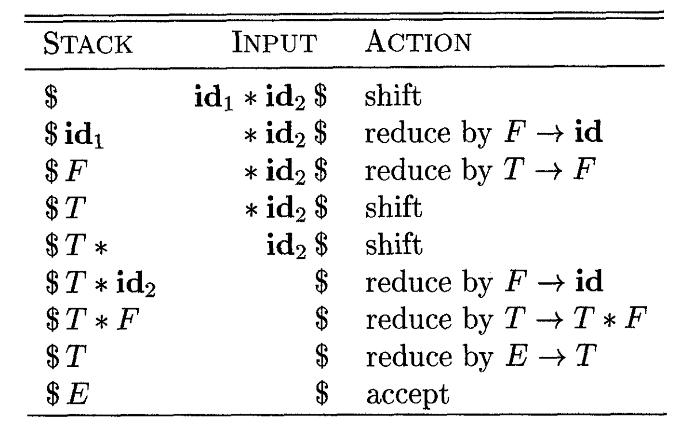
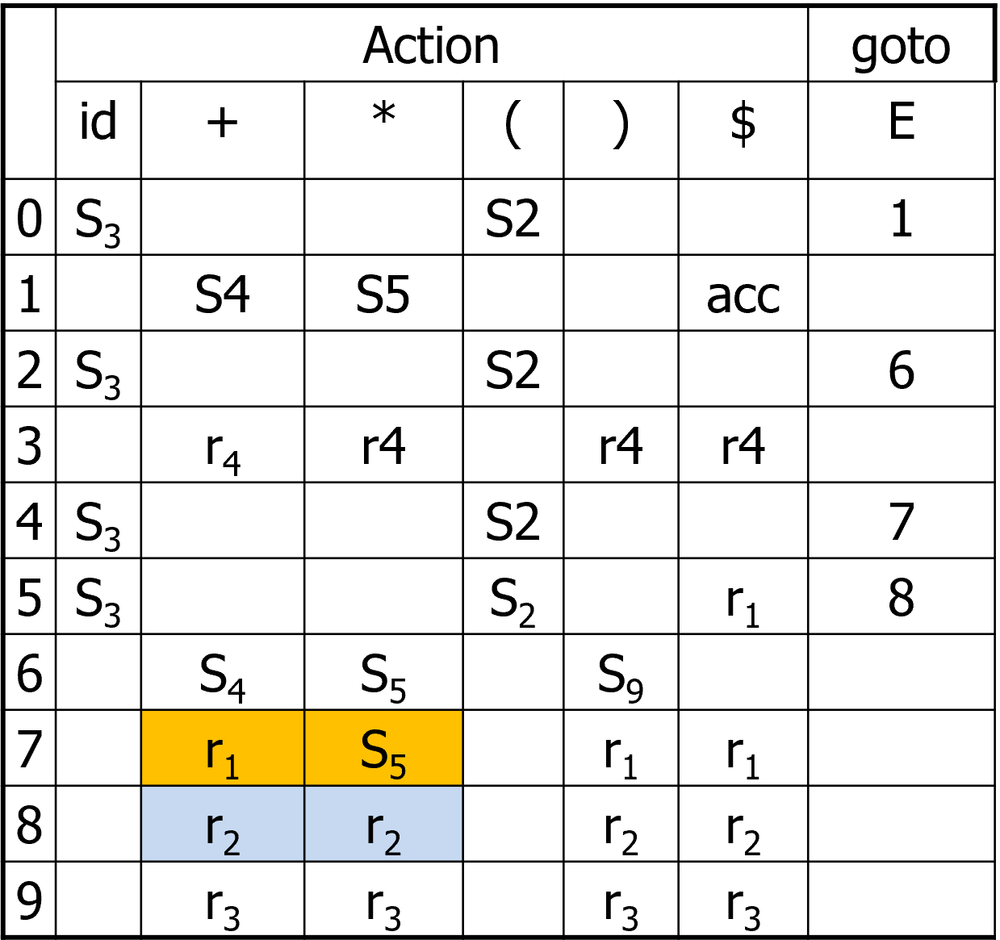
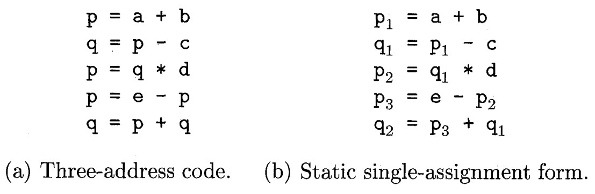
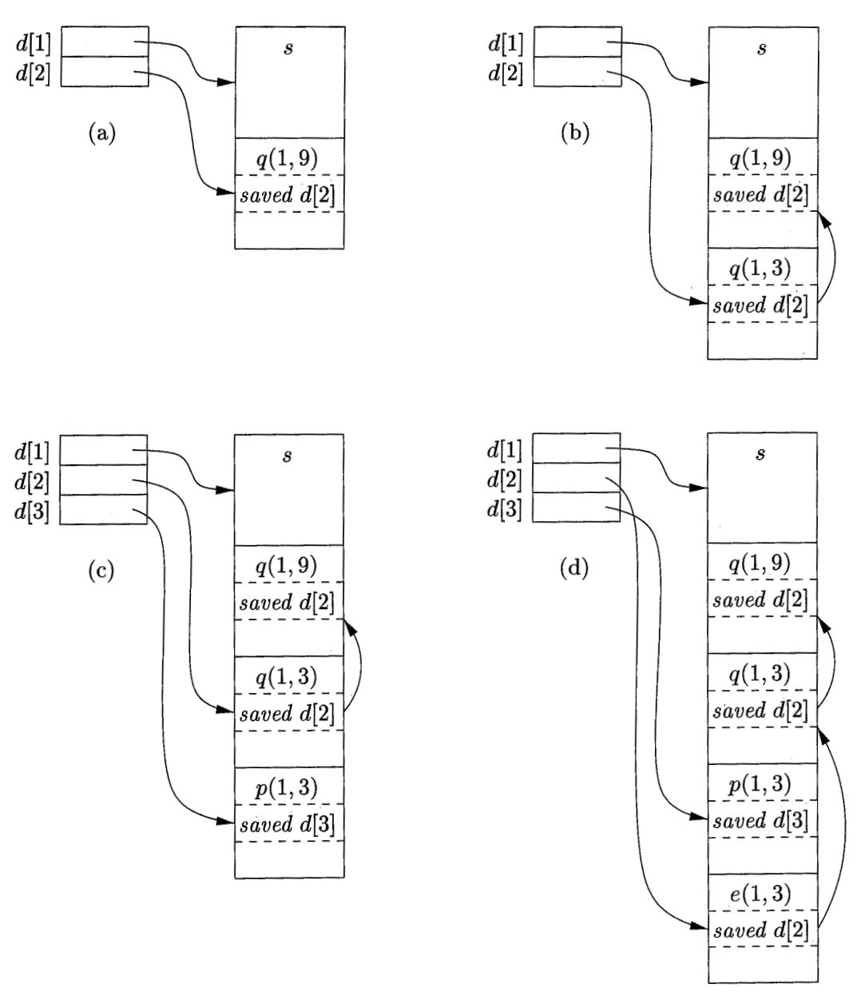

# 编译原理

**@ author: Shuxin-Wang**

**@ time: 2022-09-18**

[TOC]

# 1 Introduction to Compiling


## 1.1 The Phases of a Compiler


# 2 语言与语法


## 2.1 基本术语与概念


### 2.1.1 字母表和符号

- 符号：语言中***<u>不可再分</u>***的单位；
- 字母表：符号的***非空有穷***集合；

> $\sum,V$或其他大写字母；
>
> $V_1=\{a,b,c\}$
>
> $V_2= \{+,-,0,1,...,9\}$
>
> $\sum = \{x|x\in ASCII字符\}$


### 2.1.2 符号串

- 某**字母表上**的符号的***有穷集合***

>a, b, c, abc, bc,…：V1上的符号串
>
>1250, +2, -1835,…：V2上的符号串
>
>空串（ε）：不含任何符号的串


### 2.1.3 语句

- 字符表上符合某种***<u>构成规则</u>***的符号串序列
- 用$a,b,c,...$表示符号；用$\alpha,\beta,\gamma,...$表示符号串；用$A,B,C,...$表示符号或符号串的集合


### 2.1.4 语言

- 某字母表上的句子集合


### 2.1.5 符号串集合的积

- 设串集$A=\{\alpha_1,\alpha_2,...\},B=\{\beta_1,\beta_2,...\},$二者的笛卡尔积$AB=\{\alpha\beta|\alpha\in A, \beta\in B\}$

> 若$A=\{a,b\},B=\{c,e,d\},$那么$AB=\{ac,ae,ad,bc,be,bd\}$


### 2.1.6 字符串集合的幂

- $A^0=\{\epsilon\},$
- $A^n=AA^{n-1}$

> 若$|A| = m,$那么，$|A^0|=1,|A^1|=m,|A^n|=m^n$


### 2.1.7 Kleene闭包和正闭包

- Kleene闭包：$A^*=A^0\cup A^1\cup A^2\cup...$
- 正闭包：$A^+=A^*-\{\epsilon\}$
- 一个语言是其字母表上闭包的子集


### 2.1.8 文法Grammar

- 表达语言构成规则的形式化方法$G=(V_N,V_T,S,P)$

> $V_N$：非终结符集
>
> $V_T$：终结符集
>
> $S$：文法开始符号
>
> $P$：产生式     $A→\alpha$
>
> $<句子> → <主语><谓语><宾语>$


### 2.1.9 推导与规约

- 推导：使用产生式的右部取代左部的过程；
- 归约：推导的逆过程，用产生式的左部取代右部的过程；


- 最左推导和最右推导称为规范推导；
- 最左归约和最右归约称为规范归约。


### 2.1.10 句型、句子与语言

- 句型：从文法开始符号S开始，每步推导（包括0步推导）所得到的字符串$\alpha$,$S→\alpha,\text{其中}\alpha\in(V_N,V_T)^*$；
- 句子：***<u>仅含终结符</u>***的句型；
- 语言：由S推导所得的句子的集合

> $L(G)=\{\alpha|S→\alpha,且\alpha\in V_T^*\}$,G为文法


### 2.1.11文法规则的递归定义

- 非终结符的定义中包含了非终结符自身

> $设\sum = \{0,1\}$
>
> $<S>\rightarrow<D><S><D>$
>
> $<D>\rightarrow0|1$

- 使用递归定义时要谨慎，要有递归出口，否则，可能永远产生不出句子

  

### 2.1.12 扩充的BNF表示

- $()$——提因子

> $U\rightarrow ax|ay|az改写成U\rightarrow a(x|y|z)$

- $\{\}$——重复次数指定

> $<标识符>\rightarrow<字母>\{<字母>|<数字>\}_{(0)}^{(5)}$

- $[\ \ ]$——任选符号

> $<整数>\rightarrow[+|-]<数字>\{<数字>\}$


## 2.2 文法与语言的形式定义

- 表达语言构成规则的形式化方法$G=(V_N,V_T,S,P)$

> $V_N$：非终结符集
>
> $V_T$：终结符集
>
> $S$：文法开始符号
>
> $P$：产生式     $A→\alpha$

$V=(V_N\cup V_T)$，称作文法符号集合


### 2.2.1 Chomsky 0型文法

- $P中产生式\alpha\rightarrow\beta,其中\alpha\in V^+并且至少含有一个非终结符,\beta\in V^*$

> 是对产生式限制最少的文法；识别0型语言的自动机称为图灵机(TM)；对0型文法的产生式作某些限制，可以得到其他类型的文法;


### 2.2.2 Chomsky 1型文法

- $1.\ \alpha\rightarrow\beta,除可能有S\rightarrow\epsilon外均有|\beta|\ge|\alpha|,若有S\rightarrow\epsilon,规定S不得出现在产生式右部$;
- $1^`.\ \alpha\rightarrow\beta,除可能有S\rightarrow\epsilon外均有\alpha A\beta \rightarrow\alpha\gamma\beta, 其中\alpha,\beta\in V^*,A\in V_N,\gamma\in V^+ $;

> 长度增加文法（上下文有关文法）
>
> 1型文法对非终结符进行替换时必须考虑上下文；
>
> 除文法开始符号外不允许将其它的非终结符替换成$\epsilon$；识别1型语言的自动机称为线性界限自动机(LBA)；


### 2.2.3 Chomsky 2型文法

- $P中产生式具有形式A\rightarrow\beta,其中A\in V_N,\beta\in V^*$；

> 产生式左部一定是非终结符，产生式右部可以是$V_N 、V_T或\epsilon$
>
> 非终结符的替换不必考虑上下文，故也称作上下文无关文法；识别2型语言的自动机称为下推自动机(PDA)。


### 2.2.4 Chomsky 3型文法

- $P中产生式具体形式A\rightarrow\alpha B,A\rightarrow\alpha.或者A\rightarrow B\alpha,A\rightarrow \alpha,其中A,B\in V_N,\alpha\in V^+$

> 也称为正规文法RG、线性文法：若所有产生式均是左线性，则称为左线性文法；若所有产生式均是右线性，则称为右线性文法。
>
> 产生式要么均是右线性产生式，要么是左线性产生式，不能既有左线性产生式，又有右线性产生式；识别3型语言的自动机称为有限状态自动机。


### 2.2.5 文法产生语言

> 例1- 3型

$$
设G_1=(\{S\},\{a,b\},S,P),其中P为：\\
(0)S\rightarrow aS\\
(1)S\rightarrow a\\
(2)S\rightarrow b
$$

- $L(G_1)=\{a^i(a|b)|i\ge0\}$\


> 例2 - 2型

$$
设G_1=(\{S\},\{a,b\},S,P),其中P为：\\
(0)S\rightarrow aSb\\
(1)S\rightarrow ab
$$

- $L(G_2)=\{a^nb^n|n\ge1\}$


> 例3 - 1型

$$
设G_1=(\{S,A,B\},\{a,b,c\},S,P),其中P为：\\
(0)S\rightarrow aSAB\\
(1)S\rightarrow abB\\
(2)BA\rightarrow AB\\
(3)bA\rightarrow bb\\
(4)bB\rightarrow bc\\
(5)cB\rightarrow cc
$$

- $L(G_3)=\{a^nb^nc^n|n\ge 1\}$


## 2.3 文法构造与文法简化


### 2.3.1 文法构造例子

- 构造形如$a^{mi}b^{ni}$的语言的文法

$$
S\rightarrow a...aSb...b | \epsilon
$$

- $a^ib^j,(i\ge 2j,j\ge 1)$

$$
\rightarrow a^{i-2j}a^{2j}b^j
$$

- $S\in\{a,b\}^*,限制a,b个数$

> 利用状态机方法解决


### 2.3.2 文法的简化

***简化步骤：***

1. 删除形如P→P的产生式；
2. 删除永不被使用的产生式，即由文法的开始符号无法推导出其左部；
3. 删除不能从中导出终结符串的产生式；
4. 整理产生式；


> 简化示例

| (0)S  →  Be | (5)B →Ce    |
| ----------- | ----------- |
| (1)S  →  Ec | (6)B  → Af  |
| (2)A → Ae   | (7)C  →  Cf |
| (3)A → e    | (8)D →  f   |
| (4)A → A    |             |

- ***<u>简化后：</u>***

| (0)  S →  Be | (2)A  → e  |
| ------------ | ---------- |
| (1)A  →  Ae  | (3)B  → Af |


### 2.3.3 构造无$\epsilon$产生式的上下文无关文法

***<u>满足条件：</u>***

- 若P中含$S \rightarrow \epsilon$ ，则S不出现在任何产生式右部，其中S为文法的开始符号；
- P中不再含有其它任何e产生式。

***<u>变换算法：</u>***

$G = (V_N, V_T, P, S)\Rightarrow G^`=(V_N^`, V_T^`,P^`,S^`)$

1. G满足如下定义的非终结符集合

$$
V_0=\{A|A\in V_N,A\rightarrow^+\epsilon\}
$$

2. 构造产生式集合$P^`$
   1. 若产生式$B\rightarrow a_0B_1a_1B_2…B_ka_k$属于P，其中$a_j \in V^* (0 \le j \le k)，B_i \in V_0$，那么将这些$B_i$分别以$\epsilon$和$B_i$本身这两种形式替代，然后将有关B的所有产生式扣除$\epsilon$产生式后加入到P’中
   2. 其它产生式扣除$\epsilon$产生式后（原来就有，或者由步骤1产生）也投入到P’中
   3. n如果P中有产生式$S\rightarrow\epsilon$（原来就有，或者由步骤1产生），且S出现在产生式的右部，则将它扣除并增加如下产生式： $S’ \rightarrow \epsilon|S$，将S’加入VN’，文法开始符号变为S’


> 例题

$$
设G_1=(\{S\},\{a,b\},P,S),其中\\
P:\\
(0)S\rightarrow \epsilon\\
(1)S\rightarrow aSbS\\
(2)S\rightarrow bSaS
$$

- $V_0={S}$
- $P':S\rightarrow abS|aSbS|aSb|ab\\S\rightarrow baS|bSaS|bSa|ba\\S'\rightarrow\epsilon|S$
- $G'_1=(\{S',S\},\{a,b\},P',S')$


## 2.4 语法树与文法的二义性


### 2.4.1 语法树

> (0) S→aB
>
> (1)S→bA
>
> (2)A → a
>
> (3)A → aS
>
> (4)A → bAA
>
> (5)B → aBB
>
> (6)B → bS
>
> (7)B →b


### 2.4.2 基本术语

- 子树：除叶子结点之外的任意结点连同它的所有子孙结点构成子树；
- 修剪子树：剪去子树树根的所有子孙节点，对应于归约（一步或多步）；
- 句型：由树的末端符（叶结点）从左至右连成的串是文法的一个句型；
- 短语：子树的末端符号自左到右连成串，相对于子树树根而言称为短语；
- 简单短语(直接短语)：若短语是某子树根经过1步推导得到的，则称之为该子树根的简单短语；
- 句型的短语：某句型中的短语（属于某子树）；
- 句柄：句型中的最左简单短语。是最左归约时要寻找的简单短语；


### 2.4.3 文法的二义性

- 如果文法的一个句子存在对应的两棵或两棵以上的语法树，则该句子是二义的；
- 包含二义性句子的文法是二义文法；


***<u>评论：</u>***

- 二义性会给语法分析带来不确定性；
- 文法的二义性是不可判定的，即不存在算法，能够在有限步数内确切判定一个文法是否为二义文法；
- 若要证明是二义性，只要举出一例；
- 二义文法并非绝对必需去除的；


# 语言构造文法的方法⭐

由语言构造文法的常用方法有4个：

- 对称法
- 逐步求精法（分解法）
- 等价法
- 电路状态转换法


## 对称法

适用于存在对称性的语言，方法如下：

1. 找出对称轴
2. 找出对称性

**<u>*列题：*</u>**
$$
L=\{a^{2n}b^n|n>1\ and\ a,b\in V_T\}
$$
观察可得：

- $n=1时，L=aab$；
- $n=2时，L=aaaab\Rightarrow L=aa\mathbf{aab}b $

我们可以推出以下文法：
$$
(1)S\Rightarrow aaSb\\
(2)S\Rightarrow aab
$$

## 逐步求精法（分解法）

1. 两种方法：**自上而下**或者**从左到右**；

2. 使用条件：语言各成分之间没有关联；

**<u>*例题：*</u>**
$$
L_2=\{a^ib^jc^k|i,j,k\ge 1\ and\ a,b \in V_T\}
$$

- 自上而下求精法：

分析：

我们把$a^i,b^j,c^k$各自看成一个整体，由$i\ge 1$，语言中最少存在一个$a$，所以可以写成这样的文法：$A\Rightarrow aA|a$。同理可以得到其他两个，推出以下文法：
$$
(1)S\Rightarrow ABC\\
(2)A\Rightarrow aA|a\\
(3)B\Rightarrow bB|b\\
(4)C\Rightarrow cC|c
$$

- 从左向右求精法：

分析：

$a^ib^jc^k = a^*a^{i-1}b^jc^k$，其中$i-1\ge 0$。当$i-1\ge1$时，$S\Rightarrow aS$；当$i-1=0时，S\Rightarrow aA$。$A$对应语言是$b^jc^k$，同理可以推出以下文法：
$$
(1)S\Rightarrow aS|aA\\
(2)A\Rightarrow bA|bB\\
(3)B\Rightarrow cB|c
$$

## 等价法

**产生式两边具有相同特性**

**<u>*例题：*</u>**
$$
L_3 =\{\omega|\omega\in(a,b)^*\ and\ a,b数量相同\}
$$
分析：

首先我们写出下面三个产生式：

- 当以$a$开头时，$S\Rightarrow aA$
- 当以$b$开头时，$S\Rightarrow bB$
- $S$可以为空，$S\Rightarrow \epsilon$

在$S、A、B$中，$a，b$的数量满足：

- $S:\ |a|=|b|$
- $A:\ |a|+1=|b|$
- $B:\ |b|+1=|a|$

在$A$中，若以$b$开头：$A\Rightarrow bS|b$；若以$a$开头：$A\Rightarrow aAA$

同理推出以下文法：
$$
(1)S\Rightarrow aA|bB|\epsilon\\
(2)A\Rightarrow bS|b|aAA\\
(3)B\Rightarrow aS|a|bBB
$$

## 电路状态转换法

**语言中对元素有奇偶要求**

电路状态概念：0代表偶，1代表奇；

比如000代表语言中a，b，c的个数都是偶数，现在增加一个a，那么电路状态就转换成100，同理b，c如下图：


**<u>*结题步骤：*</u>**

1. 构造电路状态转换图

   首先确定状态，如果有n个元素，则存在$2^n$个状态，然后链接状态。下图为3个元素的所有状态转换：

   

2. 确定开始状态和结束状态

   开始状态和结束状态是相对的，视题目具体情况确定：

   - 以全是0作为结束状态，以题目要求作为开始状态；
   - 以题目要求作为结束状态，以全是0作为开始状态；
   - 比如对于某种语言，以a或b开头，以c结尾，abc的数量皆是偶数，那么开始状态就不是唯一的，就不能用全是0作为开始状态。而结束状态是唯一的，所以可以拿全是0作为结束状态；

3. 命名各个状态

   初始状态用$S$命名，其他状态用$A,B,C\dots$命名；

4. 写出相应的产生式

   每条边的变化都对应一条产生式，对结束状态要增加一条产生式：$G\Rightarrow \epsilon$，严格来说，最后可以写出$2^{n}(n+1)+1$条产生式；

**<u>*例题：*</u>**
$$
L_4=\{\omega|\omega\in(0,1)^*,1的数量为偶数\}
$$
电路状态转换图如下所示：


由题可得，共有两个状态：

- $S$：1的数量为偶数，$A$：1的数量为奇数；
- $S$作为终止状态；

根据状态转换图推出以下产生式：
$$
(1)S\Rightarrow 0S|1A|\epsilon\\
(2)A\Rightarrow 0A|1S
$$


# 3 词法分析 Lexical Analysis


## 3.1 正规文法


### 3.1.1 正规文法、正规集与正规式

由正规文法产生的语言称作正规集。正规集是集合，可以是有穷的也可以是无穷的，用一种形式化的方法——正规式（Regular Expression **Re**）进行描述。

设$A$是非空的有限字母表，$A =\{a_i|i=1,2,\dots,n\}$，则：

- $\varepsilon,\varnothing,a_i(i=1,2,\dots,n)$都是Re；
- 若$\alpha,\beta$是Re，则$\alpha|\beta,\alpha\beta,\alpha^*,\beta^*$也是Re；
- Re只能通过有限次使用1，2规则来获得。

### 3.1.2 正则规则

1. $\varepsilon$是基本的正规表达式；

2. 构成符号：

   - $|$：或；

   - $\cdot$：连接connect；

   - $*$：闭包closure；

     优先级：$*>\cdot>|$

3. 代数定律

|              定律              |            描述             |
| :----------------------------: | :-------------------------: |
|           $r|s=s|r$            |          $|$可交换          |
|       $r|(s|t)=(r|s)|t$        |          $|$可结合          |
|         $r(st)=(rs)t$          |         连接可结合          |
|  $r(s|t)=rs|rt;(s|t)r=sr|tr$   |       连接对$|$可分配       |
| $\varepsilon r=r\varepsilon=r$ | $\varepsilon$是连接的单元位 |
|    $r^*=(r|\varepsilon)^*$     | 闭包中一定包含$\varepsilon$ |
|          $r^{**}=r^*$          |      $^*$具有灯幂等性       |

4. 正规定义

如果$\sum$是基本符号的集合，那么一个正则定义（regular definition）是具有如下形式的定义序列：
$$
d_1\Rightarrow r_1\\
d_2\Rightarrow r_2\\
\dots\\
d_n\Rightarrow r_n\\
$$
其中：

- 每个$d_i$都是一个新符号，它们不在$\sum$中，并且各不相同；
- 每个$r_i$是字母表$\sum\cup\{d_1,d_2,\dots,d_{i-1}\}$上的正则表达式；


5. 其他简化符号

- `+`：一个或多个；
- `?`：零个或一个，$r?$是$r|\varepsilon$的简写；
- `[a-z]`：字符类；


## 3.2 有穷自动机Finaite Automata


### 3.2.1 状态转换图

- 状态state，用节点或圆圈表示。状态包括开始状态和最终状态
  - 最终状态：又称接收状态，用双圈圆圈表示；
  - 开始状态：又称起始状态，该状态用一条没有出发节点、标号为start的边知名；
- 边edge，从一个状态指向另一个状态，每个标号包括一个或多个符号；


### 3.2.2 有穷自动机

有穷自动机Finite automata，简称FA，是识别器，它们只能对每个可能的输入串简单地回答“是”或“否”。有穷自动机分为不确定的有穷自动机（NFA）和确定的有穷自动机（DFA）。

FA范式表达：$FA(S,s_0,F,\sum,map/move)$

- $S$：有穷状态集合；
- $s_0$：开始状态；
- $F$：终止状态集合；
- $\sum$：输入符号集合；
- $map/move$：映射；


### 3.2.3 不确定的有穷自动机

**不确定的有穷自动机(Nondeterministic Finite Automata，NFA)**对其边上的标号没有任何限制。每个符号标记离开同一状态的多于边，并且空串$\varepsilon$也可以作为标号。

NFA范式表达：$M(S,\sum,move,s_0,F)$

- $S$：有穷状态集合；
- $\sum$：输入符号集合；
- $move$：转换函数，它为每个状态中的每个符号都会给出相应的后继状态的集合；

>A mapping $from\ S\times\sum\ to\ 2^S,move(s,a)=2^S,2^S\in S$

- $s_0$：开始状态；
- $F$：终止状态集合；


### 3.2.4 确定的有穷自动机

**确定的有穷自动机(Deterministic Finite Automata，DFA)**中每个状态及自动机输入字母表中的每个符号有且只有一条离开该状态、以该符号为标号的边。

DFA范式表达：$M(S,\sum,move,s_0,F)$

- $S$：有穷状态集合；
- $\sum$：输入符号集合；
- $move$：转换函数，它为每个状态中的每个符号都会给出相应的后继状态的集合；

> A mapping $from\ S\times\sum\ to\ S,move(s,a)=s'$

- $s_0$：开始状态；
- $F$：终止状态集合；


## 3.3 从正则表达式到自动机


### 3.3.1 从正则表达式构造NFA


#### 分解法

较为简介，但这种方法**计算机没法使用**。

1. 引入开始状态和结束状态；
2. 逐步分解；

**<u>*基本组合：*</u>**


#### Thumpson算法

1. 把正则表达式的中缀形式转化为后缀表达式；
2. 将后缀表达式从左向右依次做组合；

**<u>*基本组合*</u>**

- 终结符


- $|$操作：$N(s|t)$


- 连接操作：$N(st)$


- 闭包操作：$N(s^*)$


**<u>*例题：*</u>**
$$
N:=(a|b)^*ab
$$
Thumpson算法构造NFA结果如下：


### 3.3.2 从NFA构造DFA

#### 空串闭包$\varepsilon-closure(s)$

$\varepsilon-closure(s)$表示由状态$s$经由条件$\varepsilon$可以到达的所有状态的集合。

以上面得到的NFA结果为例，各状态的的空串闭包如下：

- $\varepsilon-closure(0)=\{0,1,2,4,7\}$
- $\varepsilon-closure(1)=\{1,2,4\}$
- $\varepsilon-closure(2)=\{2\}$
- $\varepsilon-closure(3)=\{1,2,3,4,6,7\}$
- $\varepsilon-closure(4)=\{4\}$
- $\varepsilon-closure(5)=\{1,2,4,5,6,7\}$
- $\varepsilon-closure(6)=\{1,2,4,6,7\}$
- $\varepsilon-closure(7)=\{7\}$
- $\varepsilon-closure(8)=\{8\}$
- $\varepsilon-closure(9)=\{9\}$


#### 构建转换表

**<u>*构造步骤：*</u>**

1. 求出初始状态集合$I_0=\varepsilon-closure(\{x\})，x为初始状态s_0$；
2. 根据$I_i求move(I_i,输入)$；
3. 根据$move(I_i,输入),求闭包I_{i+1}=\varepsilon-closure(move(I_i,输入))$；
4. 重复2，3，直到**不出现新的状态集合**；

**<u>*以上面的为例：*</u>**

初始状态集合$I_0=\varepsilon-closure(0)=\{0,1,2,4,7\}$；

$move(I_0,a)$表示从状态$I_0$，经过a到达的状态，即对$I_0=\{0,1,2,4,7\}$里每个元素都考虑是否通过a到达某个状态，从NFA图中我们可以发现，只有状态2和7记过a，分别到达了3和8，所以$move(I_0,a)=\{3,8\}$；

闭包$\varepsilon-closure(move(I_0,a))=\varepsilon-closure(\{3,8\})$，该闭包为状态3和状态8闭包的**<u>并集</u>**，即$\varepsilon-closure(3)\cup\varepsilon-closure(8)=\{1,2,3,4,6,7,8\}$，该状态从未出现过，我们将其作为$I_1$；

整个过程如下

- $ε-closure(0)=\{0,1,2,4,7\}=I_0$;
- $ε-c l o s u r e ( m o v e ( I_0 , a ) ) = ε-c l o s u r e ( \{ 3 , 8 \} ) = \{ 1 , 2 , 3 , 4 , 6 , 7 , 8 \} = I_1 $;
- $ε - c l o s u r e ( m o v e ( I_0 , b ) ) = ε-c l o s u r e ( 5 ) = \{ 1 , 2 , 4 , 5 , 6 , 7 \} = I_2$;
- $ε - c l o s u r e ( m o v e ( I_1 , a ) ) = ε - c l o s u r e ( \{ 3 , 8 \} ) = \{ 1 , 2 , 3 , 4 , 6 , 7 , 8 \} = I_1 $;
- $ε - c l o s u r e ( m o v e ( I_1 , b ) ) = ε - c l o s u r e ( \{ 5 , 9 \} ) = \{ 1 , 2 , 4 , 5 , 6 , 7 , 9 \} = I_3 $;
- $ε - c l o s u r e ( m o v e ( I_2 , a ) ) = ε - c l o s u r e ( \{ 3 , 8 \} ) = \{ 1 , 2 , 3 , 4 , 6 , 7 , 8 \} = I_1 $;
- $ε - c l o s u r e ( m o v e ( I_2 , b ) ) = ε - c l o s u r e ( 5 ) = \{ 1 , 2 , 4 , 5 , 6 , 7 \} = I_2 $;
- $ε - c l o s u r e ( m o v e ( I_3, a ) ) = ε - c l o s u r e ( \{ 3 , 8 \} ) = \{ 1 , 2 , 3 , 4 , 6 , 7 , 8 \} = I_1 $;
- $ε - c l o s u r e ( m o v e ( I_3 , b ) ) = ε - c l o s u r e ( 5 ) = \{ 1 , 2 , 4 , 5 , 6 , 7 \} = I_2 $;

构建DFA转换表：

| 状态  | 输入a | 输入b |
| :---: | :---: | :---: |
| $I_0$ | $I_1$ | $I_2$ |
| $I_1$ | $I_1$ | $I_3$ |
| $I_2$ | $I_1$ | $I_2$ |
| $I_3$ | $I_1$ | $I_2$ |

- 如何判断DFA**终止状态**？

  如果$I_i\cap F \not= \varnothing,F为NFA终止状态集合$，则$I_i$为DFA终止状态；

该例中，NFA终止状态为{9}，所以DFA终止状态为$\{I_3\}$；

所以得到的DFA范式表达为：
$$
DFA:=(S=\{I_0,I_1,I_2,I_3\},\sum=\{a,b\},move,s_0=I_0,F=\{I_3\})\\
move(I_i,s),I_i\in S,s\in \sum,即刚刚构建的DFA转换表
$$


### 3.3.3 DFA简化

#### 消除多余状态

**<u>*多余状态：*</u>**

- 从该状态出发没有通路到达最终状态；
- 从开始状态出发，任何输入串也不能到达的那个状态；

处理方法：直接删除

#### 合并等价状态

**<u>*等价状态：*</u>**

- **一致性条件**：状态s和状态t必须同时为终态或非终态；
- **蔓延性条件**：对于所有输入符号，状态s和状态t必须转化到等价的状态里；

处理方法：可通过状态转换表判断是否为等价状态（不适合复杂DFA）

#### 状态最小化算法

对于一个$DFA:=(S,\sum,move,s_0,F)$：

1. 构造包含两个组F和S-F的初始划分$\Pi$，两个组分别是DFA的最终状态组和非最终状态组；
2. 最初，令$\Pi_{new}=\Pi$；**对于$\Pi$中的每个组G**：将G分划为更小的组，使得两个状态s和t在同一组中当且仅当所有的输入符号a，状态s和t在a上的转换都到达$\Pi$中同一组；（最坏情况下，每个状态各成一组）在$\Pi_{new}$中将G替换为对G进行分划得到的那些小组，下面处理$\Pi$中的下一组；
3. 如果$\Pi_{new}=\Pi$，令$\Pi_{final}=\Pi$并进行步骤4；否则，将$\Pi_{new}$代替$\Pi$并重复步骤2；
4. 在分划$\Pi_{final}$的每个组中选取一个状态作为改组的代表。这些代表构成最少DFA'的状态。DFA'的其他部分按如下步骤构建：
   - DFA'的开始状态是包含DFA的开始状态的代表；
   - DFA'的接受状态是那些包含了DFA的接受状态组的代表；
   - 令s是$\Pi_{final}$中某个组G的代表，并令DFA中在输入a上离开s的转换到达t。令r为t所在组H的代表。那么DFA'中存在一个从s到r在输入a上的转换。
5. 消除DFA'上的多余状态


**<u>*示例：*</u>**

最小化下面的DFA


1. 初始化：$\Pi=\{\{0,1,2\},\{3,4,5,6\}\}$；
2. 1 对与$\Pi$中组{0，1，2}
   - 我们将其分为{0，2}、{1}
     - 对于输入a，$move(\{0,2\},a)=\{1\},move(\{1\},a)=\{3\}$，1与3不在$\Pi$的同一组里，继续划分；
     - 我们将{0,2}分为{0}、{2}
       - 对于输入b:$move(\{0\},b)=\{2\},move(\{2\},b)=\{5\}$，2与5不在$\Pi$的同一组里，组中各个状态已成一组；
   - $\Pi_{new}=\{\{0\},\{1\},\{2\},\{3,4,5,6\}\}$；

2. 2对与$\Pi$中组{3，4，5，6}
   - 对于输入a：$move(\{3,4,5,6\},a)=\{3,6\}$，3与6在同一组里；
   - 对于输入b：$move(\{3,4,5,6\},b)=\{4,5\}$，4与5在同一组里；
   - 不需划分；
   - $\Pi_{new}=\{\{0\},\{1\},\{2\},\{3,4,5,6\}\}$；
3. $\Pi_{new}\not=\Pi,令\Pi=\Pi_{new}$执行步骤2，已不可划分，得到$\Pi_{new2}$
   - $\Pi_{new2}=\{\{0\},\{1\},\{2\},\{3,4,5,6\}\}=\Pi_{new}$；
   - $\Pi_{final}=\Pi_{new}$；
4. 状态3代替{3,4,5,6}，得到最小化结果：


# 4 语法分析Syntax Analysis——自顶向下


## 4.0 概述

语法分析器是编译器的核心，语法分析器从词法分析器获得一个由词法单元组成的串，并验证这个串可以由源语言的文法生成。

语法分析器大体上可以分为三种类型：通用的、**<u>自顶向下</u>**的和**<u>自底向上</u>**的。

编译器中常用的方法可以分为自顶向下的和自底向上的，**<u>*自顶向下的方法从语法分析树的顶部（根节点）开始向底部（叶子节点）构造语法分析树，自底向上则相反*</u>**。语法分析器的输入总是按照从左向右的方式被扫描，每次扫描一个符号。


自顶向下处理文法典型为**LL(1)文法**，自下而上处理文法典型为LR文法。其中LR文法包括SLR、LR(1)、LALR(1)文法。


### 4.0.1 语法错误处理

程序可能有不同层次的错误：

- 词法错误（Lexical）；
- 语法错误（Syntactic）；
- 语义错误（Semantic）；
- 逻辑错误（Logical）；

错误处理目标：

- 清晰精准地报告出现的错误；
- 能很快地从各个错误中恢复，以继续检测后面的错误；
- 尽可能少地增加处理正确程序时的开销；

错误恢复策略：

- 恐慌模式的恢复；
- 短语层次的恢复；
- 错误产生式；


## 4.1 LL(1)文法


### 4.1.1 文法简介

自顶向下语法分析可以被看作是为输入串构造语法分析树的问题，它从语法分析树的根节点开始，按照先跟次序（**深度优先**地）创建这棵语法分析树的各个结点，可以被看作寻找输入串最左推导的过程。

在一个自顶向下语法分析的每一步中，关键问题是确定对一个非终结符号应用哪个产生式。一旦选择了某个产生式，语法分析过程的其余部分负责将相应产生式体中的终结符号和输入相匹配。

**预测分析技术**通过在输入中向前看固定多个符号来选择正确的A的产生式。对于有些文法，**我们可以构造出向前看<u>k个输入符号</u>的预测分析器，这类文法有时也称为LL(k)文法类**。通常情况下我们只需要向前看一个符号（即只看下一个输入符号），即我们讨论研究的**LL(1)**文法。


### 4.1.2 LL(1)文法定义

一个文法G是LL(1)的，当且仅当G的任意两个不同的产生式$A\rightarrow \alpha|\beta$满足下面的条件：

1. **<u>不存在</u>**终结符号a使得$\alpha和\beta$**都能**够推导出以a开头的串；
2. $\alpha和\beta$最多只有一个可以推导出空串；
3. 如果$\beta\Rightarrow^*\varepsilon$，那么$\alpha$不能推导出任何以$FOLLOW(A)$中某个终结符号开头的串，反之亦然；

==**注意：**==

- 条件1，2等价于说$FIRST(\alpha)和FIRST(\beta)$是不相交的集合；
- 条件3等价于，如果$\varepsilon在FIRST(\beta)$中，那么$FIRST(\alpha)$和$FOLLOW(A)$是不相交的集合，反之亦然成立；

$FIRST集与FOLLOW集$将在后面进行介绍；


## 4.2 LL(1)文法判断⭐

LL(1)文法判断有两种方法，一种是根据以上LL(1)文**法定义进行判断**；另一种更常用的方法是**<u>*构造出预测分析表*</u>**进行判断。

LL(1)文法表驱动分析过程：

1. 预处理，对文法进行消除左递归和提取左公因子；
2. 写出预处理文法的First集和Follow集；
3. 构造LL(1)预测分析表(Predictive Parsing Table, PPT)；

后面讲对各个步骤进行详细介绍

### 4.2.1 消除左递归

#### 立即左递归(Immediate left recursion)

存在形如$A\rightarrow A\alpha$的产生式，这是我们认为该产生式存在左递归，该左递归为**立即左递归**，自顶向下语法分析方法不能处理左递归的文法，因此需要一个转换方法来消除左递归。

**<u>*通用消除立即左递归方法：*</u>**

首先将A**全部**产生式分组如下：
$$
A\rightarrow A\alpha_1|A\alpha_2|\dots|A\alpha_m|\beta_1|\beta_2|\dots|\beta_n
$$
其中$\beta_i$**都不是**以$A$开头。然后将这些A产生式替换为：
$$
A\rightarrow \beta_1A'|\beta_2A'|\dots|\beta_nA'\\
A'\rightarrow \alpha_1A'|\alpha_2A'|\dots|\alpha_mA'|\varepsilon
$$
**<u>*例子：*</u>**
$$
A\rightarrow Aa|ab|b
$$
消除左递归为：
$$
(1)A\rightarrow abA'|bA'\\
(2)A'\rightarrow aA'|\varepsilon
$$

#### 非立即左递归(Indirect left recursion)

形如$P\rightarrow Aa,A\rightarrow Pb|c$的两个产生式，两个非终结符间**构成一个环**，这是我们认为产生式存在非立即左递归（间接左递归）。

**<u>*消除左递归算法：*</u>**

1. 将文法G中的**非终结符**以**<u>某种顺序（由内到外）</u>**排序为$P_1,P_2,\dots,P_n$；
2. 从1到n的每个终结符$P_i$：
   - 从1到i-1的每个终结符$P_j$：
     - 将每个形如$P_i\rightarrow P_j\gamma$的产生式替换为产生式组$P_i\rightarrow \delta_1\gamma|\delta_2\gamma|\dots|\delta_k\gamma$，其中$P_j\rightarrow \delta_1|\delta_2|\dots|\delta_k$是所有$P_j$产生式==（**<u>即将$P_i$产生式中的$P_j$替换成$P_j$产生式的结果</u>**）==；
   - 消除$P_i$产生式之间的立即左递归；
3. 重新排列语法；

**<u>*例子：*</u>**
$$
(1)S\rightarrow Qc|c\\
(2)Q\rightarrow Rb|b\\
(3)R\rightarrow Sa|a
$$

1. 将非终结符由内到外排序为：R,Q,S；

2. 对于R：无操作；

   对于Q：$Q\rightarrow Rb|b \Rightarrow Q\rightarrow Sab|ab|b$；

   - Q无立即左递归；

   对于S：$S\rightarrow Qc|c\Rightarrow S\rightarrow Sabc|abc|bc|c$；

   - S存在立即左递归：

   $$
   (1)S\rightarrow (abc|b|c)S'\\
   (2)S'\rightarrow abcS'|\varepsilon
   $$

3. 因为无法到达R，Q所以删除，最终语法为：

$$
(1)S\rightarrow (abc|b|c)S'\\
(2)S'\rightarrow abcS'|\varepsilon
$$

==**<u>*消除原则：*</u>**==

- 由内到外、从左到右；
- 消除的结果中开始符不能变；

### 4.2.2 提取左公因子

当不清楚应该在两个A产生式中如何选择时，我们可以通过改写产生式来退后这个决定，等我们读入足够多的输入，获得足够信息后再做出选择。

**<u>*提取左公因子方法：*</u>**

对于所有A产生式：
$$
A\rightarrow \alpha\beta_1|\alpha\beta_2|\dots|\alpha\beta_n|\gamma
$$
替换为：
$$
(1)A\rightarrow \alpha A'|\gamma\\
(2)A'\rightarrow \beta_1|\beta_2|\dots|\beta_n
$$


### 4.2.3 构建First集

$FIRST(\alpha)$被定义为可从$\alpha$推导得到的串的首符号，其中$\alpha$是任意的文法符号串。

计算FIRST(`X`)方法规则：

1. 如果X是一个终结符，那么FIRST(X)=X；
2. 如果X是非终结符，X的产生式形如$X\rightarrow aB(a是终结符)$，那么将a加入到FIRST(X)集合中；
3. 如果X是非终结符，X的产生式形如$X\rightarrow Y_1Y_2\dots Y_k(Y_i都为非终结符)$。从左向右看$Y_i$，把$First（Y_i)$加入到FIRST(X)中，如果$First（Y_i)包括\varepsilon$，则再把$First（Y_{i+1})$加入到FIRST(X)，如此重复，直到下一个Y的FIRST不包含$\varepsilon$；
4. 如果$X\rightarrow \varepsilon$是一个产生式，把$\varepsilon$加入到FIRST(X)中；

==**规则2与规则3可以归纳为规则3，为方便理解，这里分开解释**==

### 4.2.4 构建Follow集

对于非终结符A，FOLLOW(A)被定义为可能某些句型中紧跟在A右边的终结符号的集合。

计算规则：

1. 将\$放到FOLLOW(S)中，**其中S是开始符号**，\$是输入右端的结束符号；
2. 如果存在一个产生式$A\rightarrow \alpha B\beta$，那么$FIRST(\beta)-\{\varepsilon\}$加入到FOLLOW(B)中；
3. 如果存在一个产生式$A\rightarrow \alpha B,或存在A\rightarrow \alpha B\beta且\varepsilon \in FIRST(\beta)$，那么将FOLLOW(A)符号加入FOLLOW(B)中；


### 4.2.5 构建预测分析表

构造方法：

对于文法G的每个产生式$A\rightarrow \alpha$，进行如下处理：

1. 对于$FIRST(\alpha)$中的每个终结符号a，将$A\rightarrow \alpha$加入到M[A,a]中；
2. 如果$\varepsilon\in FIRST(\alpha)$中，那么对于FOLLOW(A)中的每个终结符b，将$A\rightarrow \alpha$加入到M[A,b]中。如果$\varepsilon\in FIRST(\alpha)且\$\in FOLLOW(A)$，也将$A\rightarrow \alpha$加入到M(A, \$)中；

在完成上述操作后，如果M[A,a]中没有产生式，那么将M[A,a]设置为error（在表中用空白表示）

### 4.2.6 示例

判断下列文法G是否为LL(1)文法：
$$
0.E\rightarrow E+T|T\\
1.T\rightarrow T*F|F\\
2.F\rightarrow (E)|id
$$

#### 消除左递归

由内到外，从左到右顺序：

1. 产生式2无左递归；
2. 产生式1存在左递归，进行消除

$$
T\rightarrow FT'\\
T'\rightarrow *FT'|\varepsilon
$$

3. 产生式0存在左递归，进行消除

$$
E\rightarrow TE'\\
E'\rightarrow +TE'|\varepsilon
$$

综上，消除左递归后产生文法G'为： 
$$
\begin{aligned}
&(0)E\rightarrow TE'\\
&(1)E'\rightarrow +TE'|\varepsilon\\
&(2)T\rightarrow FT'\\
&(3)T'\rightarrow *FT'|\varepsilon\\
&(4)F\rightarrow (E)|id
\end{aligned}
$$

#### 构建First和Follow集

对每个产生式我们可以很容易得到每个产生式的**FIRST集**，如下表所示：
$$
\begin{array}{cc}
产生式&FIRST\\
\hline
E\rightarrow TE' &\{(,id\} \\
\hline
E'\rightarrow +TE' &\{+\} \\

E'\rightarrow \varepsilon &\{\varepsilon\} \\
\hline
T\rightarrow FT' &\{(,id\} \\
\hline
T'\rightarrow *FT' &\{*\} \\

T'\rightarrow \varepsilon &\{\varepsilon\}\\
\hline
F\rightarrow (E) &\{(\} \\

F\rightarrow id &\{id\} \\
\hline
\end{array}
$$
下面我们获取**FOLLOW集**：

`FOLLOW(E)`:

- E为开始符号，所以加入\$；根据产生式$F\rightarrow (E)$得，FOLLOW(E)中加入`)`；
- $FOLLOW(E)=\{),\$\}$；

`FOLLOW(E')`

- E'只出现在E产生式的右部尾部，所以FOLLOW(E')=FOLLOW(E)；
- $FOLLOW(E’)=\{),\$\}$；

`FOLLOW(T)`

- 产生式$E'\rightarrow +TE'$，E'在T后面，所以加入FIRST(E')-{ε}，即`+`；又$\varepsilon\in FIRST(E')$，所以FOLLOW(E')加入FOLLOW(T)中；
- $FOLLOW(T)=\{+,),\$\}$；

`FOLLOW(T')`

- T'只出现在T产生式右部尾部，所以FOLLOW(T')=FOLLOW(T)；
- $FOLLOW(T')=\{+,),\$\}$；

`FOLLOW(F)`

- 产生式$T'\rightarrow *FT'$，T'在F后面，所以加入FIRST(T')-{ε}，即`*`；又$\varepsilon\in FIRST(T')$，所以FOLLOW(T')加入FOLLOW(F)中；
- $FOLLOW(T)=\{*,+,),\$\}$；

构建FIRST和FOLLOW表：
$$
\begin{array}{c|c|c}
产生式&FIRST&FOLLOW\\
\hline
E\rightarrow TE' &\{(,id\}&\{(,\$\} \\
\hline
E'\rightarrow +TE' &\{+\} &\{(,\$\} \\

E'\rightarrow \varepsilon &\{\varepsilon\}&\{(,\$\} \\
\hline
T\rightarrow FT' &\{(,id\}&\{+,(,\$\} \\
\hline
T'\rightarrow *FT' &\{*\} &\{+,(,\$\}\\

T'\rightarrow \varepsilon &\{\varepsilon\}&\{+,(,\$\}\\
\hline
F\rightarrow (E) &\{(\} & \{*,+,(,\$\}\\

F\rightarrow id &\{id\} & \{*,+,(,\$\}\\
\hline
\end{array}
$$

#### 构建预测分析表

根据构建规则，构建预测分析表如下：
$$
\begin{array}{c|c|c|c|c|c|c}
(非)终结符&id&+&*&(&)&\$\\
\hline
E&E\rightarrow TE' &  & &E\rightarrow TE' & &\\
\hline
E'& &E'\rightarrow +TE'  & & &E'\rightarrow \varepsilon & E'\rightarrow \varepsilon\\
\hline
T&T\rightarrow FT' &  & &T\rightarrow FT' & &\\
\hline
T'& &T'\rightarrow \varepsilon  &T'\rightarrow *FT' & &T'\rightarrow \varepsilon &T'\rightarrow \varepsilon\\
\hline
F&F\rightarrow id &  & &F\rightarrow (E) & &\\

\end{array}
$$
表中**<u>未出现二义性条目</u>**，**所以文法G'是LL(1)文法，文法G==存在等价==的LL(1)文法**。


# 5 语法分析Syntax Analysis——自底向上


## 5.1 概述

一个自底向上的语法分析过程对应于为一个输入串构造语法树的过程，它从叶子节点（底部）开始逐渐向上到达根节点（顶点）。

对于文法：
$$
E\rightarrow E+T|T\\
T\rightarrow T*F|F\\
F\rightarrow (E)|\mathbf{id}
$$
当输入串为：$\mathbf{id}*\mathbf{id}$时，构造语法树过程如下：


### 5.1.1 归约

我们可以将自底向上语法分析过程看成将串$\omega$“归约”为文法开始符号的过程。在每个*归约(reduction)*步骤中，一个与某产生式体相匹配的特定子串被替换为该产生式头部的非终结符。  

对于刚刚示例构造语法树过程，可以用如下符号串序列来讨论这个过程：
$$
\mathbf{id}*\mathbf{id},F*\mathbf{id},T*\mathbf{id},T*F,T,E
$$
根据定义，**一次归约是一个推导步骤的<u>反向操作</u>**。因此，自顶向上语法分析的目标是一个反向构造一个推导过程。下面推导对应示例构造语法树过程：
$$
E\Rightarrow T\Rightarrow T*F\Rightarrow T*\mathbf{id}\Rightarrow F*\mathbf{id}\Rightarrow \mathbf{id}*\mathbf{id}
$$

### 5.1.2 移入—归约语法分析技术

主要的语法分析操作是移入和归约，但实际上一个移入—归约语法分析器可采取如下**四种可能的动作**：

1. 移入(shift)：将下一个输入符号移到栈的顶端；
2. 归约(reduce)：被归约的符号串的右端必然是栈顶。语法分析器在栈中确定这个串的左端，并决定用哪个非终结符来替代这个串；
3. 接受(accept)：宣布语法分析过程成功完成：
4. 报错(error)：发现一个语法错误，并调用一个错误恢复子进程；

下表表示了上面示例的移入—归约语法分析过程：




### 5.1.3 移入—归约语法分析中的冲突

即使知道了栈中的所有内容以及接下来的k个输入符号，我们仍然无法判断应该进行移入还是归约操作（移入/归约冲突），或者无法在多个可能的归约方法中选择正确的归约动作（归约/归约冲突）。

==冲突发生在归约时==


### 5.1.4 LR语法分析技术简介

自底向上语法分析器都是基于所谓的LR(k)语法分析的概念。其中，“L”表示对输入进行从左到右的扫描；“R”表示反向构造出一个最右推导序列，而k表示在做出语法分析决定时向前看k个输入符号。

常用的LR(k)文法包括：

- SLR：简单LR技术；
- LR(1)：规范LR；
- LALR：向前看LR（Look ahead）；


## 5.2 SLR：简单LR技术⭐


### 5.2.1 LR(0)项

一个LR语法分析器通过维护一些状态，用这些状态来表明我们在语法分析过程中所处的位置，从而做出移入—归约决定。这些状态代表了“项”（item）的集合。一个文法G的一个**LR(0)项**（简称为*项*）是G的一个产生式再加上一个位于它的体中某处的==点==。因此，产生式$A\rightarrow XYZ$产生了四个项：
$$
A\rightarrow \cdot XYZ\\
A\rightarrow X\cdot YZ\\
A\rightarrow XY\cdot Z\\
A\rightarrow XYZ\cdot\\
$$
产生式$A\rightarrow \varepsilon$只生成一个项$A\rightarrow \cdot$。


### 5.2.2 增广文法

如果G是一个以S为开始符号的文法，那么G的增广文法G'就是在G中加上新开始符号S'和产生式$S'\rightarrow S$而得到的文法 。

引入这个新的开始产生式的目的是告诉语法分析器何时应该停止语法分析并宣称接受输入符号串。也就是说，当且仅当语法分析器要使用规则$S'\rightarrow S$进行归约时，输入符号串被接受。


### 5.2.3 项集的闭包$CLOSURE$函数

如果I是文法G的一个项集，那么CLOSURE(I)就是根据下面的两个规则从I构造得到的项集：

1. 一开始，将I中的各项加入到CLOSURE(I)中；
2. 如果$A\rightarrow \alpha\cdot B\beta$在CLOSURE(I)中，$B\rightarrow \gamma$是一个产生式，并且项$B\rightarrow \cdot\gamma$不在CLOSURE(I)中，就在这个项加入其中。不断应用这个规则，直到没有新项可以加入到CLOSURE(I)中；

下图为上例文法的增广文法的**LR(0)项集组**的LR(0)自动机：


像状态$I_0,I_4,I_6,I_7$的**阴影部分**都是白色部分产生式通过规则2拓展得到的，因此项集的闭包计算过程也称作**<u>*==状态内部扩展==*</u>**过程。


### 5.2.4 移点$GOTO$函数

移点是**<u>*==状态之间扩展==*</u>**过程，即GOTO函数。

$GOTO(I,X)$定义为I中所有形如$[A\rightarrow \alpha\cdot X\beta]$的项所对应的项$[A\rightarrow \alpha X\cdot\beta]$的集合的闭包。直观的讲，GOTO函数用于定义一个文法的LR(0)自动机中状态的转换。

以上图为例，状态$I_0\Rightarrow I_1$过程即为$GOTO(I_0,E)$转换过程。


### 5.2.5 语法分析动作$ACTION$函数

ACTION函数有两个状态：一个是状态i，另一个是**终结符**a（或者是输入结束标记\$）。

$ACTION[i,a]$的取值可以有下列四种形式：

1. 移入状态j；
2. 归约$A\rightarrow \beta$；
3. 接受；
4. 报错；


### 5.2.6 构造SLR语法分析表⭐⭐

语法分析表由两个部分组成：一个语法分析动作函数ACTION和一个人转换函数GOTO。

对于一个增广文法G'，构建G'的SLR语法分析表函数ACTION和GOTO：

1. 构建G'的规范LR(0)项集族$C=\{I_0,I_1,\dots,I_n\}$；

2. 根据$I_i$得到i。状态i的语法分析动作有下面方法决定：

   - 如果$[A\rightarrow \alpha\cdot a\beta]在I_i中并且GOTO[I_i,a]=I_j$，那么将ACTION[i,a]设置为“移入j”，表中标记为==$s_j$==。这里的a必须为一个**终结符**；
   - 如果$[A\rightarrow \alpha\cdot]在I_i$中，那么**==FOLLOW(A)==**中的所有a，将ACTION[i, a]设置为“归约$A\rightarrow\alpha$”，表中标记为==$r_k$==，k为产生式$A\rightarrow \alpha$的编号。这里A不等于S'；
   - 如果$S'\rightarrow S\cdot在I_i$中，那么ACTION[i, \$]设置为“接受”；

   如果根据上面的规则生成任何冲突动作，我们就说这个文法不是SLR(1)的。

3. 状态i对于各个非终结符号A的GOTO转换使用下面的规则构造得到：如果$GOTO[I_i,A]=I_j$，那么GOTO[i, A] = j；

4. 规则2，3没有定义的条目都设置为“报错”；

5. 语法分析器的初始状态就是根据$[S'\rightarrow\cdot S]$所在项集构造得到的状态；


### 5.2.7 SLR(1)示例

对于文法G构建SLR语法分析表：
$$
E\rightarrow E+T|T\\
T\rightarrow T*F|F\\
F\rightarrow (E)|\mathbf{id}
$$

1. **<u>==构建增广文法G'并编号==</u>**

$$
\begin{array}{algin}
(0)E'\rightarrow E\\
(1)E\rightarrow E+T\\
(2)E\rightarrow T\\
(3)T\rightarrow T*F\\
(4)T\rightarrow F\\
(5)F\rightarrow (E)\\
(6)F\rightarrow\mathbf{id}
\end{array}
$$

2. **<u>==构建G'的规范LR(0)项集族==</u>**


3. **<u>==构建语法分析表==</u>**


- ✨根据语法分析表在处理输入$\mathbf{id}*\mathbf{id}+\mathbf{id}$时，栈和输入内容的序列如下图所需所示：


## 5.3 LR(1)：规范LR⭐

规范LR，它充分地利用了向前看符号。这个方法使用了一个很大的项集，称为**LR(1)项集**。


### 5.3.1 规范LR(1)项

在SLR方法中，如果项集$I_i$包含项$[A\rightarrow \alpha\cdot]$，且当前输入符号a在FOLLOW(A)中，那么状态i就要按照$A\rightarrow \alpha$进行归约。然而在某些状态下，当状态i出现在栈顶时，栈中的**<u>可行前缀</u>**是$\beta\alpha$且在任何最右句型中a都不可能跟在$\beta A$之后，那么当输入为a时不应该按照$A\rightarrow \alpha$进行归约。

>可行前缀：可以出现在一个移入—归约语法分析器的栈中的最右句型前缀被称为*可行前缀(viable prefix)*。定义如下：一个可行前缀是一个最右句型的前缀，并且它没有越过该最右句型的最右句柄的右端。

如果在状态中包含更多的信息，我们就可以排除掉一些这样的不正确的$A\rightarrow \alpha$归约。在必要时，我们可以通过分裂某些状态，设法让LR语法分析器的每个状态精确地指向那些输入符号可以跟在句柄$\alpha$的后面，从而使$\alpha$可能被归约成为A。

将额外信息加入状态中的方法是对项进行精化。项的一般形式变成了$[A\rightarrow \alpha\cdot\beta,a]$，其中$A\rightarrow \alpha\beta$使一个产生式，而a使一个终结符号或右端标记\$，我们称这样的对象为**<u>*LR(1)项*</u>**。只有栈顶状态中包含一个LR(1)项$[A\rightarrow \alpha\cdot,a]$，我们才会输入输入为a时进行归约。这样的a的集合**<u>总是FOLLOW(A)的子集</u>**。


### 5.3.2 构造LR(1)项集

构造有效LR(1)项集族的方法实质上和构造规范LR(0)项集族的方法相同。我们只需要修改两个过程：CLOSURE和GOTO。

CLOSURE(I)按如下方法构造：

1. I的任何项都属于CLOSURE(I)；
2. 若有项$[A\rightarrow \alpha\cdot B\beta,a]\in CLOSURE(I)$，$B\rightarrow \gamma$是文法中的产生式，$\beta\in V^*,b\in FIRST(\beta a)$，则$[B\rightarrow \cdot\gamma,b]\in CLOSURE(I)$；
3. 重复2直到CLOSURE(I)不再增大为止；


**<u>*例子：*</u>**
$$
\begin{array}{aligin}
S'\rightarrow S\\
S\rightarrow CC\\
C\rightarrow cC\\
C\rightarrow d
\end{array}
$$
以初始状态为例，计算$\{[S'\rightarrow \cdot S,\$]\}$的闭包。在求闭包时，将项$[S'\rightarrow \cdot S,\$]$和过程CLOSURE中的项$[A\rightarrow \alpha\cdot B\beta,a]$相匹配，$A=S',\alpha=\varepsilon,B=S,\beta=\varepsilon和a=\$$。$B\rightarrow \gamma$就是$S\rightarrow CC$，所以$b=FIRST(\beta a)=FIRST(\varepsilon\ \$)\Rightarrow \$$，所以加入$[S\rightarrow \cdot CC,\$]$。

后面过程同理，我们可以得到如下LR(1)项集：


### 5.3.3 构造规范LR(1)语法分析表⭐⭐

对于一个增广文法G'，构建G'的LR(1)语法分析表函数ACTION和GOTO：

1. 构建G'的规范LR(1)项集族$C'=\{I_0,I_1,\dots,I_n\}$；

2. 根据$I_i$得到i。状态i的语法分析动作有下面方法决定：

   - 如果$[A\rightarrow \alpha\cdot a\beta,b]在I_i中并且GOTO[I_i,a]=I_j$，那么将ACTION[i,a]设置为“移入j”，表中标记为==$s_j$==。这里的a必须为一个**终结符**；
   - 如果$[A\rightarrow \alpha\cdot,a]在I_i$中，将ACTION[i, a]设置为“归约$A\rightarrow\alpha$”，表中标记为==$r_k$==，k为产生式$A\rightarrow \alpha$的编号。这里A不等于S'；
   - 如果$[S'\rightarrow S\cdot,\$]在I_i$中，那么ACTION[i, \$]设置为“接受”；

   如果根据上面的规则生成任何冲突动作，我们就说这个文法不是LR(1)的。

3. 状态i对于各个非终结符号A的GOTO转换使用下面的规则构造得到：如果$GOTO[I_i,A]=I_j$，那么GOTO[i, A] = j；

4. 规则2，3没有定义的条目都设置为“报错”；

5. 语法分析器的初始状态就是根据$[S'\rightarrow\cdot S,\$]$所在项集构造得到的状态；


### 5.3.4 LR(1)示例

对于下面文法G是否为LR(1)文法：
$$
S\rightarrow CC\\
C\rightarrow cC|d
$$

1. **<u>==构建增广文法G'并编号==</u>**

$$
\begin{array}{aligin}
(0)S'\rightarrow S\\
(1)S\rightarrow CC\\
(2)C\rightarrow cC\\
(3)C\rightarrow d
\end{array}
$$

2. **<u>==构建G'的规范LR(1)项集族==</u>**


3. **<u>==构建语法分析表==</u>**


表中不存在二义性操作，G'为LR(1)文法。


## 5.4 LALR：向前看LR⭐

向前看LR，它基于LR(0)项集族。和基于 LR(1)项的典型语法分析器相比，它的状态要少很多。通过向LR(0)项中小心地引入向前看符号，我们使用LALR方法处理的文法比使用SLR方法时处理的文法更多，同时构造得到的语法分析表却不比SLR表大。


### 5.4.1 构造LALR语法分析表⭐⭐

LALR(1)文法是在将LR(1)项集**<u>相同核心</u>**的项项集合并，所谓和**==核心就是项集第一个分量的集合==**。比如上例中的$I_4和I_7,I_3和I_6,I_8和I_9$，一般而言，一个核心就是当前正处理文法的LR(0)项集，一个LR(1)文法可能产生多个具有相同核心的项集。

**==一个简单，但空间需求大的LALR分析表构造方法==**

对于一个增广文法G'，构建G'的LR(1)语法分析表函数ACTION和GOTO：

1. 构建G'的规范LR(1)项集族$C'=\{I_0,I_1,\dots,I_n\}$；
2. 对于LR(1)项集中的每个核心，将具有相同核心的项集进行合并，并将这些项集替换为它们的并集；
3. 令$C'=\{J_0,J_1,\dots,J_m\}$是合并项集后的LR(1)项集族。状态i的语法动作按照构建LR(1)语法分析表的算法进行构建，如果根据上面的规则生成任何冲突动作，我们就说这个文法不是LALR(1)的；
4. GOTO表的构造方法如下。如果J是一个或多个LR(1)项集的并集，也是说$J=I_1\cup I_2\cup\dots\cup I_k$，令K是所有和$GOTO(I_1,X)$具有相同核心的项集的并集，那么GOTO(J,X)=K；


### 5.4.2 LALR示例

与LA(1)示例前两步相同，在构建完LA(1)项集族后，将相同核心的I进行合并在构建语法分析表。

对于下面文法G是否为LR(1)文法：
$$
S\rightarrow CC\\
C\rightarrow cC|d
$$

1. **<u>==构建增广文法G'并编号==</u>**

$$
\begin{array}{aligin}
(0)S'\rightarrow S\\
(1)S\rightarrow CC\\
(2)C\rightarrow cC\\
(3)C\rightarrow d
\end{array}
$$

2. **<u>==构建G'的规范LR(1)项集族==</u>**


3. **<u>==构建语法分析表==</u>**

$I_4和I_7合并为I_{47},I_3和I_6合并为I_{36},I_8和I_9合并为I_{89}$，语法分析表如下：


## 5.5 使用二义性文法

每个二义性文法(Ambiguous grammar)都不是LR的，二义性就是构造文法分析表中出现的**移入/归约冲突**或**归约/归约冲突**。


### 5.5.1 用优先级和结合性解决冲突

比如以下文法：
$$
E\rightarrow E+E|E*E|(E)|\mathbf{id}
$$
其增广表达式的LR(0)项集族如下：


构建文法分析表如下：


我们发现在状态7和状态8的符号`+`和`*`上都出现移入/归约冲突。

- 考虑输入$\mathbf{id}+\mathbf{id}*\mathbf{id}$：

当输入乘号`*`时，解析器不知道应该先将栈里的`E+E`归约，还是先将`*`移入栈中，并准备将这个`*`和其左右的id归约；

- 考虑输入$\mathbf{id}+\mathbf{id}+\mathbf{id}$：

同理我们不知道`+`是左结合还是右结合，哪一个先进行归约；

假设`+`是左结合，状态7输入`+`时应该进行归约；`*`的优先级高，那么状态7在输入`*`时应该移入，当栈顶为E*E时，状态8进行归约；考虑到`*`也是左结合，同理得到解决冲突的语法分析表如下：




### 5.5.2 悬空else的二义性

考虑文法：
$$
S'\rightarrow S\\
S\rightarrow iSeS|iS|a
$$
其中i代表`if exper then`，e表示`eles`，a表示“所有其他产生式”；

其构建的LR状态集如下：


状态4中我们不知道是将iS进行归约，还是输入else，所以我们规定优先移入else，规定后语法分析表如下：


## 5.6 语法分析总结


# 6 语法制导翻译Syntax-Directed Translation


## 6.1 语法制导定义SDD

语法制导定义（Syntax-Directed Definition，SDD）是一个上文文无关文法和 **<u>属性及规则</u>** 的结合。

属性和文法符号相关联，而规则和产生式相关联。如果X是一个符号而a是X的一个属性，那么我们用`X.a`来表示a在某个标号为X的分析树结点上的值。属性可以有很多种类型，比如数字、类型、表格引用或串。


### 6.1.1 属性分类

1. **综合属性（synthesized attribute）**：==自下而上==传递信息。在分析树节点N上的非终结符号A的综合属性是由N上的产生式所关联的语义规则来定义。


2. **继承属性（inherited attribute）**：==自上而下==传递消息。在分析树节点N上的非终结符号B的继承属性是由N的父节点上的产生式所关联的语义规则来定义。


> 终结符只有综合属性，它由语法分析器提供。非终结符既可以有综合属性也可以有继承属性，但文法开始符号的继承属性作为属性计算前的初始值。

- 一个只**<u>==包含综合属性==</u>**的SDD称为S属性(S-attribute)的SDD；
- 一个S属性的SDD可以和一个LR语法分析器一起自然地实现；
- 一个没有副作用的SDD有时也称为属性文法（attribute grammar）；一个属性文法的规则仅仅通过其他属性值和常量值来定义一个属性值；


### 6.1.2 在语法分析树的结点上对SSD求值⭐

一个显示了它的各个属性的值的语法分析树称为 ***注释语法分析树（annotated parse tree）***。

我们对一棵语法分析树的某个结点的一个属性进行求值之前，必须首先**求出这个属性值依赖的==所有==属性值**。

- 对于综合属性，我们可以按照任何自底向上的顺序计算它们的值，比如对语法分析树进行**后序遍历**的顺序；
- 对于同时具有继承属性和综合属性的SSD，不能保证有一个顺序来对各节点上的属性进行求值；
- 从计算角度看，给定一个SDD，很难确定是否存在某棵语法分析树使得SDD属性值之间具有依赖关系。幸运的是，存在一个SDD的有用子类，它们能够保证对每棵语法分析树都存在一个求值顺序，后面将进一步讨论；


**<u>*示例1：*</u>**

对于如下文法：


写出$3*5+4n$的注释语法分析树。

***<u>==自下而上==</u>***


**<u>*示例2：*</u>**

对于如下文法：


写出$3*5$的注释文法分析树。

**<u>*==自顶向下==*</u>**


## 6.2 SDD的求值顺序


### 6.2.1 依赖图

 *依赖图（dependency graph）*可以确定一棵给定的语法分析树中各个属性实例的求值顺序。注释语法分析树显示了各个属性的值，而依赖图可以帮助我们确定如何计算这些值。

依赖图描述了某个语法分析树中的属性实例之间的信息流。从一个属性实例到另一个实例的边表示计算第二个属性实例时需要第一个属性实例的值。图中的边表示语义规则所蕴含的约束。

**<u>*==实例2依赖图如下：==*</u>**


### 6.2.2 属性求值的顺序

如果依赖图中有一条从结点M到结点N的边，那么要先对M对应属性求值，再对N对应的属性求值。因此，所有的可行求值顺序就是满足下列条件的结点顺序$N_1,N_2,\dots,N_k$：如果有一条从结点$N_i$到$N_j$的依赖图的边，那么$i<j$。这样的排序将一个有向图变成了一个线性排序，这个排序称为这个图的*拓扑排序*（topological sort）。

如果图中存在任意一个环，那么就不存在拓扑排序。也就是说，没有办法在这棵语法分析树上对相应的SDD求值。然而，如果图中没有环，那么总是至少存在一个拓扑排序。


### 6.2.3 S属性的定义⭐

第一种SDD类型的定义如下：

- 如果一个SDD的每个属性**<u>都是</u>综合属性**，它就是*S属性的*（S-attribute）。

S属性的定义可以在自底向上语法分析的过程中实现，因为一个自底向上的语法分析过程对应一次后序遍历。


### 6.2.4 L属性的定义⭐

第二种SDD称为L属性定义（L-attributed definition）。这类SDD的思想是在一个产生式体所关联的各个属性之间，依赖图的边总是从左到右，而不能从右到左。每个属性必须是：

- 综合属性；
- 继承属性，但是它的规则具有如下限制。假设存在一个产生式$A\rightarrow X_1X_2\dots X_n$，并且有一个通过这个产生式所关联的规则计算得到的继承属性$X_i.a$。那么这个规则只能使用：
  - 和产生式头A关联的继承属性；
  - 位于$X_i$左边文法的文法符号实例$X_1,X_2,\dots,X_{i-1}$相关的继承属性或者综合属性；
  - 和这个$X_i$的实例本身相关的继承属性或综合属性，但是在由这个$X_i$的全部属性组成的依赖图中不存在环；

==结点使用信息“**来自上边或左边**”==，要么是综合属性。


### 6.2.5 具有受控副作用的语义规则

对于SDD，我们在属性文法和翻译方案之间找到一个平衡点。属性文法没有副作用，并支持任何与依赖图一致的求值顺序。翻译方案要求按从左到右的顺序求值。

控制SDD中的副作用：

- 支持那些不会对属性求值产生约束的附带副作用；
- 对允许的求值顺序添加约束，使得以任何允许的顺序求值都会产生相同的翻译结果；


## 6.3 语法制导的应用


### 6.3.1 抽象语法树的构造

我们将使用具有适当数量的字段的对象来实现一棵语法树的各个结点。每个对象将有一个op字段，也就是这个结点的标号。这些对象将具有如下所述的字段：

- 如果结点是一个叶子，那么对象将有一个附加的域来存放这个这个叶子结点的词法值。构造函数$Leaf(op,val)$创建一个叶子对象。我们也可以把结点看作记录，那么$Leaf$就会返回一个指向与叶子节点对应的新纪录的指针；
- 如果结点是内部结点，那么它的附加字段的个数和结点在语法树中的子节点个数相同。构造函数的$Node$带有两个或多个参数：$Node(op,c_1,c_2,\dots,c_k)$，该函数创建一个对象，第一个字段的值为op，其余k个字段的值为$c_1,\dots,c_k$；

下面为S属性定义为一个简单的表达式文法构造出语法树：


下面为$a-4+c$的抽象语法树：


### 6.3.2 类型结构

当语法分析树的结构和输入的抽象语法树的结构不同时，继承属性是很有用的。在这种情况下，继承属性可以用来将信息从语法分析树的 一部分传递到另一部分。

下图为数组类型的语法制导的翻译：


输入串$int[2][3]$翻译如下图：


## 6.4 语法制导的翻译方案

语法制导的翻译方案（syntax-directed translation scheme，SDT）是在其产生式体中嵌入了程序片段的一个上下文无关文法。这些程序片段称为 ***语义动作***，它们可以出现在产生式体中的任何地方。

任何SDT都可以通过下面的方法实现：首先建立一棵语法分析树，然后按照从左到右的深度优先顺序来执行这些动作，也就是说在一个前序遍历过程中执行。我们主要关注如何使用SDT来实现两类重要的SDD：

1. 基本文法可以用LR技术分析，且SDD为S属性；
2. 基本文法可以用LL技术分析，且SDD为L属性；

可以在语法分析过程中实现的SDT可以按照如下的方式识别：将每个内嵌的语义动作替换成一个独有的**标记非终结符号**（marker nonterminal）。每个标记非终结符M只有一个产生式$M\rightarrow \varepsilon$。如果带有标记非终结符号的文法可以使用某个方法进行语法分析，那么这个SDT就可以在语法分析过程中实现。


### 6.4.1 后缀翻译方案

至今为止，最简单的实现SDD的情况是文法可以用自底向上方法来分析且该SDD是S属性定义。在这种情况下，我们可以构造出一个SDT，其中的每个动作都放在产生式的最后，并且在按照这个产生式将产生式体归约为产生式头的时候执行这个动作。所有动作都在产生式最右端的SDT称为*后缀翻译方案*。

下图为桌上计算器的后缀SDT：


### 6.4.2 产生式内部带有语义动作的SDT

动作可以放置在产生式体中的任何位置上。当一个动作左边的所有符号都被处理过后，该动作立刻执行。因此，如果我们有一个产生式$B\rightarrow X\{a\}Y$，那么当我们识别到X（如果X是终结符号）或者所有从X推导出的终结符号（如果X是非终结符号）之后，动作a就会只自行。

- 如果语法分析过程是自底向上的，那么我们在X的此次出现位于语法分析栈的栈顶时，我们立刻执行动作a；
- 如果语法分析过程是自顶向下的，那么我们在试图展开Y的本次出现（如果Y是非终结符号）或者在输入中检测Y（如果Y是非终结符号）之前执行语义动作a；


### 6.4.3 从SDT中消除左递归

核心方法：在转换文法的时候，==将动作当作**终结符号**处理==。

**<u>*实例：*</u>**
$$
E\rightarrow E_1+T\{print('+');\}|T
$$
引用R表示E的余部，消除左递归后为：
$$
\begin{aligned}
&E\rightarrow TR\\
&R\rightarrow +T\{print('+')\}R|\varepsilon
\end{aligned}
$$


### 6.4.4 L属性定义的SDT

将一个L属性的SDD转换为一个SDT的规则如下：

1. 把计算某个非终结符号A的继承属性的动作插入到产生式体中紧靠在A的本次出现之前的位置上。如果A的多个继承属性以无环的方式相互依赖，就需要对这些属性的求值动作进行排序，以便先计算需要的属性；
2. 将计算一个产生式头的综合属性的动作放置在这个产生式体的最右端；


# 7 中间代码生成Intermediate Code Generation


## 7.1 语法树的变体

为表达式构建的**无环有向图（Directed Acyclic Graph，DAG）**，其指出了表达式中*公共子表达式*（多次出现的子表达式）。


### 7.1.1 表达式的有向无环图

和表达式的语法树类似，一个DAG的叶子节点对应于原子运算分量，而内部结点对应于运算符。与语法树不同的是，如果DAG中的一个结点N表示一个公共子表达式，而N可能有多个父结点。因此，DAG不仅更简洁地表示了表达式，而且可以为最终生成表达式的高效代码提供重要信息。

下图为表达式$a+a*(b-c)+(b-c)*d$的DAG：


### 7.1.2 构造DAG的值编码方法

语法树或DAG图中的结点通常存放在一个记录数组中，在每个记录中，第一个字段是一个运算符代码，也是该结点的标号。各叶子结点还有还有一个附加字段，它存放了标识符的词法值；内部结点则有两个附加的字段，分别指明其左右子节点。

下图为表达式$i=i+10$的DAG与记录数组：


## 7.2 三地址代码Three-address Code (TAC)

在三地址代码中，一条指令的右侧最多有一个运算符。三地址代码是一棵语法树或者一个DAG的**<u>线性表示</u>**形式。下图为一个表达式的DAG及其对应的三地址代码：


### 7.2.1 地址和指令

==地址==可以具有如下形式之一：

- 名字：实现中，源程序名字被替换为指向符号表条目的指针；
- 常量：不同类型的常量与变量；
- 编译器生成的临时变量；


常见的三地址==指令==形式：
$$
\begin{aligned}
&1)\ x=y\ op\ z\ 双目运算符\\
&2)\ x = op\ y\ 单目运算符\\
&3)\ x=y\ 复制指令\\
&4)\ goto\ L\ 转移指令\\
&5)\ if\ x\ goto\ L或\ if\ False\ x\ goto\ L\ 条件转移指令\\
&6)\ if\ x\ relop\ y\ goto\ L\ 条件转移指令\\
&7)\ param\ x\ 参数传递; call\ p,n\ 过程调用 ; y=call\ p,n\ 函数调用;return\ y\ 返回指令\\
&8)\ x=y[i],x[i]=y\ 带下标的复制指令\\
&9)\ x=\&y,x=*y,*x=y\ 地址及指复制指令
\end{aligned}
$$


下图为语句`do i = i + 1;while(a[i] < v);`的两种翻译：


### 7.2.2 四元式表示

一个 ***四元式（quadruple）*** 有四个字段，我们分别称为$op,arg_1,arg_2,result$。字段op包含一个运算符的内部编码。下面为一些特例：

1. 单目运算符指令与复制指令不使用$arg_2$；
2. 像$param$这样的运算符既不使用$arg_2$，也不适用result；
3. 条件或者非条件转移指令将目标标号放入result字段；

下图为语句`a = b * -c + b * -c`的三地址代码与对应四元式：


### 7.2.3 三元式表示

一个 ***三元式（triple）*** 只有三个字段，我们分别称为$op,arg_1,arg_2$。使用三元式时，我们将运用计算结果的位置来表示它的结果，而不是一个显式的临时名字来表示。

- 表达式的DAG表示和三元式表示时等价的；
- 复制语句`a=b`，字段$arg_1$中放置`a`，字段$arg_2$放置`b`；
- 像`x[i]=y`这样的三元运算在三元式中需要两个条目；

下图为语句`a = b * -c + b * -c`的DAG与对应三元式：


***间接三元式（indirect triple）*** 包含了一个指向三元式的指针的列表，而不是列出三元式序列本身。如下图：


### 7.2.4 静态单赋值形式

***静态单赋值形式（Static Single-Assignment Form，SSA）*** 是另一种中间表示形式，它有利于实现某些类型的代码优化。

- SSA中的所有赋值都是针对具有不同名字的变量的；

下图为三地址代码和静态单赋值形式表示的中间程序：



在同一个程序中，同一变量可能在两个不同的控制流路径中被定值，SSA使用一种称为$\varphi$函数的表示规则将变量定值合并起来，如下图：


## 7.3 类型和声明

可以将类型的应用划分为类型检查和翻译：

1. **类型检查（type checking）**。类型检查利用一组逻辑规则来推理一个程序在运行时刻的行为。更明确的讲，类型检查保证运算分量的类型和运算符的预期类型相匹配；
2. **翻译时的应用（translation application）**。根据一个名字的类型，编译器可以确定这个名字在运行时刻需要多大的存储空间；


### 7.3.1 类型表达式

类型自身也有结构，***类型表达式（type expression）*** 来表示这种结构，可能是基本类型，也可能通过把称为 *类型构造算子* 的运算符作用于类型表达式而得到．

基本类型的集合和类型构造算子根据被检查的具体语言而定．我们将使用如下的类型表达式的定义：

1. 基本类型是一个类型表达式。一个语言的基本类型通常含`boolean, char, integer, floatvoid`；
2. 类名是一个类型表达式；
3. 将类型构造算子`array`作用于一个数字和一个类型表达式可以得到一个类型表达式；
4. 一个记录是包含有名字段的数据结构。将record类型构造算子应用于字段名和相应的类型可构造得到一个类型表达式；
5. 使用类型构造算子→可以构造得到函数类型的类型表达式；
6. 如果s和t是类型表达式，则其笛卡尔积$x\times y$也是类型表达式，可以用于描述类型的列表或元组；
7. 类型表达式可以包含取值为类型表达式的变量；

下图为`int[2][3]`的类型表达式：


### 7.3.2 类型等价

当用图来表示类型表达式的时候，两种类型之间 ***结构等价（structurally equivalent）*** 当且仅当下面的某个条件为真：

1. 它们是相同的基本类型；
2. 它们是将相同的类型构造算子应用于结构等价的类型而构造得到；
3. 一个类型是另一个类型表达式的名字；


### 7.3.3 声明

下面为声明基本数据类型`int,float`和对应数组的文法：
$$
\begin{aligned}
&D\rightarrow T\ \mathbf{id};D|\varepsilon\\
&T\rightarrow BC|record'\{'D'\}'\\
&B\rightarrow \mathbf{int}|\mathbf{float}\\
&C\rightarrow \varepsilon|[\mathbf{num}]C
\end{aligned}
$$


### 7.3.4 局部变量名的存储信息

名字的类型和相对地址信息保存在相应的符号表条目中。

下面图给出的翻译方案（SDT）计算了基本类型和数组宽度以及它们的宽度：


下图展示了类型`int[2][3]`的语法分析树与依赖图：


### 7.3.5 声明的序列

在考虑第一个声明之前，`offset=0`，下图为计算被声明变量的相对地址的的SDT：


### 7.3.6 记录和类的字段

文法加上产生式
$$
T \rightarrow \mathbf{record} '\{' D '\}'
$$
这个记录类型中的字段D由生成的声明序列描述，需小心地处理下面两件事：

1. 一个记录中各个字段的名字必须互不相同；
2. 字段的偏移量是相对于该记录的数据区字段而言的；

为方便起见，记录类型将使用一个专用的符号表，对它们的各个字段的类型和相对地址进行编码．记录类型形如record(t)，其中record是类型构造算子，t是一个符号表对象，它保存了有关该记录类型的各个字段的信息。

记录类型SDT如下：


## 7.4 表达式的翻译

> Translation of expressions

### 7.4.1 表达式的运算


- 一个地址可以是变量名字、常量或者编译器产生的临时变量；
- `S.code,E.code`分别表示S、E对应的三地址码；
- `top.get`表示返回对应的符号表条目；
- 记号`gen(x '=' y '+' z)`来表示三地址指令`x = y + z`；


### 7.4.2 增量翻译

code属性可能是很长的字符串，因此我们不像上式一样构建`E.code`，我们可以像下图翻译方案一样只生成新的三地址指令：


### 7.4.3 数组元素寻址

- 一维数组

假设每个数组元素的宽度是$w$，那么数组A的第i个元素的开始地址为：
$$
base+i\times w
$$
其中$base$是分配给数组A的内存块的相对地址，即$A[0]$的相对地址；

- 二维数组

假设一行的宽度是$w_1$，同一行中每个元素的宽度是$w_2$。$A[i][j]$的相对地址可以使用下面的公式计算：
$$
base+i_1\times w_1+i_2\times w_2
$$

- k维数组

相应的公式为：
$$
base+i_1 \times w_2+i_2\times w_2+\dots+i_k\times w_k
$$
其中，$w_j(1\le j\le k)$是二维数组中$w_1,w_2$的推广；


**<u>*二维数组的存储布局：*</u>**

- 按行存放；
- 按列存放；


### 7.4.4 数组引用的翻译

令非终结符号L生成一个数组名字再加上一个下标表达式的序列：
$$
L\rightarrow L[E]\ |\ \mathbf{id}[E]
$$
处理数组引用的语义动作：


非终结符L有三个综合属性：

1. $L.addr$指示一个临时变量；
2. $L.array$是一个指向数组名字对应的符号表条目的指针；
3. $L.type$是L生成的子数组的类型；


## 7.5 类型检查

> Type Checking

为了进行类型检查（type checking），编译器需要给源程序的每一个组成部分赋予一个类型表达式。然后，编译器要去确定这些类型表达式是否满足一组逻辑规则。这些规则称为源语言的类型系统（type system）。

一个**健全（sound）的类型系统**可以消除对动态类型错误检查的需要，因为它可以帮助我们静态地确定这些错误不会在目标程序运行的时候发生。如果编译器可以保证它接受的程序运行时刻不会发生类型错误，那么该语言的这个实现就称为**强类型（strongly typed）**。

### 7.5.1 类型检查规则

> Rules for Type Synthesis

#### 类型综合（type synthesis）

类型综合**根据子表达式的类型构造出表达式的类型**。它要求名字先声明再使用。表达式$E_1+E_2$的类型是根据$E_1$和$E_2$的类型定义的。一个典型的类型综合规则具有如下形式：
$$
\begin{aligned}
&\mathbf{if}\ f的类型为s\rightarrow t且x的类型为s\\
&\mathbf{then}\ 表达式f(x)的类型为t

\end{aligned}
$$

#### 类型推导（type inference）

类型推导**根据一个语言结构的<u>使用方式</u>**来确定该结构的类型。

一个典型的类型推导规则具有下面的形式：

$$
\begin{aligned}
&\mathbf{if}\ f(x)是一个表达式\\
&\mathbf{then}\ 对某些\alpha和\beta，f的类型为\alpha\rightarrow\beta且x的类型为\alpha
\end{aligned}
$$

### 7.5.2 类型转换

> Type Conversions

对于表达式`2*3.14`，我们要先将整数使用单目运算符`(float)`转为浮点数，如下：

- `t1 = (float)2`
- `t2 = t1*3,14`

不同语言具有不同的类型转换规则。Java的转换规则区分了拓宽（widening）转换和窄化（narrowing）转换。

#### 拓宽（widening）转换

- 可以保持原有信息，在层次结构中位于底层的类型可以拓宽为较高层次的类型；

#### 窄化（narrowing）转换

- 可能丢失信息，如果存在一条从s到t的路径，则可以将类型s窄化为类型t；

Java中简单类型的转换如下图：


#### 自动类型转换（Coercion）

- 类型转换由编译器自动完成，那么这样的转换就称为隐形转换，即自动类型转换；

#### 强制类型转换（Cast）

- 由程序员写出某些代码来引发类型转换运算，那么这个转换就称为显示转换；


### 7.5.3 函数和运算符的重载

> Overloading of Functions and Operators

依据符号所在的上下文不同，被重载（overloading）的符号会有不同的含义。在这里我们只考虑那些只需要查看函数参数就能解决的函数重载。

针对重载函数的类型转换综合规则：
$$
\begin{aligned}
&\mathbf{if}\ f可能的类型为s_i\rightarrow t_i(1\le i\le n),其中s_i\not =s_j(i\not=j)\\
&\mathbf{and}\ x的类型为s_k(1\le k\le n)\\
&\mathbf{then}\ 表达式f(x)的类型为t_k
\end{aligned}
$$


### 7.5.4 类型推导和多态函数

> Type Interface and Polymorphic Functions

#### 多态（polymorphic）

- 任何可以在不同的参数类型上运行的代码片段；

#### 参数多态（parametric polymorphism）

- 这种多态通过参数和类型变量来刻划；

函数`length`的描述可以描述为：
$$
“对于任何类型\alpha,length函数将元素类型\alpha的列表映射为整数。”
$$
函数`length`定义：
$$
\begin{aligned}
&\mathbf{fun}\ length(x)=\\
&&\mathbf{if}\ null(x)\ \mathbf{then}\ 0\ \mathbf{else}\ length(tl(x))+1
\end{aligned}
$$

- 预定义函数`null(x)`测试一个列表是否为空；
- 预定义函数`tl`(tail的缩写)移除列表中的第一个元素，然后返回列表的余下部分；

使用符号$\forall$以及类型构造算子list，length的类型可以写作：
$$
\forall\ \alpha.list(\alpha)\rightarrow integer
$$

- 其中带有$\forall$符号表达式被称为“多态类型”；


## 7.6 控制流

> Control Flow

- if-else语句；
- while语句；
- 布尔表达式
  - 改变控制流：`if(E)S`；
  - 计算逻辑值：使用带有逻辑运算符的三地址指令进行求值；


### 7.6.1 布尔表达式

> Boolean Expressions

本节中考虑如下文法生成的布尔表达式：
$$
B\rightarrow B\Vert B\ |\ B\&\&B\ |\ !B\ |\ (B)\ |\ E\ \mathbf{rel}\ E\ |\ \mathbf{true}\ |\ \mathbf{false}
$$

- 通过属性$\mathbf{rel}.op$指明运算符`<,<=,=,!=,>,>=`中的一种；


### 7.6.2 短路（跳转）代码

> Short-Circuit(or jumping) Code of Boolean Expression

在短路（跳转）代码中，布尔运算符$\Vert,\&\&,!$被翻译成跳转指令。==运算符本身不出现在代码中==，布尔表达式的值是通过代码序列中的位置来表示的。

对于语句
$$
if(x<100)\ \Vert\  x>200\ \&\&\ x!=y)x=0;
$$
翻译的跳转代码如下：
$$
\begin{aligned}
&if\ x<100\ goto\ L_2\\
&goto\ L_3\\
L_3:\ &if\ x>200\ goto\ L_4\\
&goto\ L_1\\
L_4:\ &if\ x!=y\ goto\ L_2\\
&goto\ L_1\\
L_2:\ &x=0\\
L_1:\ &...
\end{aligned}
$$

### 7.6.3 控制流语句

> Flow-of-Control Statements

将布尔表达式翻译成为三地址码：
$$
\begin{aligned}
&S\rightarrow \mathbf{if}(B)S_1\\
&S\rightarrow \mathbf{if}(B)S_1\ \mathbf{else}\ S_2\\
&S\rightarrow \mathbf{while}(B)S_1
\end{aligned}
$$
翻译过程如下图表示：


语法制导定义如下：


### 7.6.4 布尔表达式的控制流翻译

> Semantic Rules of Boolean Expression

针对布尔表达式的语义规则如下图所示：


==**实例：**==

```python
while a < b do
    if c < d then
        x = y + z
	else
    	x = y - z
```

翻译结果如下：
$$
\begin{aligned}
L_1:\ &if\ a<b\ goto\ L_2\\
&goto\ L_{next}\\
L_2:\ &if\ c<d\ goto\ L_3\\
&goto\ L_4\\
L_3:\ &t_1=y+z\\
&x=t_1\\
&goto\ L_1\\
L_4:\ &t_2=y-z\\
&x=t_2\\
&goto\ L_1\\
L_{next}:\ &...
\end{aligned}
$$

## 7.7 回填

> Backpatching

对于$if(B)S$中的布尔表达式B的翻译结果中包含一条跳转指令。当B为假时，该指令将跳转到紧跟在S的代码之后的指令处。在一趟式的翻译中，B必须在处理S之前就翻译完毕。那么跳过S的goto指令的目标是什么呢？我们解决这个问题的方法是将标号作为继承属性传递到生成相关跳转指令的地方。但是，这样的做法要求在进行一趟处理，将标号和具体地址绑定起来。

本节介绍一种称为回填的补充性技术，它把一个由跳转指令组成的列表以综合属性的形式进行传递。明确的讲，生成一个跳转指令时暂时不指定该跳转指令的目标。这样的指令都被放入一个由跳转指令组成的列表中。等到能确定正确的目标标号时才去填充这些指令的目标标号。同一列表的所有跳转指令具有相同的目标标号。


### 7.7.1 回填技术目标代码生成

- `makelist(i)`：创建一个只包含i的列表；
- `merge(p1,p2)`：将列表p1和p2进行合并，返回合并后列表的指针；
- `backpatch(p,i)`：将i作为目标标号插入p列表中；


### 7.7.2 布尔表达式的回填

> Backpatching for Bolean Expressions

布尔表达式文法如下：
$$
\begin{aligned}
&B\rightarrow B\Vert M B\ |\ B\&\&MB\ |\ !B\ |\ (B)\ |\ E\ \mathbf{rel}\ E\ |\ \mathbf{true}\ |\ \mathbf{false}\\
&M\rightarrow\varepsilon
\end{aligned}
$$
翻译方案如下：


### 7.7.3 控制转移语句

> Flow-of-Control Statements

控制流语句文法如下：
$$
\begin{aligned}
&S\rightarrow \mathbf{if}(B)MS\ |\ \mathbf{if}(B)MSN\ \mathbf{else}\ MS\ |\ \mathbf{while}M(B)MS\ |\ \{L\}\ |\ A\\
&M\rightarrow \varepsilon\\
&N\rightarrow\varepsilon\\
&L\rightarrow LMS\ |\ S
\end{aligned}
$$

- S表示一个语句；
- L是一个语句的列表；
- A是一个赋值语句；
- B是一个布尔表达式；

翻译方案如下：


# 8 运行时刻环境Runtime Environments

编译器必须准确地实现源程序语言中包含的各个抽象概念。这些抽象概念通常包括名字、作用域、绑定、数据类型、运算符、过程、参数以及控制流构造等概念。编译器还必须和操作系统以及其他系统软件协作，在目标机上支持这些抽象概念。

为了做到这一点，编译器创建并管理一个运行时刻环境（run-time environment），它编译得到的目标程序运行在这个环境中。这个环境处理很多事务，包括为在源程序中命名的对象分配和安排存储位置，确定目标程序访问变量时使用的机制，过程间的连接，参数传递机制，以及与操作系统、输入输出设备及其他程序的接口。


## 8.1 存储组织

> Storage Organization

从编译器的角度看，正在执行的目标程序在它自己的**逻辑地址空间**内运行，其中每个程序值都在这个空间中有一个地址。对这个逻辑地址空间的管理和组织是由编译器、操作系统和目标机共同完成的。操作系统**将逻辑地址映射为物理地址**，而物理地址对整个内存空间编制。

运行时刻内存被划分成代码区（code areas）和数据区（data areas）的典型方式如下：


- 代码区（Code）：生成的目标代码的大小在编译时刻就已经固定下来了，因此编译器可以将可执行目标代码放在一个静态确定的区域，代码区通常位于存储的低端；
- 静态区（Static）：程序的某些数据对象的大小可以在编译时刻知道，它们可以放置在静态区中，该区域可以被静态确定，该区域数据对象包括全局变量和编译器产生的数据，比如用于支持垃圾回收的信息等；
- 栈（Stack）和堆（Heap）：为了将运行时刻的空间利用率最大化，堆和栈放在剩余地址空间的相对两端，这些区域是动态的，它们的 大小会随着程序运行而改变。这两个区域根据需要向对方增长。**栈区用来存放称为活动记录的数据结构，这些活动记录在函数调用过程中生成**。==在实践中==，栈向较低地址方向增长，而堆向较高地址增长。

### 静态和动态存储分配

> Static and Dynamic allocation

- 静态分配（Static Allocation）：在编译时刻布局分配数据对象；
- 动态分配（Dynamic Allocation）：
  - 栈式存储（Stack Allocation）：一个过程的局部名字在栈中分配空间，运行时刻栈支持通常的过程调用/返回策略；
  - 堆存储（Heap Allocation）：有些数据的生命周期要比创造它的某次过程调用更长，这些数据通常被分配在一个可复用存储的“堆”中。堆是虚拟内存的一个区域，它允许对象或其他数据元素被创建时获得存储空间，并在数据变得无效时释放该内存空间；


## 8.2 空间的栈式分配

> Stack Allocation

### 8.2.1 活动树

> Activation Tree

一个快速排序程序概要如下图：


对于该程序可能的活动序列如下：


下图为quicksort的某次运行中的调用活动树：


在活动树和程序行为之间存在下列多种有用的对应关系，正是因为这些关系使我们可以使用运行时刻栈：

1. ==过程调用==的序列和活动树的**前序遍历**相对应；
2. ==过程返回==的序列和活动树的**后续遍历**相对应；
3. 假设控制流位于某个过程的特定活动中，且该过程活动对应于活动树上的某个结点N。那么当前尚未结束的（即活跃的）活动就是结点N及其祖先结点对应的活动。这些活动被调用的顺序就是它们在根结点到N的路径上的出现顺序。这些活动将按照这个顺序的反序返回；

### 8.2.2 活动记录

> Activation Records

过程调用和返回通常由一个称为**控制栈（control stack）**的运行时刻栈进行管理。每个活跃的活动都有一个位于这个控制栈中的**活动记录（activation record，有时也称为帧（frame））**。活动树的根位于栈底，栈中全部活动记录的序列对应于在活动树中到达当前控制所在的活动结点的路径。程序控制所在的活动的记录位于栈顶。

一个概括性的活动记录如下图：


- 临时值（Temporary values）：当表达式求值过程中产生的中间结果无法存放在寄存器中时，就会产生这些临时值；
- 局部数据（Local data）：对应于这个活动记录的过程的局部数据；
- 保存的机器状态（A saved machine status）：其中包括对此过程的此次调用之前的机器状态信息。这些信息通常包括返回地址（程序计数器的值，被调用过程必须返回到该值所指位置）和一些寄存器中的内容（调用过程会使用这些内容，被调用过程必须在返回时恢复这些内容）；
- 访问链（Access link）：当被调用过程需要其他地方（比如另一个活动记录）的某个数据时需要使用访问链进行定位；
- 控制链（Control link）：指向调用者的活动记录；
- 返回值（Returned values）：当被调用函数有返回值时，要有一个用于存放这个返回值的空间。不是所有的被调用过程都有返回值，即使有，我们也可能倾向于将该值放在寄存器中以提高效率；
- 实在参数（Actual parameters）：这些值通常将尽可能地放在寄存器中，而不是放在活动记录中，因为放在寄存器中会得到更好的效率。然而，我们仍然为它们预留了相应的空间，使得我们的活动记录具有完全的通用性；

上例中快速排序程序的向下增长的活动记录栈如下图：


### 8.2.3 调用代码序列

> Calling Sequences

实现过程调用的代码段称为调用代码序列（calling sequence）。这个代码序列为一个活动记录在栈中分配空间，并在此记录的字段中填写信息。返回代码序列（return sequence）是一段类似的代码，它恢复机器语言状态，使得调用过程能够在调用结束之后继续执行。

寄存器`top_sp`指向当前的顶层活动记录中机器状态字段的末端。

#### 调用代码序列（calling sequence）

调用者（Caller）和被调用者（Callee）之间的任务划分如下：


调用代码序列描述如下：

1. 调用者计算实在参数的值；
2. 调用者将返回地址和原来的`top_sp`值存放到被调用者的活动记录中。然后，调用者增加`top_sp`的值，使之指向上图所示位置。也就是说，`top_sp`越过了**==调用者的局部数据和临时变量以及被调用者的参数和机器状态字段==**；
3. 被调用者保存寄存器值和其他状态信息；
4. 被调用者初始化其局部数据并开始执行；


#### 返回代码序列（return sequence）

1. 被调用者将返回值放到**与参数相邻**的位置；
2. 使用机器状态字段中的信息，被调用者恢复`top_sp`和其他寄存器，然后跳转到由调用者放在机器状态字段中的返回地址；
3. 尽管`top_sp`已经被减少，但调用者仍然知道返回值对于当前`top_sp`值的位置。因此，调用者可以使用那个返回值；


## 8.3 栈中非局部数据访问

> Access to Nonlocal Data on the Stack

### 8.3.1 嵌套深度

> Nesting Depth

对于不内嵌在任何其他过程中的过程，我们设定其嵌套深度为1，然而，如果一个过程p在一个嵌套深度i的过程中定义，那么我们设定p的嵌套深度为i+1。

### 8.3.2 访问链

> Access Links

如果过程p在源代码中直接嵌套在过程q中，那么p的任何活动中访问链都指向最近的q的活动。q的嵌套深度一定比p的嵌套深度恰巧少1。

用来查找非局部数据的访问连如下图：


### 8.3.3 显示表

> Displays

如果嵌套深度变大，我们必须沿着一段很长的访问链路才能找到需要的数据。一个更高效的实现方法是使用一个称为显示表的辅助数组d，它为每个嵌套深度保存一个指针。我们设法使得在任何时刻，指针`d[i]`指向栈中最高的对应于某个嵌套深度i的过程的活动记录。

下图为维护显示表的过程：




# 9 代码优化与生成Code Optimization and Generation

编译器的代码优化和代码生成步骤通常比称为编译器的后端（back end），代码优化器和代码生成器的位置如下图：


## 9.1 优化的主要来源

> Places for Potential Improvements

### 源代码

> Source code

- 用户可以配置程序、更改算法或变换循环；

### 中间代码

> Intermediate code

- 编译器可以改进循环、过程调用或地址计算；

### 目标代码

> Target code

- 编译器可以使用寄存器、选择指令或执行**窥视转换（Peephole transformation）**；

### 代码优化器组织

> Organization of the code Optimizer


- 控制流分析（Control-flow analysis）：识别程序流程图中的块和循环；
- 数据流分析（Data-flow analysis）：收集有关整个程序的信息，并将这些信息分发到流程图（flow graph）中的每个块；


## 9.2 基本块和流图

> Basic blocks and Flow graph

### 9.2.1 基本块

> Basic blocks

把中间代码划分为基本块（basic block）。每个基本块是满足下列条件的最大的连续三地址码指令序列：

- 控制流只能从基本块中的第一个指令进入该块。也就是说，没有跳转到基本块中间的转移指令；
- 除了基本块的最后一条指令，控制流在离开基本块之前不会停机或者跳转；

#### 基本块划分

> Partition into Basic Blocks

- 输入：一个三地址指令序列；
- 输出：输入序列对应的一个基本块的列表，其中每个指令敲恰好被分配给基本块；
- 方法：首先，我们确定中间代码序列中哪些指令是**<u>首指令（leader）</u>**，即某个基本块的第一条指令。跟在中间程序末端之后的指令的不包含在首指令集合中。选择首指令的规则如下：
  - 中间代码的第一个三地址指令是一个首地址；
  - 任意一个条件或无条件转移指令之后的指令是一个首指令；
  - ==**紧跟**==在一个条件或无条件转移指令之后的指令是一个首指令；

**<u>==示例：==</u>**

源码：

```c
begin
    read X;
    read Y;
    while (X mod Y<>0) do 
       begin
           T:=X mod Y;
           X:=Y;
           Y:=T
       end;
   write Y
end
```

三地址码：

- (1)Read X
- (2)Read Y
- (3) T1:=X mod Y
- (4) If T1<>0 goto (6)
- (5)goto (10)
- (6)T:=X mod Y
- (7)X:=Y
- (8)Y:=T
- (9)goto (3)
- (10)write Y
- (11)halt

基本块划分如下：


### 9.2.2 后续使用信息

> Next-Use Information

如果一个变量的值当前存放在一个寄存器中，且之后一直不会被使用，那么这个寄存器就可以被分派给另一个变量。

#### 名字的使用

> The Use of a Name

假设三地址语句i给x赋了一个值。如果语句j的一个运算分量为x，并且从语句i开始可以通过未对x进行的赋值的路径到达语句j，那么我们说语句j使用了在语句i处计算得到的x的值。

我们可以进一步说x在语句i处为**活跃变量（Live variable）**。


### 9.2.3 流图

> Flow graph

当将一个中间代码程序划分成为基本块后，我们用一个流图来表示它们之间的控制流。流图的结点（nodes）就是这些基本块。

从基本块B到基本块C之间有一条边（edge）当且仅当基本块C的第一个指令可能紧跟在B的最后一个指令之后执行。存在这样一条边的原因有两种：

1. 有一个从B的结尾跳转到C的开头的条件或无条件跳转语句；
2. 按照原来的三地址语句序列中的顺序，C紧跟在B之后，且B的结尾不存在无条件跳转语句；

我们通常说B是C的前驱（predecessor），而C是B的一个后继（successor）；


### 9.2.4 流图的表示方式

**<u>==示例：==</u>**

源码：

```python
for i from 1 to 10 do
	for j from 1 to 10 do
    	a[i,j]=0.0;
for i from 1 to 10 do
	a[i,i]=1.0;
```

中间代码如下：


流图如下：


### 9.2.5 循环

> Loops

因为事实上每个程序会花很多时间执行循环，所以对一个编译器来说，为循环生成优良的代码就变得非常重要。很多代码转换依赖于对流图中“循环”的识别。如果下列条件成立，我们就说流图中的一个结点集合L是一个循环。

1. 在L中有一个被称为循环入口（loop entry）的结点，它是唯一的其前驱可能在L之外的结点。也就是说，从整个流图的入口结点开始到L中的任何结点的路径都必然经过循环入口结点，并且这个循环入口结点不是整个流图的入口结点本身；
2. L中的每个结点都有一个到达L的入口结点的非空路径，并且该路径全部在L中；

上面示例的流图中有三个循环：

- $B_3$自身
- $B_6$自身
- $\{B_2,B_3,B_4\}$


## 9.3 基本块的优化

> Optimization of Basic Blocks

### 9.3.1 基本块的DAG表示

> DAG(有向无环图)

我们按照如下方式为一个基本块构造DAG：

1. 基本块中出现的每个变量有一个对应的DAG的结点表示其初始化；
2. 基本块中的每个语句s都有一个相关的结点N。N的子结点是基本块中的其他语句的对应结点。这些语句是在之前、最后一个对s所使用的某个运算分量进行定值的语句；
3. 结点N的标号是s中的运算符；同时还有一组变量被关联到N，表示s是在此基本块内最晚对这些变量进行定值的语句；
4. 某些结点被指明为**输出结点（output node）**。这些结点的变量在基本块的出口处活跃。也就是说，这些变量的值可能以后会在流图的另一个基本块中要被使用到；

对于基本块：

```c
a = b + c;
b = a - d;
c = b + c;
d = a - d;
```

该基本块的DAG如下图：


### 9.3.2 公共子表达式消除

> Common subexpression elimination

如果表达式E在某次出现之前已经被计算过，并且E中的变量的值从那次计算之后就一直没被改变，那么E的该次计算就称为一个公共子表达式（common subexpression）。如果将E的上一次计算结果赋予变量x，且x的值在中间没有被改变，那么我们就可以使用前面计算得到的值，从而避免重新计算E。

快速排序的代码片断的流图：


**==局部==公共子表达式消除**前后：


经过**==公共==子表达式消除**之后的$B_5$和$B_6$：


### 9.3.3 复制传播

> Copy propagation

考虑形如`u=v`的赋值表达式，这种表达式被称为复制语句（copy statement），或者简称复制。因为常用的公共子表达式消除算法会引入这些复制语句，其他一些优化算法也会引起这样的语句。

在公共子表达式消除过程中引入的复制语句：


进行复制传播转换后的基本块$B_5$：


### 9.3.4 死代码消除

> Dead Code Elimination

如果一个变量在某一程序点上的值可能会在以后被使用，那么我们就说这个变量在该点上活跃（live）。否则，它在该点上就是死的（dead）。与此相关的一个想法就是死（或者说无用）代码。所谓死代码就是其计算结果永远不会被使用的语句。程序员不大可能有意引入死代码，死代码多半是因为前面执行过的某些转换而造成的。

先进行复制传播再进行死代码消除，基本块$B_5$的进一步改进：


## 9.4 数据流分析

> Data-flow analysis

上面介绍的所有优化都依赖于数据流分析。“数据流分析”指的是一组用来获取有关数据如何沿着程序执行路径流动的相关信息的技术。比如，实现全局公共子表达式消除的方法之一要求我们确定在程序的任何可能执行的路径上，两个在文字上相同的表达式是否会给出相同的值。另一个例子是，如果某一个赋值语句的结果在任何后续的执行路径中都没有被使用，那么我们可以把这个赋值语句当作死代码消除。

### 数据流抽象

> The Data-Flow Abstraction

流图会给出可能执行路径的信息：

- 在一个基本块内部，一个语句之后的程序点和它的下一个语句之前的程序点相同；
- 如果有一个从基本块$B_1$到基本块$B_2$的边，那么$B_2$的第一个语句之前的程序点可能紧跟在$B_1$的最后一个语句后的程序点之后；

这样，我们可以把从点$p_1$到点$p_n$的一个执行路径（excution path，简称路径）定义为满足下列条件的点的序列$p_1,p_2,\dots,p_n$：对于每个$i=1,2,\dots,n-1$：

1. 要么$p_i$是紧靠在一个语句前面的点，且$p_{i+1}$是紧跟在该语句后面的点；
2. 要么$p_i$是某个基本块的结尾，且$p_{i+1}$是该基本块的一个后继基本块的开头；

下图说明数据流抽象的例子程序：


为了帮助用户调试他们的程序，我们可能希望找到在某个程序点上一个变量可能有哪些值，以及这些值可能在哪里定值。比如，我们可能对程序点（5）上的所有程序状态进行如下总结：a的值总是{1, 243}中的一个，而它有$\{d_1,d_2\}$中的一个定值。可能沿着某些路径到达某个程序点的定值称为**到达定值（reaching definition）**。
