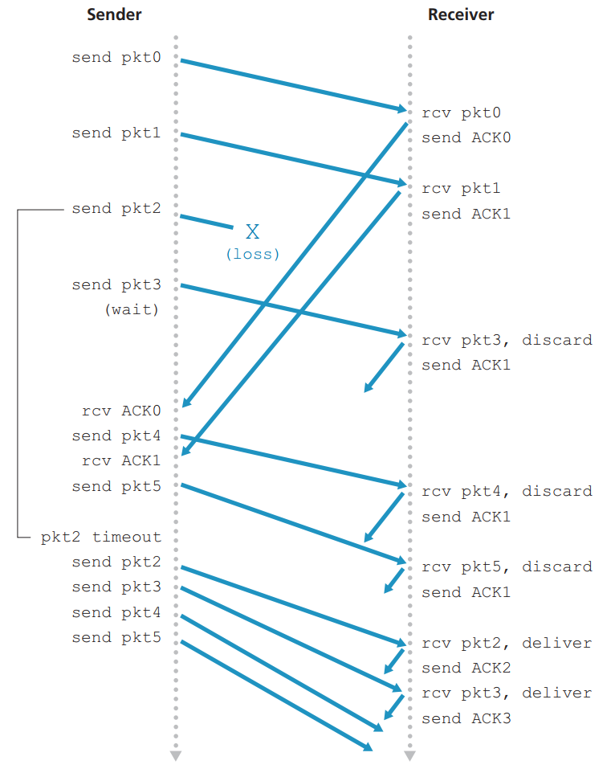
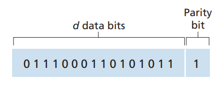

# 计算机网络-自顶向下

**@ author: Shuxin-Wang**

**@ time: 2022-09-18**


[TOC]

# 1 Introduction概述


## 1.1 Why computer network?


### 1.1.1 构建计算机网络的目的

> Purpose of constructing computer networks

- 促进信息交流；

> Facilitate information exchange


### 1.1.2 计算机网络的功能

> Functionality of computer networks

- 信息资源分享；
- 改变生活方式；

> - Information/resource sharing
> - Change our way of life


### 1.1.3 为什么要理解计算机网络

> Why should we understand computer networks

- 人们正处于信息时代；
- 计算机网络塑造我们的社会和我们自己；

> - The era of information
> - Computer networks shape our society and ourselves


## 1.2 计算机网络的结构组成

> The structure of computer networks


### 1.2.1 计算机网络概念

> Computer network structure

- 计算机网络，通常简称为网络，**是由==硬件组件和计算机==组成的集合，通过通信通道互连，从而实现资源和信息的共享**。如果一个设备中的至少一个进程能够向驻留在远程设备中的最少一个进程发送/接收数据，则称这两个设备位于网络中。

> A **computer network**, often simply referred to as a network, **is a collection of hardware components and computers interconnected by communication channels that allow sharing of resources and information**. Where at least one process in one device is able to send/receive data to/from at least one process residing in a remote device, then the two devices are said to be in a network. 


### 1.2.2 物理结构

> **Physical structure: a “nuts and bolts” view**


#### 结构组成

- Connected computing **devices**:
  - host(主机)=end systems(端系统)
  - running network apps at Internet's edge(在网络边缘运行应用程序)
- **Packet switches(分组交换机)**: forward packets(chunks of data)(转发数据包（数据块）)
  - routers(路由器)
  - switches(交换机)
- **Communication links(通信链路)**
  - fiber, copper, radio, satellite(光纤、铜缆、无线电、卫星)
  - transmission rate:bandwidth(传输速率：带宽)
- **Network(网络)**
  - collection of devices, routers, links: managed by an organization(设备、路由器、链接的集合：由组织管理)


#### Protocols(协议)

- 协议定义了网络实体之间发送和接收的消息的**格式**、**顺序**，以及在消息传输和接收上采取的**操作**；

> *Protocols* *define the* ***format***,***order*** *of* *messages sent and received* *among network entities, and* ***actions** taken* *on msg transmission, receipt* 


### 1.2.3 功能结构

> **Functional structure**


#### 结构组成

- **Network egde(网络边缘)**:
  - applications and hosts
  - Interface between end system and networks(端系统与网络间的接口)
- **Access networks(网络接入)**:
  - wired, wireless communication links(有线、无线通信链路)
  - Interface between network edge and network core(网络边缘和网络核心之间的接口)
- **Network core(网络核心)**:
  - Edge network(边缘网络)
  - Core/backbone network(核心/骨干网)


### 1.2.4 Functional structure-Network edge

- hosts: clients and servers
- servers often in data centers


### 1.2.5 Functional structure-Access networks

1. **Residential access nets(家庭接入网)**

   - cable-based access(基于电缆接入)

     - 频分复用（FDM）：在不同频带传输的不同信道

       > *frequency division multiplexing (FDM):* different channels transmitted in different frequency bands

     - HFC：混合光纤同轴电缆；不对称：高达40 Mbps–1.2 Gbs下行传输速率，30-100 Mbps上行传输速率

       > HFC: hybrid fiber coax; Asymmetric: up to 40 Mbps – 1.2 Gbs downstream transmission rate, 30-100 Mbps upstream transmission rate

     - 电缆、光纤网络将家庭连接到ISP路由器

       > network of cable, fiber attaches homes to ISP router

     - 电缆调制解调器接入网络

       > Cable modem access network

     - 电力线宽带接入网

       > Power line broadband access network

   - digital subscriber line (DSL)(数字用户线)

     - 使用现有电话线连接中央办公室DSLAM

       > use *existing* telephone line to central office DSLAM

2. **mobile access networks (WiFi, 4G/5G)(移动接入网络)**

   - Wireless local area networks(WLANs)无线局域网
     - typically within or around building (~100 ft)
     - 802.11b/g/n (WiFi): 11, 54, 450 Mbps transmission rate
   - Wide-area cellular access networks(广域蜂窝接入网)
     - provided by mobile, cellular network operator (10’s km)
     - 10’s Mbps 

3. **institutional access networks(机构介入网络)**

   - 混合使用有线、无线链路技术，连接混合的交换机和路由器；
     - 以太网：100Mbps、1Gbps、10Gbps有线接入；
     - WiFi：无线接入点速度为11、54、450 Mbps；

   > mix of wired, wireless link technologies, connecting a mix of switches and routers 
   >
   > - Ethernet: wired access at 100Mbps, 1Gbps, 10Gbps;
   > - WiFi: wireless access points at 11, 54, 450 Mbps; 


### 1.2.5 Functional structure-Network core

- 互连路由器网格
- 数据包交换：主机将应用层消息分成数据包
  - 将数据包从一个路由器转发到下一个路由器，在从源到目标的路径上通过链路；
  - 以全链路容量传输每个数据包；

> - Mesh of interconnected routers
> - Packet-switching: hosts break application-layer messages into *packets*
>   - forward packets from one router to the next, across links on path from source to destination;
>   - each packet transmitted at full link capacity;


### 1.2.6 Function structure-work flow


#### Host: sends packets of data

- 获取应用程序消息
- 分为更小的块，称为数据包，长度L位
- 以传输速率R将数据包传输到接入网络
  - 链路传输速率，即链路容量，即链路带宽

$$
T_{\text{packet transmission delay}}=\frac{L_{\text{bits}}}{R_{\text{bits/sec}}}
$$

> Host sending function:
>
> - Takes application message;
> - Breaks into smaller chunks, known as *packets*, of length *L* bits;
> - Transmits packet into access network at *transmission rate R*
>   - link transmission rate, aka link *capacity, aka link bandwidth*


#### Communication link: physical media

- 位(Bit)：在发射机/接收机对之间传播
- 物理链接(Physical link)：发射机和接收机之间的内容
- 导向介质(Guided media)：
  - 信号在固体介质中传播：铜、光纤、同轴电缆
- 非导向介质(Unguided media)：
  - 信号自由传播，例如无线电


***<u>导向介质：</u>***

1. 双绞线(Twisted pair)(TP)
   - 两条绝缘铜线
     - 5类：100 Mbps，1 Gbps以太网；
     - 6类：10Gbps以太网；
2. 同轴电缆(Coaxial cable)
   - 两根同心(concentric)铜导线
   - 双向(bidirectional)
   - 宽带(broadband)：
     - 电缆上的多个频率通道每通道100 Mbps
3. 光纤网线(Fiber optic cable)
   - 玻璃纤维携带光脉冲，每脉冲一位
   - 高速运转：
     - 高速点对点传输（10’s-100 Gbps）
   - 低错误率：
     - 中继器间隔很远
     - 对电磁噪音免疫


***<u>非导向介质：</u>***

- 电磁频谱中携带的信号

- 无物理“线”
- 广播和“半双工”（发送方到接收方）
- 传播环境影响：
  - 反射
  - 物体障碍物干扰
- 链接类型：
  - 地面微波(terrestrial)
    - 高达45 Mbps信道
  - 无线局域网（WiFi）(wireless LAN)
    - 高达100 Mbps
  - 广域（如蜂窝）4G蜂窝(wide-area)
    - ~10 Mbps
  - 卫星(stellite)
    - 高达45 Mps每信道
    - 270毫秒终端延迟
    - 地球同步与低地球轨道


#### Access networks

- 见1.2.4节


#### Network core

- **Routing(路由)：**
  - 全局操作：确定数据包采用的源目标路径
  - 路由算法
- **Forwarding(转发)：**
  - 本地操作：将到达的数据包从路由器的输入链路移动到适当的路由器输出链路


### 1.2.7 Packet switching分组交换


#### 存储转发

- 整个数据包必须到达路由器才能在下一链路上传输；

对于包(packet)数据长度为L，传输速率为R，通信链路条数为N，则：
$$
t_{\text{trans}}=N\frac{L}{R}
$$


#### 排队时延与分组丢失

如果链路的到达速率（bps）在一段时间内超过链路的传输速率（bps）：

- 数据包将排队等待在输出链路上传输;
- 如果路由器中的内存（缓冲区）已满，数据包可能会被丢弃（丢失）


### 1.2.8  Circuit switching线路交换


**分配给的终端资源，保留给源和目标之间的“调用”（缓存，链路传输速率）**

> End-end resources allocated to, reserved for “call” between source and destination

- 专用资源：无共享
  - 电路类（保证的）性能；
- 如果呼叫未使用，则电路段空闲（无共享）；
- 常用于传统电话网络；


#### 频分复用Frequency Division Multiplexing (FDM)

- 光、电磁频率被划分为（窄）频带；
- 每个呼叫分配自己的频带，可以以该窄带的最大速率传输；


#### 时分复用Time Division Multiplexing (TDM)

- 时间被划分为周期性时隙；
- 每个呼叫分配的周期时隙，可以以（更宽）频带的最大速率传输，但只能在其时隙内传输；


### 1.2.9 Circuit vs. Packet switching

- Circuit switching: PSTN( Public Switched Telephone Network )定义：公共交换电话网络，一种常用旧式电话系统。即我们日常生活中常用的电话网；
- Packet switching: Computer network

***动机不同：***

PSTN：稳定、恒定、稳定的流量；

计算机网络：突发流量；

数据包交换为计算机网络显示了更高的效率；同时允许更多的用户去使用网络；

***数据包交换的特点：***

- 非常适合“突发”数据——有时需要发送数据，但有时不需要；
- 可能出现过度拥塞：缓冲区溢出导致的数据包延迟和丢失：
  - 可靠数据传输、拥塞控制所需的协议；
- 传统上用于音频/视频应用的带宽保证来提供类电路行为；


### 1.2.10 Network core-network of networks

- 主机通过访问Internet服务提供商（ISP）；
  - 住宅，企业（公司、大学、商业）接入ISP；
- ISP必须相互连接；
  - 以便任何两台主机都可以相互发送数据包；
- 结果网络网络的演变非常复杂；
  - 这是由经济和国家政策驱动的；


### 1.2.11 服务结构

- 从源到目标的可靠数据传输（FTP、WWW）；
- “尽力而为(unreliable)”（不可靠）数据传输（Skype、Voice on IP）；


## 1.3 计算机网络性能评估

> To evaluate the performance of computer networks


- **服务品质Quality of service(QoS)**
  - Loss
  - Delay
  - Throughput
- **网络安全Network security**


路由器缓冲区中的数据包队列

- 数据包队列，等待输出；
- 到达率链路（暂时）超过输出链路容量：数据包丢失；


### 1.3.1 包延迟 Packet delay: four sources

$$
d_{\text{nodal}}=d_{\text{proc}}+d_{\text{queue}}+d_{\text{trans}}+d_{\text{prop}}
$$

$d_{proc}$: nodal processing

- 检查位错误；
- 确定输出链接；
- 通常<毫秒；


$d_{queue}$:queueing delay

- 输出链路等待传输的时间；
- 取决于路由器的拥塞级别；


# 2 Application layer应用层


## 2.1 应用层协议原理

> **Principles of network applications**

### 2.1.1 网络应用程序体系结构

> Network application structure

**应用程序体系结构（application architecture）**由应用程序研发者设计，规定了如何在各种端系统上组织该应用程序。现代网络应用程序中所使用的两种主流体系结构：

#### 客户-服务器体系结构

> Client-server architecture

1. Server

   - 总是在线（always on host）；
   - 永久的IP地址（permanent IP address）；
   - 配置在数据中心（often in data centers）；

2. Client

   - 与服务器沟通联系；
   - 被间歇性（intermittently）的连接；
   - 拥有动态地址；
   - 客户之间不直接联系；

   


#### P2P体系结构

> Peer-peer architecture

- 没有一直在线的服务器；
- 端与端之间直接进行连接；
- **自拓展性（self-scalability）**，每个对等方通过向其他对等方分发文件为系统提供服务能力；
- 对等方可间歇性的被连接并且可以改变IP地址；


### 2.1.2 进程通信

> Process communicating

用操作系统的术语来说，进行通信的实际上是**进程（process）**而不是程序；在两个不同端系统上的进程，通过跨越计算机网络交换**报文（message）**而相互通信。

#### 客户和服务器进程

- 客户进程：发起通信的进程；
- 服务进程：在会话开始时等待联系的进程；

#### 进程与计算机网络之间的接口

> Socket

进程通过一个称为**套接字（Sockets）**的软件接口向网络发送报文和从网络接受报文。由于该套接字是建立网络应用的可编程接口，因此套接字被称为应用程序和网络之间的**应用程序编程接口（Application Programming Interface，API）**。


#### 进程寻址

> Addressing processes

- 主机地址👉**IP地址（IP address）**标识；
- 目的主机指定**接受进程**的标识符👉目的地**端口号（port number）**；


### 2.1.3 可供应用程序使用的运输服务

> Transport service used in application

1. **可靠数据传输（reliable data transfer）**
   - 一些应用需要100%可靠数据传输；
   - 一些应用允许丢包（loss）；
2. **吞吐量（Throughout）**
   - 具有吞吐量要求是应用程序被称为**带宽敏感的应用（bandwidth-sensitive application）**；
   - **弹性应用（elastic application）**能够根据当时可用的带宽或多或少地利用可供使用的吞吐量；
3. **定时（Timing）**
   - **低延时（low delay）**要求；
4. **安全（Security）**
   - 加密技术（encryption）、数据完整性（data integrity）；

### 2.1.4 因特网提供的运输服务

> Transport protocols services

#### TCP服务

- 面向连接的服务（connection-oriented）：报文开始流动之前，TCP让客户和服务器互相交换运输层控制信息（握手阶段），握手阶段后，一条TCP连接（TCP connection）就在两条进程的套接字之间建立；
- 可靠的数据传送服务（reliable transport）：无差别、按适当顺序交付所有发送的数据；
- 拥塞控制机制（congestion control）；

**<u>*==TCP安全==：*</u>**

**安全套接字层（Secure Sockets Layer，SSL）**提供了关键的进程到进程的安全性服务。


我们平时上网冲浪时，网址前面的`http`与`https`的关系其实就是`http + SSL = https`🫡

#### UDP服务

- 提供一种不可靠数据传送服务（unreliable data transfer）；
- 当进程将报文发送至UDP套接字时，UDP并不能保证该报文将到达接收进程；

### 2.1.5 应用层协议

> Application-layer protocol

**应用层协议（Application-layer protocol）**定义了运行在不同端系统上的应用程序进程如何相互传递报文。

### 2.1.6 网络应用

- Web
- 电子邮件
- 目录服务
- 流式视频
- P2P
- 。。。


## 2.2 Web和HTTP

> **Web and http**

### 2.2.1 HTTP概况

> HTTP overview

Web的==应用层协议==是**超文本传输协议（HyperText Transfer Protocol，HTTP）**，它是Web的核心。。

- **Web页面（Web page）**（也叫文档）是由对象组成。一个对象（object）只是一个文件，诸如一个HTML文件、一个JPEG图片、一个Java小程序等等；
- 多数Web页面包含**HTML基本文件（base HTML）**以及几个引用对象；
- **Web浏览器（Web browser）**实现了HTTP的客户端；**Web服务器（Web server）**实现了HTTP的服务器端；
- HTTP使用TCP作为它的支撑运输协议；
- 因为HTTP服务器并不保存关于客户的任何信息，所以我们会说HTTP是一个无状态协议（stateless protocol）；


### 2.2.2 非持续连接和持续连接

> Non-persistent HTTP and Persistent HTTP

#### 非持续连接

1. TCP连接开启；
2. 最多一个对象通过该TCP连接发送；
3. 该TCP连接关闭；

#### 持续连接

1. TCP连接开启；
2. 多个对象通过该TCP连接发送；
3. 该TCP连接关闭；


- **往返时间（Round-Trip Time，RTT）**定义：该时间是指一个短分组从客户到服务器然后在返回客户所需要的时间；


### 2.2.3 HTTP报文格式

> HTTP message format

#### HTTP请求报文

```http
GET /index.html HTTP/1.1\r\n
Host: www-net.cs.umass.edu\r\n
User-Agent: Firefox/3.6.10\r\n
Accept: text/html,application/xhtml+xml\r\n
Accept-Language: en-us,en;q=0.5\r\n
Accept-Encoding: gzip,deflate\r\n
Accept-Charset: ISO-8859-1,utf-8;q=0.7\r\n
Keep-Alive: 115\r\n
Connection: keep-alive\r\n
\r\n
```

- 请求报文的第一行叫做**请求行（request line）**，其后继的行叫作**首部行（header line）**；
- 请求行有3个字段：方法字段、URL字段和HTTP版本字段；
  - 方法可取`GET,POST,HEAD,PUT,DELETE`；
- 首部行`HOST:`指明了对象所在的主机；首部行`User-Agent:`指明了用户代理，即浏览器类型；。。。

**<u>*HTTP请求报文通用格式：*</u>**


#### HTTP响应报文

```http
HTTP/1.1 200 OK\r\n
Date: Sun, 26 Sep 2010 20:09:20 GMT\r\n
Server: Apache/2.0.52 (CentOS)\r\n
Last-Modified: Tue, 30 Oct 2007 17:00:02 GMT\r\n
ETag: "17dc6-a5c-bf716880"\r\n
Accept-Ranges: bytes\r\n
Content-Length: 2652\r\n
Keep-Alive: timeout=10, max=100\r\n
Connection: Keep-Alive\r\n
Content-Type: text/html; charset=ISO-8859-1\r\n
\r\n
(data data data data data ... )
```

- 上例响应报文包括一个**初始状态行（status line）**，9个**首部行（header line）**，然后是**实体体（entity boby）**；
- 状态行有3个字段：协议版本字段、状态码和状态信息；
  - `200 OK`：请求成功；
  - `301 Moved Permanently`：请求对象以及被永久转移；
  - `400 Bad Request`：一个通用差错代码，该请求不能被服务器理解；
  - `404 Not Found`：被请求的文档不在服务器上；
  - `505 HTTP Version Not Support`：服务器不支持请求报文使用的HTTP协议版本；

### 2.2.4 用户与服务器的交互：cookie🍪

> Maintaining user/server state: cookies🍪

前面提到HTTP服务器为无状态的，而一个Web站点通常希望能够识别用户，可能是因为服务器希望限制用户的访问，或者因为它希望把内容与用户身份联系起来。为此，HTTP使用了cookie🍪。

cookie技术有4个组件：

- HTTP响应报文的cookie首部行；
- HTTP请求报文的cookie首部行；
- 用户端系统中保留一个cookie文行；
- 位于Web站点的一个后端数据库；


### 2.2.5 Web缓存

> Web cache(proxy server)

**Web缓存器（Web cache）**也叫**代理服务器（proxy server）**，它是能够代表**初始Web服务器（origin server）**来满足HTTP网络请求的实体。


请求过程：

1. 浏览器创建一个到Web缓存器的TCP连接，并向Web缓存器中的对象发送一个HTTP请求；
2. Web缓存器进行检查，看看本地是否存储该对象副本。如果有，Web缓存器向客户返回该对象；
3. 如果缓存器中没有该对象，它就打开一个与该对象的初始服务器的TCP连接。Web缓存器向初始服务器发送请求，并得到初始服务器的响应；
4. 当Web缓存器接受对象后，在本地创建给对象的副本，并向客户发送响应报文返回该对象；

通过使用**内容分发网络（Content Distribution Network，CDN）**，Web缓存器正在因特网中发挥着越来越重要的作用。

### 2.2.6 条件GET方法

> Conditional GET

尽管高速缓存器能减少用户感受到的响应时间，但引入了一个新的问题，即存放在缓存器中的副本可能陈旧的。

**条件GET方法：**

1. 请求报文使用`GET`方法；
2. 请求报文中包含一个`If-Modified-Since:`首部行；

响应报文中状态行为`304 Not Modified`表示缓存器可以使用该对象的副本。


## 2.3 因特网种的电子邮件

> E-mail

电子邮件三个主要组成部分：

- 用户代理（User agent）；
- 邮件服务器（mail server）；
- 简单邮件传输协议（Simple Mail Transfer Protocol，SMTP）；


用户代理

- 撰写、编辑、阅读邮件；
- 服务器上存储的传入和传出的消息；

邮件服务器

- 邮箱（mailbox）包括用户传入的消息；
- 报文队列（message queue）中为待发送的邮件报文；

SMTP协议

- 在邮箱服务器之间传输邮件报文；

### 2.3.1 SMTP

假设Alice想给Bob发送一封简单的ASCII报文：

1. Alice调用她的邮件代理程序并提供Bob的邮件地址，撰写报文，然后指示用户代理发送该报文；
2. Alice的用户代理把报文发给她的邮件服务器，在那里该报文被放在报文队列中；
3. 运行在Alice的邮件服务器上的**SMTP客户端**发现了该报文队列中的这个报文，它就创建一个到运行在Bob的邮件服务器上的SMTP服务器的**TCP连接**；
4. 经过一些**初始SMTP握手**后，SMTP客户通过该TCP连接发送Alice的报文；
5. 在Bob的邮件服务器上，**SMTP的服务器端**接受该报文。Bob的邮件服务器然后将该报文放入Bob的邮箱中；
6. 在Bob方便的时候，他调用用户代理阅读该报文；


- 如果Bob的邮件服务器没有开机，该报文会保留在Alice的邮件服务器上并等待进行新的尝试，这意味着邮件并**不在中间的某个邮件服务器存留**。

### 2.3.2 与HTTP对比

1. HTTP主要是一个**拉协议（pull protocol）**，TCP连接是由想==接受==文件的机器发起的；SMTP是一个**推协议（push protocol）**，TCP连接是由==发送==文件的机器发起；
2. SMTP要求报文采用7比特ASCII码格式，如果含有非7比特ASCII字符，则这些数据必须按照7比特ASCII码进行编码；HTTP不受这种限制；
3. HTTP把每个对象分别封装在不同的HTTP响应报文中；SMTP则把所有报文对象放在一个报文中；

### 2.3.3 邮件报文格式

```HTTP
To:发件人地址
From:收件人地址
Subject:邮件主题

...邮件正文
```

### 2.3.4 邮件访问协议

> Mail accss protocol

收件人的用户代理不能使用SMTP得到报文，因为取得报文是一个拉操作，而SMTP协议是一个推协议。通过引用一个特殊的邮件访问协议来解决这个问题，该协议将收件人邮件服务器上的报文传送给他的本地PC。目前有一些流行的邮件访问协议，包括第三版的邮局协议（Post Office Protocol-Version 3，POP3）（不常用）、因特网邮件访问协议（Internet Mail Access Protocol，IMAP）以及HTTP。


## 2.4 DNS：因特网的目录服务

> Domain Name System
> 

### 2.4.1 DNS提供的服务

> DNS:services

识别主机的两种方式：通过**主机名（hostname）**或者**IP地址（IP address）**。人们喜欢记忆主机名标识方式，而路由器喜欢定长的、有着层次结构的IP地址。域名系统的主要任务：==主机名到IP地址转换的目录服务==。

DNS是：

1. 一个由分层的**DNS服务器（DNS service）**实现的分布式数据库；
2. 一个使得主机能够查询分布式数据库的应用层协议；

DNS协议运行在`UDP`之下，使用`53`号端口；


DNS重要的服务：

- 主机名到IP地址的转换（hostname to IP address translation）；
- 主机别名（host aliasing）：应用程序调用DNS获取主机别名对应的**规范主机名（canonical hostname）**以及主机的IP地址；
- 邮件服务器别名（mail server aliasing）；
- 负载分配（load distribution）：繁忙的站点被**冗余分布在多台服务器**上，每台服务器运行在不同的端系统上，每个都有着不同的IP地址。由于这些冗余的Web服务器，一个==IP地址集合==于**一个规范主机名**相联系。当客户对映射到某处到某地址集合的名字发出一个DNS请求时，该服务器用IP地址的整个集合进行响应，但在每个回答中循环这些地址次序。因为客户通常**<u>总是向IP地址排在最前面的服务器发送HTTP请求报文</u>**，所以DNS就在所有这些冗余的Web服务器之间循环分配了负载；

### 2.4.2 DNS工作机理概述

> Overview of How DNS Works

集中式设计的问题包括：

- 单点故障（a single point of failure）；
- 通信容量（traffic volume）；
- 远距离的集中式数据库（distant centralized database）；
- 维护（maintenance）；

#### 分布式，层次数据库

分布式DNS服务器的层次结构：

- 根DNS服务器（root DNS servers）；
- 顶级域服务器（Top-Level Domain DNS servers）；
- 权威DNS服务器（authoritative DNS servers）；
- 本地服务器（local DNS servers）：不属于该服务器的层次结构，但它对DNS层次结构是至关重要的；


#### 查询方式

1. 递归查询（Recursive query）


2. 迭代查询（Iterative query）


==从请求主机到本地的DNS服务器的查询是**递归**的，其余的查询是**迭代**的。==

#### DNS缓存

在某一个请求链中，当某DNS服务器接收一个DNS回答，它能映射在本地存储器中。由于主机和主机名与IP地址的映射并不是永久的，DNS服务器在一段时间后将丢弃缓存的信息。

### 2.4.3 DNS记录和报文

> DNS Record and Protocol Message

#### DNS记录

所有DNS服务器存储了**资源记录（Resourse Record，RR）**，资源记录是一个包含了下列字段的4元组：

- `(Name, Value, Type, TTL)`

下面为不同类型`Type`的`Name`和`Value`：


#### DNS报文

DNS报文中各字段的语义如下：


## 2.5 P2P文件分发

> Peer-to-Peer File Distribution  

CS系统极大依赖于总是打开的基础设施服务器，P2P对总是打开的服务器有最小的（或者没有）依赖。

### P2P体系结构的扩展性

> Scalability of P2P Architectures

文件分发问题的示例图如下：


对于客户-服务器体系结构的分发时间如下：
$$
D_{cs}=\max\{\frac{NF}{u_s},\frac{F}{d_{min}}\}
$$
对于P2P体系结构分发时间如下：
$$
D_{P2P}=\max\{\frac{F}{u_s},\frac{F}{d_{min}},\frac{NF}{u_s+\sum^N_{i=1}u_i}\}
$$
P2P和客户-服务器体系结构的分发时间随用户数量变化如下：


### BitTorrent

参与一个特定文件分发的所有对等方的集合被称为一个**洪流（torrent）**。在一个洪流中的对等方彼此下载等长度的**文件块（chunk）** ，典型块长度为256KB。当一个对等方下载块时，也为其他对等方上载了多个块。每个洪流具有一个基础设施节点，称为**追踪器（tracker）**。当一个对等方加入某洪流时，它向追踪器注册自己，并周期性地通知追踪器它仍在该洪流中。


- 决定请求哪些块的过程：**最稀缺优先（rarest first）**技术；
- 决定响应哪个请求：根据当前能够以最高速率的**疏通（unchoked）**的对等方提供数据的邻居，给出优先权；


## 2.6 视频流和内容分发网

> Video Streaming and Content Distribution Networks

### 2.6.1 HTTP流和DASH

HTTP流所有客户接受到相同编码的视频，但对不同用户或者不同时间，客户可用的带宽大小有很大不同。**HTTP的动态适应性流（Dynamic Adaptive Streaming over HTTP，DASH）**：视频编码成几个不同的版本，其中每个版本具有不同的比特率，对应于不同的质量水平。客户动态地请求来自不同版本且长度为几秒的视频段数据块。

每个视频版本存储在HTTP服务器中，每个版本都有一个不同的URL。HTTP服务器也有一个**告示文件（manifest file）**，为每个版本提供了一个URL及其比特率。

### 2.6.2 内容分发网

为了应对向分布于全世界的用户分发巨量视频数据的挑战，几乎所有主要的视频流公司都利用**内容分发网（Content Distribution Network，CDN）**。CDN管理分布在多个地理位置上的服务器，在它的服务器中存储视频的副本，并且所有试图将每个用户请求定向到一个将提供最好的用户体验的CDN位置。CDN可以是**专用CDN（private CDN）**，即它由内容提供商自己所拥有；另一种CDN可以是**第三方CDN（third-party CDN）**，它代表多个内容提供商分发内容。

#### CDN操作

当客户请求一个特定视频时，CDN必须截获该请求，以便能够：

1. 确定此时适合用于该客户的CDN服务器集群；
2. 将客户的请求重定向到该集群的某台服务器；

CDN操作步骤如下：


## 2.7 套接字编程：生成网络应用

> Socket Programming: Creating Network Applications

### 2.7.1 UDP套接字编程


### 2.7.2 TCP套接字编程


# 3 Transport layer运输层


## 3.1 概述和运输层服务

> Introduction and Transport-Layer Services

运输层协议为运行在不同的主机上的应用进程之间提供了**逻辑通信（logic communication）**功能从应用程序的角度看，通过逻辑通信，运行不同进程的主机好像直接相连一样。逻辑通信的概念如下：


运输层协议是**在端系统中**而不是在路由器中实现。在发送端，运输层将从发送应用程序接收到的报文转换成传输层分组，用因特网术语来讲该分组称为运输层**报文段（segment）**。

### 3.1.1 运输层和网络层的关系

> Relationship Between Transport and Network Layers

在协议栈中，运输层刚好位于网络层之上。网络层提供了**主机之间**的逻辑通信，而运输层为运行在**不同主机上的进程之间**提供了逻辑通信。运输协议能够能够提供的服务常常受制于底层网络层协议的服务模型。如果网络层协议无法为主机之间发送的运输层报文段提供时延或带宽保证的话，运输层协议也就无法为进程之间发送的应用程序报文提供时延或带宽保证。

即使底层网络协议是不可靠的，也就是说网络层协议会使分组丢失、篡改和冗余，运输层协议也能为应用程序提供可靠的数据传输服务。另一方面，即使网络层不能保证运输层报文段的机密性，运输协议也能使用加密来确保应用程序报文不被入侵者读取。

### 3.1.2 因特网运输层概述

> Overview of the Transport Layer in the Internet

因特网提供两种不同的可用的运输层协议。**UDP（User Datagram Protocol）**，它为调用它的应用程序提供了一种不可靠、无连接的服务；**TCP（Transmission Control Protocol）**，它为调用它的应用程序提供了一种可靠的、面向连接的服务。

因特网网络层协议有一个名字叫IP（Internet Protocol），即网际协议，IP的服务模型是**尽力而为交付服务（best-effort delivery service）**，同时IP被称为**不可靠服务（unreliable service）**。

UDP和TCP最基本的责任是，将两个端系统间IP的交付服务扩展为运行在端系统上的两个进程之间的交付服务。将主机间交付扩展到进程间交付被称为**运输层的多路复用（transport-layer multiplexing）**与**多路分解（demultiplexing）**。


## 3.2 多路复用与多路分解

> Multiplexing and Demultiplexing

运输层的多路复用与多路分解，也就是将由网络层提供的主机到主机的交付服务延伸到为运行在主机上的应用程序提供进程到进程的服务。一个进程（作为网络应用的一部分）有一个或多个**套接字（socket）**，它相当于从网络向进程传递数据和从进程向网络传递数据的门户。下图为进程交付过程：


- 多路分解（Demultiplexing）：在接收端，运输层检查这些字段，标识出接收套接字，进而将报文段定向到该套接字，即将运输层报文段的数据交付到正确的套接字的工作；
- 多路复用（Multiplexing）：在源主机从不同套接字中收集数据块，并为每个数据块封装上首部信息（这将在以后用于分解）从而生成报文段，然后将报文传递到网络层；

运输层多路复用要求：

1. 套接字由唯一标识符；
2. 每个报文段有特殊字段来指示该报文段所要交付的套接字；

这些特殊字段是**源端口号字段（source port number field）**和**目的端口号字段（destination port number field）**，如下图所示：


端口号是一个16比特的数，其大小在`0~65535`之间。`0~1023`范围的端口号称为**周知端口号（well-know port number）**，是受限制的。

### UDP的socket表示

二元组表示👉`(源端口， 目的端口)`，具体过程如下图所示：


### TCP的socket表示

四元组表示👉`(源IP地址， 源端口号， 目的IP地址， 目的端口号)`，下图为两个客户使用相同的目的端口号（80）与同一个Web服务器应用通信：


## 3.3 无连接运输：UDP

> Connectionless Transport: UDP

使用UDP时，在发送报文段之前，发送方和接收方的运送层实体之间没有握手，UDP被称为**无连接的（connectionless）**。许多应用更适合用UDP的原因如下：

- 无拥塞控制（no congestion control）；
- 无须连接建立（no connection establishment)；
- 无连接状态（no connection state）；
- 分组首部开销小（small header size）；

流行的因特网应用及其下面的运输协议如下图：


### 3.3.1 UDP报文段结构

> UDP Segment Structure

报文段包括上面提到的源端口号和目的端口号；还有长度字段，指明UDP报文段中的字节数（首部➕数据）；报文段中的检验和字段来检查在该报文段中是否出现差错。报文段结构如下图：


### 3.3.2 UDP检验和

> UDP Checksum

发送发的UDP对报文段中的所有16比特字的和进行反码运算，求和时遇到的任何溢出都被**回卷（溢出位与低16位相加）**，下图为两个16比特字相加过程：


接收方，全部的16比特字（包括检验和）加在一起，如果分组中没有差错，接收方处该和将是`1111111111111111`，如果比特字中出现`0`，那么就认为该分组出现差错。


## 3.4 可靠数据传输原理

> Principles of Reliable Data Transfer

可靠数据传输的框架：为上层实体提供的服务抽象是：数据可以通过一条可靠的信道进行传输。如下图所示：


实现这种服务抽象是**可靠数据传输协议（reliable data transfer protocol，rdt）**的责任，下图为可靠数据传输协议的相关接口（Interface）：


### 3.4.1 构造可靠数据传输协议

> Building a Reliable Data Transfer Protocol

#### 经完全可靠信道的可靠数据传输：rdt1.0

发送方和接收方的表示使用==**有限状态机（Finite-State Machine，FSM）**==定义，如果对一个事件没有动作，或没有就发生发生而采取了一个动作，我们将在横线上方或下方使用==**符号$\Lambda$**==，以分别明确地表示缺少动作或事件。

我们考虑最简单的情况，**即==底层信道==是完全可靠的**，我们称该协议为`rdt1.0`，发送方和接收方的FSM定义如下：


#### 经具有比特差错信道的可靠数据传输：rdt2.0

底层信道更为实际的模型是分组中的比特可能受损的模型。在分组传输、传播或缓存的过程中，这种比特差错通常会出现在网络的物理部件中。在接收方得到比特差错的信息时，需要发送方进行重传。在计算机网络环境中，基于这种重传机制的可靠数据传输协议称为**自动重传请求（Automatic Repeat reQuest，ARQ）协议**。ARQ协议中还需要另外三种协议来处理存在比特差错的情况：

- 差错检测：发送方同时发送检测和（checksum）到接收端判断是否出现比特差错；
- 接收方反馈：
  - **肯定确认（Acknowledgement，ACK）**：接收方告诉发送方包数据无差错；
  - **否定确认（Negative acknowledgement，NAK）**：接收方告诉发送方包数据有错误；
- 重传：接收方收到有差错的分组时，发送方将重传该分组文；

`rdt2.0`的FSM如下图：


当发送方处于等待ACK或NAK的状态时，它不能从上层获得更多的数据；这就是说，`rdt_send()`事件不可能出现；仅当接收到ACK并离开该状态时才能发生这样的事件。因此，发送方将不会发送一块新数据，除非发送方确信接收方已正确接收当前分组。由于这种行为，`rdt2.0`这样的协议被称为**停等（stop-and-wait）协议**。

`rdt2.0`协议并没有考虑ACK和NAK受损的情况，为了解决这一问题，就是在数据分组中添加一新字段，让发送方对其数据分组编号，即将发送数据分组的**序号（sequence number）**放在该字段。于是，接收方只需要检查序号即可确定收到的分组是否一次重传。

`rdt2.1`的FSM如下图：


如果收到受损的分组，则接收方将发送一个否定确认。如果不发送NAK，而是对上次正确接收的分组发送一个ACK，我们也能实现与NAK一样的效果。发送方接收到对同一个分组的两个ACK，即冗**余ACK（duplicate ACK）**后，就知道接收方没有正确接收到跟在被确定两次的分组后面的分组。

`rdt2.2`的FSM如下图所示：


#### 经具有比特差错的丢包信道的可靠数据传输：rdt3.0

- 因为特别大的时延，发送方和接收方的信道中引入了**冗余数据分组（duplicate data packet）**的可能性；
- 需要一个**倒计数定时器（countdown timer）**，实现基于时间的重传机制；

`rdt3.0`发送方FSM如下图：


因为分组序号在0和1之间交替，因此`rdt3.0`有时被称为**比特交替协议（alternating-bit protocol）**。运行如下图所示：


### 3.4.2 流水线可靠数据传输协议

> Pipelined Reliable Data Transfer Protocols

定义发送方（或信道）的**利用率（utilization）**为：发送方实际忙于将放送比特送进信道的那部分时间与发送时间之比。对于一个等停协议的发送方利用率$U_{sender}$：
$$
U_{sender}=\frac{L/R}{RTT+L/R}
$$
对于停等协议的发送发利用率是非常低的，解决该问题的方法是：不以停等方式运行，允许发送方发送多个分组而无须等待确认。因为许多从发送方向接收方输送可以看成是填充到一条流水线中，故这种技术被称为**流水线（pipeline）**，下图为停等和流水线发送示意图：


### 3.4.3 回退N步

> Go-Back-N,GBN

在回退N步协议中，将基序号（base）定义为最早未确认分组的序号，将下一个序号（nextseqnum）定义为最小的未使用序号，则将序号范围分割成如下4段：


- `[0,base-1]`👉已经发送并得到确认的分组；
- `[base,nextseqnum-1]`👉已经发送但未被确认的分组；
- `[nextseqnum,base+N-1]`👉能用于那些要被立即发送的分组；
- `[base+N,end]`👉不能使用；

那些已被发送但还未被确认的分组的许可序号范围可以被看成一个在序号范围内长度未`N`的窗口。随着协议的运行，该窗口在序号空间向前滑动。因此，N常被称为**窗口长度（window size）**，GBN协议也常被称为**滑动窗口协议（sliding-window protocol）**。

为一个基于ACK、无NAK的GBN协议的发送方和接收方两端的扩展FSM描述，因为加入了变量`base`和`nextseqnum`所以我们称其为扩展FSM，下图为发送端的扩展FSM描述：


下图为接收端的FSM描述：


在GBN协议中，接收方丢弃所有失序分组。这种方法的优点是接收缓存简单，即接收方不需要缓存任何失序分组。因此，虽然发送方必须维护窗口的上下边界及`nextseqnum`在该窗口的位置，但接收方需要维护的唯一信息就是下一个按序接收的分组序号。运行中的GBN如下图所示：



### 3.4.4 选择重传

> Selective Repeat，SR

在GBN发送方有窗口N的基础上，接收方同时维护一个窗口N，下图为SR发送方和接收方的序号空间：


SR具体操作如下：


## 3.5 面向连接的运输：TCP

> Connection-Oriented Transport: TCP

### 3.5.1 TCP连接

> TCP Connection

- **面向连接（connection-oriented）**：相互发送预备报文段，以建立确保数据传输的参数；
- **全双工服务（full-duplex service）**：如果一台主机上的进程A与另一台主机上的进程B存在一条TCP连接，那么应用层数据就可以在从进程B流向进程A的同时，也从进程A流向进程B；
- **点对点（point-to-point）**：即在单个发送方与单个接收方之间的连接；
- **三次握手（three-way handshake）**：客户先发送一个特殊TCP报文段，服务器用另一个特殊的TCP报文段来响应，最后客户再用第三个特殊报文段作为响应。

客户进程通过套接字，TCP会将要发送的数据引导到该连接的发送缓存（send buffer），发送缓存是发起三次握手期间设置的缓存之一，TCP发送缓存与接收缓存如下图所示：


TCP可以从缓存中取出并放入报文段中数据数量限制于**最大报文段长度（Maximum Segment Size，MSS）**，MSS通常根据最初确认的由本地发送主机发送的最大链路层帧长度（即所谓的**最大传输单元（Maximum Transmission Unit，MTU）**）来设置。

### 3.5.2 TCP报文段结构

> TCP Segment Structure

TCP报文段结构如下图：


与UDP一样，首部包括**源端口号（Source port）**和**目的端口号（Dest port）**，它被用于多路复用和多路分解来自或送到上层应用的数据，也包括**检验和字段（Internet checksum）**，首部还包括以下字段：

- 32bit的**序号字段（Sequence number）**和32bit的**确认号字段（Acknowledgement number）**；
- 16bit的**接受窗字段（Receive window）**：用于控制流量；
- 4bit的**首部长度字段（Header length）**：指示了以32bit的字为单位的TCP首部长度；
- 可选和变长的**选项字段（Options）**：用于发送方与接收方协商最大报文段长度（MSS）时，或在高速网络环境下用作窗口调节因子时使用；
- 6bit的**标志字段（flag field）**：
  - `ACK`：确认字段中的值是否有效；
  - `RST,SYN,FIN`：用于连接建立和拆除；
  - `CWR,ECE`：在明确拥塞通过中使用；
  - `PSH`：被置位时，指示接收方立即将数据交给上层；
  - `URG`：指示报文段中存放着被发送端上层实体置为“紧急”的数据；
- 16bit的**紧急数据指针字段（Urgent data point）**：指出紧急数据的最后一个字节；

#### 序号和确认号

> Sequence number and Acknowledgement number

一个**报文段的序号（sequence number for a segment）**是该报文段首字节的字节流编号，而不是建立在传送的报文段的序列之上。

TCP是全双工的，因此主机A在向主机B发送数据的同时，也许也接收来自主机B的数据。从主机B到达的每个报文段都有一个序号用于从B流向A的数据。==**<u>主机A填充进报文段的确认号是主机A期望从主机B收到的下一字节的序号</u>**==。如下图所示：


### 3.5.3 往返时间的估计与超时

> Round-Trip Time Estimation and Timeout

#### 估计往返时间

报文段的样本RTT（表示为`SampleRTT`），在任意时刻，仅为一个已发送的但目前尚未确认的报文段估计SampleRTT，从而产生一个接近每个RTT的新SampleRTT值。另外，TCP绝不为已重传的报文段计算SampleRTT；它仅为传输一次的报文段测量。

TCP维持一个SampleRTT均值（称为`EstimatedRTT`），EstimatedRTT更新方式如下：
$$
EstimatedRTT=(1-\alpha)\times EstimatedRTT+\alpha\times SampleRTT\\
\alpha推荐值为\alpha=0.125
$$
这种平均方法被称为指**数加权移动平均（Exponential Weighted Moving Average，EWMA）**。

定义RTT偏差`DevRTT`，用于估算SampleRTT一般会偏离EstimatedRTT的程度：
$$
DevRTT=(1-\beta)\times DevRTT+\beta\times |SampleRTT-EstimatedRTT|\\
\beta推荐值\beta=0.25
$$

#### 设置和管理重传超时间隔

超时间隔应该大于等于EstimatedRTT，否则，将造成不必要的重传。在TCP确定重传超时间隔的设置方法如下：
$$
TimeoutInterval = EstimatedRTT + 4\times DevRTT
$$

### 3.5.4 可靠数据传输

> Reliable Data Transfer

TCP在IP不可靠的尽力而为服务之上创建了一种**可靠数据传输服务（reliable data transfer service）**。为了减少多个定时器管理带来的相当大的开销，TCP在即使有多个已发送但未确认的报文段的情况下，定时器的管理过程仅使用==**单一**==的定时器。简化的TCP发送方如下：

```c
/* Assume sender is not constrained by TCP flow or congestion control, that data from above is less than MSS in size, and that data transfer is in one direction only. */

NextSeqNum=InitialSeqNumber
SendBase=InitialSeqNumber
    
loop (forever) {
    switch(event)
        
        event: data received from application above
            create TCP segment with sequence number NextSeqNum
            if (timer currently not running)
            	start timer
            pass segment to IP
            NextSeqNum=NextSeqNum+length(data)
            break;
    
        event: timer timeout
            retransmit not-yet-acknowledged segment with smallest sequence number
            start timer
            break;
    
        event: ACK received, with ACK field value of y
            if (y > SendBase) {
                SendBase=y
                if (there are currently any not-yet-acknowledged segments)
                	start timer
            }
    		break;
} /* end of loop forever */
```

#### 超时间隔加倍

当发生超时事件时，TCP重传时都会将下一次的超时间隔设为先前值的两倍；当发生其他两个事件计时器重启时，`TimeoutInterval`由最近的`EstimatedRTT`值与`DevRTT`值推算得到。这种修改提供了一个形式受限的拥塞控制。

#### 快速重传

当比期望序号大的失序报文段到达，接收方立即发送**冗余ACK（duplicate ACK）**，指示下一个期待字节的序号（其为间隔的低端的序号）。如果TCP发送方接收到对相同数据的3个冗余ACK，TCP就执行**快速重传（fast retransmit）**，即在该报文段的定时器过期之前重传丢失的报文段。快速重传示例如下图：


#### 选择确认

> selective acknowledgment

允许TCP接收方有选择地确认失序报文段，而不是积累地确认最后一个正确接收的有序报文。当该机制与选择重传机制结合起来使用时，TCP看起来就很像通常的SR协议。因此，TCP的差错恢复机制最好分类为GBN协议与SR协议的混合体。

### 3.5.5 流量控制

> Flow Control

TCP通过让发送方维护一个称为**接收窗口（receive window）**的变量来提供流量控制。通俗的说，接收窗口用于给发送方一个指示——该接收方还有多少可用的缓存空间。因为TCP是全双工通信，在连接两端的发送方都各自维护一个接收窗口。

接收窗口（`rwnd`）和接收缓存（`RcvBuffer`）如下图所示：


### 3.5.6 TCP连接管理

> TCP Connection Management

#### 三次握手连接

> three-way handshake

TCP三次握手：报文交换交换过程如下：


#### 四次握手关闭

> four-way handshake

由客户端关闭一条TCP连接的四次握手过程如下：


#### TCP状态

> TCP State

客户TCP经历的典型的TCP状态序列如下图：


- `ESTABLISHED`状态：已建立连接状态，TCP客户能发送和接收包含有效载荷数据；

服务器端TCP经历的典型的TCP状态序列如下图：


## 3.6 拥塞控制原理

> Principles of Congestion Control

### 3.6.1 拥塞原因与代价

> The Causes and the Costs of Congestion

- 当分组的到达速率接近链路容量时，分组经历巨大的排队时延；
- 发送方在遇到大时延时所进行的不必要重传会引起路由器利用其链路带宽来转发不必要的分组副本；
- 当一个分组沿一条路径被丢弃时，每个上游路由器用于转发该分组到丢弃该分组而使用的传输容量最终被浪费掉；


### 3.6.2 拥塞控制方法

> Approaches to Congestion Control

- **端到端拥塞控制（End-to-end congestion control）**：在端到端拥塞控制方法中，网络层没有为运输层拥塞控制显示支持。即使网络中存在拥塞，端系统也必须通过对网络行为的观察来判断；
- **网络辅助的拥塞控制（Network-assisted congestion control）**：网络辅助的拥塞控制中，路由器向发送方提供关于网络中拥塞状态的显示反馈信息；


## 3.7 TCP拥塞控制

> TCP Congestion Control

运行在发送方的TCP拥塞控制机制跟踪一个额外的变量，即**拥塞窗口（congestion window）**。拥塞窗口表示为`cwnd`，它对一个TCP发送方能向网络中发送流量的速率进行限制。发送方中未被确认的数据量不会超过`cwnd`和`rwnd`中的最小值，即：
$$
LastByteSent-LastByteACK\le \min\{cwnd,rwnd\}
$$
因为TCP使用确认来触发（或计时）增大它的拥塞窗口长度，TCP被说成是自计时（self-clocking）的。TCP基于本地信息设置它们的发送速率的指导性原则：

- 一个丢失的报文段表意味着拥塞，因此当丢失报文段时应当降低TCP发送方的速率；
- 一个确认报文段指示该网络正在向接收方交付发送方的报文段，因此，当对先前未确认报文段的确认到达时，能够增加发送方的速率；
- 带宽探测；

### 3.7.1 TCP拥塞控制算法

> TCP congestion control algorithm

该算法主要包括3个部分：**慢启动（slow-start）**、**拥塞避免（congestion avoidance）**、**快速恢复（fast recovery）**。

在慢启动（slow-start）状态，`cwnd`的值以1个MSS开始并且每当传输的报文段首次被确认就增加1个MSS。TCP发送速率起始很慢，但在慢启动阶段以指数增长，TCP慢启动如下图所示：


- 如果存在一个由超时指示的丢包事件，TCP发送方将`cwnd`设置为1并重新开始慢启动过程。它还将第二状态变量`ssthresh`（慢启动阈值）设置为`cwnd/2`，三个状态变换FSM如下图：


一旦进入拥塞避免状态，`cwnd`的值大约是上次遇到拥塞时的值的一半，即距离拥塞可能并不遥远；在任意状态冗余ACK达到3个就会进入快速恢复状态的缺失报文段。

因此，TCP拥塞控制常常被称为**加性增、乘性减（Additive-Increase，Multiplicative-Decrease，AIMD）**拥塞控制方式。

#### 对TCP吞吐量的宏观描述

$$
一条连接的平均吞吐量=\frac{0.75\times W}{RRT}
$$


# 4 Network Layer:Data Plane网络层：数据平面

## 4.1网络层概述

> Overview of Network Layer

### 4.1.1 转发和路由选择：数据平面和控制平面

> Forwarding and Routing: The Data and Control Planes

- **转发（forwarding）——数据平面**：将分组从一个输入链路接口转移到适当的输出链路接口的路由器的本地动作（==主要利用硬件==）；
- **路由选择（routing）——控制平面**：确定分组从源到目的地所采取的端到端路径的网络范围处理过程（==主要利用软件==）；

每台网络路由器中有一个关键元素是它的转发表（forwarding table）。路由器检查到达分组首部的一个或多个字段值，进而使用这些首部值在其转发表中索引，通过这种方法来转发分组。

**传统方法**是由路由器器中的路由选择算法决定转发表中的值：


**软件定义网络（Software-Defined Networking，SDN）方法**是从路由器物理上分离的另一种方法，远程控制器计算和分发转发表以供每台路由器所使用：


### 4.1.2 网络服务模型

> Network Service Model

**网络服务模型（network service model）**定义了分组在发送与接收端系统之间的端到端运输特性。可能提供发服务：

- 确保交付；
- 具有时延上界的确保交付；
- 有序分组交付；
- 确保最小带宽；
- 安全性；

因特网的网络层提供了单一的服务，称为**尽力尽为服务（best-effort service）**。传送的分组既不能保证以它们发送顺序接收，也不能保证它们最终交付；既不能保证端到端时延，也不能保证最小的带宽。

某些分组交换机称为**链路层交换机（link-layer switch）**，基于链路层帧中的字段值做出转发决定，这些交换机因此被称为链路层（==第2层==）设备；其他分组交换机称为**路由器（router）**，基于网络层数据报中的首部字段值做出转发决定，路由器因此是网络层（==第3层==）设备。

## 4.2 路由器工作原理

> How Router Works

一台路由器主要由四个组件构成如下图所示：


- 输入端口（input port）：
  - 在路由器中终结进入物理链路的物理层；
  - 与位于入链路远端的数据链路层交互；
  - 查找转发表决定路由器的输出端口；
  - 控制分组从输入端口转发到路由选择处理器；
- 输出端口（output port）：
  - 存储从交换结构接收的分组；
  - 执行必要的链路层和物理层功能在输出链路上传输这些分组；
- 交换结构（switch fabric）：
  - 将路由器的输入端口；连接到它的输出端口；
- 路由选择处理器（routing process）：
  - 执行控制平面功能；
  - 传统路由器中，执行路由选择协议，维护路由选择表与关联链路状态信息，并由该路由器计算转发表；
  - SDN路由器中，负责与远程控制器通信；
  - 执行网络管理功能；

### 4.2.1 输入端口处理和基于目的地转发

> Input Port Processing and Destination-Based Forwarding

输入端口处理过程如下图：


在32比特IP地址的情况下，假设路由器有4条链路，分组以如下方式转发到链路接口：


路由器中使用分组目的地址的**前缀（prefix）**与该表中的表项进行匹配，如下图所示：

|           前缀匹配           | 链路接口 |
| :--------------------------: | :------: |
|  `11001000 00010111 00010`   |    0     |
| `11001000 00010111 00011000` |    1     |
|  `11001000 00010111 00011`   |    2     |
|             其他             |    3     |

当有多个匹配时，该路由器使用**最长前缀匹配规则（longest prefix matching rule）**，即在该表中寻找最长的匹配项，并向与最长的前缀匹配先关联的链路接口转发分组。

实践中经常使用**三态内容可寻址存储器（Tenary Content Address Memory，TCAM）**来查找。

### 4.2.2 交换

> Switching

交换可以用许多方式完成，如下图所示：


- 经内存交换（Switching via memory）：
  - 在CPU直接控制下交换的传统计算机；
  - 数据包复制到系统存储器；
  - 速度受内存带宽限制（每个数据报2个总线交叉）；
- 经总线交换（Switching via a bus）：
  - 通过共享总线从输入端口存储器到输出端口存储器的数据报；
  - 总线竞争：受总线带宽限制的交换速度；
- 经连接网络交换（Switching via an interconnection network）：
  - Crossbar-Clos网络以及最初为连接多处理器中的处理器而开发的其他互连网络；
  - 多级交换机：nxn交换机由多级较小的交换机组成；
  - 利用并行性：入口时将数据报分段为固定长度单元；通过结构交换信元，在出口重新组装数据报；

### 4.2.3 输出端口处理

> Output Port Processing

输出端口处理如下图：


### 4.2.4 何时出现排队

> Where Does Queuing Occur

在输入端口和输出端口都可以形成分组队列，随着这些队列的增长，路由器的缓存空间最终将会耗尽，并且当无内存可用于存储到达的分组时将会出现丢包（packet loss）。

#### 输入排队

线路前部（Head-Of-the-Line，HOL）阻塞：即在一个输入队列中排队的分组必须等待通过的交换结构发送（即使输出端口是空闲的），因为它被位于线路前部的另一个分组所阻塞。如下图所示：


#### 输出排队

当数据报从结构到达的速度快于链路传输速率时，需要缓冲。输出端口排队如下图所示：


### 4.2.5 分组调度

> Packet Scheduling

#### 先进先出（First-In-First-Out，FIFO）

运行中的FIFO队列如下图所示：


#### 优先权排队（priority queuing）

假设分组1、3和4是高优先权，分组2和5是低优先权，在**非抢占式优先权排队（non-preemptive priority queuing）**中，运行如下图所示：


#### 循环排队规则（round robin queuing discipline）

假设分组1，2和4属于第一类，分组3和5属于第二类，运行如下图所示：


## 4.3 网际协议：IPv4、寻址、IPv6及其他

> The Internet Protocol (IP): IPv4,  Addressing, IPv6, and More

### 4.3.1 IPv4数据报格式

> IPv4 Datagram Format

IPv4数据报格式如下图所示：


- 版本号（Version）：规定了数据报的IP协议版本；
- 首部长度（Header length）：在无选项（Options）首部时，IP具有==**20字节**==的首部；
- 服务类型（Type of service）：不同类型的数据报可以相互区分；
- 数据报长度（Datagram length）：IP数据报的总长度（首部加上数据），以字节计数；
- 标识（Identifier）、标志（Flags）、片漂移（Fragmentation offset）：用于IP分片；
- 寿命（Time-to-live，TTL）：确保数据段不会永远在网络中循环；
- 上层协议（Upper-layer protocol）：指示IP数据报应交付给哪个运输层协议；
- 首部检验和（Header checksum）：帮助路由器检测收到的IP数据报中的比特错误；
- 源和目的IP地址（Source and Destination  IP address）；
- 选项（Options）：允许IP首部被扩展；
- 数据（Data）：一般为运输层报文段；

### 4.3.2 IPv4数据报分片

> IP fragmentation

一个链路层帧能承载的最大数据量叫作最大传送单元（Maximum Transmission Unit，MTU）。


### 4.3.3 IPv4编址

> IPv4 Adressing

主机与物理链路之间的边界叫做**接口（interface）**。每个IP地址长度为32比特（4字节），因此总共有$2^{32}$个可能的IP地址。这些地址通常按所谓**点分十进制记法（dotted-decimal notation）书**写，及地址中的每个字节用它的十进制形式书写，各字节以句点隔开。

地址`192.32.216.9`的二进制记法是：`11000001 00100000 11011000 00001001`。

下图中，一台路由器（具有三个接口）用于互联7台主机。


图中左上侧的3个主机和它们连接的路由器接口，都有一个形如`233.1.1.xxx`的IP地址。用IP的术语说，互联这3个主机接口与1个互联网接口的网络形成一个**子网（subnet）**。IP编址为这个子网分配一个地址`233.1.1.0/24`，其中`/24`记法，有时称为**子网掩码（network mask）**，指示32比特中的最左侧24比特定义了子网地址。

下图是由3个路由器互联的6个子网：


因特网的地址分配策略被称为**无类别域间路由选择（Classless Interdomain Routing，CIDR）**。当使用子网寻址时，32比特的IP地址被划分为两部分，并且也具有点分十进制形式`a.b.c.d/x`，其中`x`指示了地址的第一部分中的比特数，并且该部分经常被称为该地址的**前缀（prefix）**（或网络前缀）。

- IP广播地址`255.255.255.255`：当主机发出以广播地址为目的地址的数据报时，该报文会交付给同一个网络中的所有主机。

#### 获取主机地址

主机地址的配置更多的是使用**动态主机配置协议（Dynamic Host Configuration Protocol，DHCP）**。

- 给定主机每次与网络连接时能得到一个相同的IP地址；
- 给某个主机分配一个临时的IP地址（temporary IP address），每次地址可能不同；
- 允许移动设备频繁的加入和离开网络；

DHCP客户和服务器分布如下图：


DHCP协议是一个4个步骤过程，`yiaddr`指示分配给该新到达用户的地址，如下图所示：


### 4.3.5 网络地址转换、

> Network Address Translation (NAT) 

**网络地址转换（Network Address Translation，NAT）**：就外界而言，本地网络中的所有设备只共享一个IPv4地址。

NAT具体步骤如下图：


### 4.3.6 IPv6

> IPv6

#### 产生动机

- 将完全分配32位IPv4地址空间;
- 速度处理/转发：40字节固定长度首部；
- 启用流标签的不同网络层处理；

#### 报文格式


#### 与IPv4区别

- 删掉分片/重新组装；
- 取消首部检验和；
- 将变长选项字段由下一个首部指出；

#### IPv4到IPv6的过渡

**建隧道（tunneling）**如下图：


# 5 Network Layer:Control Plane网络层：控制平面


## 5.1 概述

> Introduction

- **每个路由器控制（Per-router control）**：每台路由器有一个路由选择组件，用于与其他路由器中的路由选择组件通信，以计算其转发表的值。如下图所示：


- **逻辑集中式控制（Logically centralized control）**：逻辑集中式控制器计算并分发转发表以供每台路由器使用，如下图所示：


## 5.2 路由选择算法

> Routing Algorithms

- **集中式路由选择算法（centralized routing algorithm）**：用完整、全局性的网络知识计算出从源到目的地之间的最低开销路径。具有全局状态信息的算法常被称作**链路状态（Link State，LS）算法**，因为该算法必须知道网络中每条链路的开销。
- **分散式路由选择算法（decentralized routing algorithm）**：路由器以迭代、分布式计算的方式计算出最低开销路径。没有节点拥有关于网络链路开销的完整信息。一个分散式路由选择算法为**距离向量（Distance-Vector，DV）算法**，每个节点维护到网络中所有其他节点的开销估计的向量。

### 5.2.1 链路状态路由选择算法

> Link State Routing Algorithms

在实践中，这经常由链路状态广播（link state broadcast）算法完成。下面给出的链路状态路由选择算法叫做`Dijkstra`算法，其计算从某节点（源节点`u`）到网络中所有其他节点的最低开销路径。

基本思想：经算法的第k次迭代后，可知道到k个目的节点的最低开销路径，在到所有目的节点的最低开销路径之中，这k条路径具有k个最低开销。

> After the kth iteration of the algorithm, the least-cost paths are known to k destination nodes, and among the least-cost paths to all destination  nodes, these k paths will have the k smallest costs.

我们定义如下符号：

- `D(v)`：到算法的本次迭代，从源节点到目的节点v的最低开销；
- `p(v)`：从源到v沿着当前最小开销路径的前一个节点（v的邻居）；
- `N'`：节点子集；如果从源到v的最低开销路径已经确定，v在`N'`中；

源节点u的链路状态（LS）算法如下：


对于下图的网络，链路状态算法迭代运行如下：


路线上的流量变化和拥塞会使LS算法产生**路由震荡（Routing Oscillations）**。

### 5.2.2 距离向量路由选择算法

> The Distance-Vector（DV）Routing Algorithm

**距离向量（Distance-Vector，DV）**算法是一种**迭代的（iterative）、异步的（asynchronous）、分布式的（distributed）和自我终止的（self-termination）**。

令$d_x(y)$是从节点x到节点y的最低开销路径。则该最低开销与著名的Bellman-Ford方程相关，即：
$$
d_x(y)=\min_v\{c(x,v)+d_v(y)\}
$$
方程中的$\min_v$是对于x的所有邻居的。

算法基本思想：每个节点x以$D_x(y)$开始，对在N中的所有节点y，估计从x到y的最低开销路径的开销路径。

> Each node x begins with $D_x(y)$, an estimate of the cost of the least-cost path from itself to node y, for all nodes, y, in N. 

距离向量算法具体过程如下：


DV算法具体实例如下：


#### 距离向量算法：链路开销改变与链路故障

链路开销发生改变，如下图所示：


这时我们会遇到**路由选择环路（routing loop）**，这样的问题也被称为**无穷计数（count-to-infinity）**问题。

#### 距离向量算法：增加毒性逆转

**毒性逆转（poisoned reverse）**思想：如果z通过y路由选择目的地x，则z将通告y，它到x的距离是无穷大，也就是z将通告$D_z(x)=\infin$。

但毒性逆转并不能解决一般的无穷计数问题。

## 5.3 因特网中自治系统内部的路由选择：OSPF

> Intra-AS Routing in the Internet: OSPF

随着路由器规模增大和管理自治的要求，可以通过将路由器组织进**自治系统（Autonomous System，AS）**来解决。在一个自治系统内运行的路由算法叫做**自治系统内部路由选择协议（intra-autonomous system routing protocol）**。

### 开放最短路优先（Open Shortest Path First，OSPF）

OSPF是一种链路状态协议，它使用洪泛链路状态信息和Dijkstra最低开销路径算法。使用OSPF，一台路由器构建了一幅关于整个自治系统的完整拓扑图。于是，每台路由器在本地运行Dijkstra的最短路径算法，以确定一个自身为根节点到所有子网的最短路径树。

使用OSPF时，路由器向自治系统内所有其他路由器广播路由选择信息，而不仅仅是向其相邻路由器广播。每当一条链路的状态发生变化时，路由器就会广播链路状态信息。

OFPF的优点：

- 安全（Security）：能够鉴别OSPF路由器之间的交换；
- 多条相同开销的路径（Multiple same-cost paths）：允许使用多条路径；
- 对单播与多播路由选择的综合支持（Integrated support for unicast and multicast routing）；
- 支持在单个AS中的层次结构（Support for hierarchy within a single AS）；

## 5.4 ISP之间的路由选择：BGP

> Routing Among the ISPs:BGP

当分组跨越多个AS进行路由时，我们需要一个**自治系统间路由协议（inter-autonomous system routing protocol）**。在因特网中，所有的AS运行相同的AS间路由选择协议，称为**边界网关协议（Broder Gateway Protocol，BGP）**。

### 5.4.1 BGP的作用

> The Role of BGP

在BGP中，分组并不是路由到一个特定的目的地址，相反是路由到CIDR化的前缀，其中每个前缀表示一个子网或者一个子网集合。

> In BGP, packets are not routed to a specific destination address, but instead to CIDRized prefixes, with each prefix representing a subnet or a collection of subnets.

BGP为每台服务器提供完成以下任务的手段：

- 从邻居AS获得前缀的可达性信息；

> Obtain prefix reachability information from neighboring ASs.

- 确定到该前缀的“最好”的路由；


> Determine the “best” routes to the prefixes.

### 5.4.2 通告BGP路由信息

> Advertising BGP Route Information

对于每个AS，每台路由器要么是一台**网关路由器（getaway router）**，要么是一台**内部路由器（internal router）**。在BGP中，每对路由器通过使用`179`端口的半永久TCP连接交换路由选择信息。跨越两个AS的BGP连接称为**外部BGP（eBGP）**连接，而在相同AS中的两台路由器之间的BGP会话称为**内部BGP（iBGP）**连接。两种连接如下图所示：


### 5.4.3 确定最好的路由

> Determining the Best Routes

通告前缀包括一些BGP属性（BGP attribute），前缀及其属性称为路由（route）。

#### 热土豆路由选择

> hot potato routing

热土豆路由选择的基本思想是：对于一个路由，尽可能快地将分组送出其AS，而不必担心其AS外部到目的地的余下部分的开销。

在路由器转发表中增加AS外部目的地的步骤：


#### 路由选择算法

> Route-Selection Algorithm

如果到相同前缀有两条或多条路由，则顺序地调用下列消除规则知道余下一条路由：

1. 路由被指派一个本地偏好（local preference）值作为其属性值之一，具有最高本地偏好值的将被选择；
2. 从余下的路由中，将选择具有最短`AS-PATH`的路由；
3. 从余下的路由中，使用热土豆路由选择，即选择具有最靠近`NEXT-HOP`路由器的路由；
4. 如果仍留下多条路由，该路由器使用BGP标识符来选择路由；

### 5.4.4 IP任播

> IP-Anycast

IP任播的动机：

1. 在许多分散的不同地理位置，替换不同服务器上的相同内容；
2. 让每个用户从最靠近的服务器访问内容；

使用IP任播将用户引向最近的CDN服务器如下图：


### 5.4.5 路由选择策略

> Routing Policy

如下图所示，X是一个**多宿主接入ISP（multi-homed stub network）**，因为它是经由两个不同的提供商连到网络的其余部分。


ISP遵循的法则：任何穿越某ISP主干网的流量必须是其源或者目的位于该ISP的某个客户网络中；不然的话这些流量将会免费搭车通过该ISP的网络。

#### 区分AS间和AS内部路由选择的原因

- 策略（Policy）；
- 规模（Scale）；
- 性能（Performance）；


## 5.5 SDN控制平面

> The SDN Control Plane

SDN体系结构具有四个关键特征：

- 基于流的转发（Flow-based forwarding）；
- 数据平面与控制平面分离（Separation of data plane and control plane）；
- 网络控制功能（Network control functions）；
- 可编程网络（A programmable network）；

SDN体系结构如下图所示：


## 5.6 ICMP：因特网控制报文协议

> ICMP: The Internet Control Message Protocol

**因特网控制报文协议（the Internet Control Message Protocol，ICMP）**，被主机和路由器用来彼此沟通网络层的信息。ICMP最典型的用途是差错报告。

ICMP报文类型如下图所示：


## 5.7 网络管理和SNMP

> Network Management and SNMP

网络管理包括了硬件、软件和人类元素的设置、综合和协调，以监视、测试、轮询、配置、分析、评价和控制网络及网元资源，用合理的成本满足实时性、运营性能和服务质量的要求。

> Network management includes the deployment, integration, and coordination of the hardware, software, and human elements to monitor, test, poll, configure, analyze, evaluate, and control the network and element resources to meet the real-time, operational performance, and Quality of Service requirements at a reasonable cost.  

### 5.7.1 网络管理框架

> The Network Management Framework

网络管理的关键组件如下图所示：


- **管理服务器（managing server）**：一个应用程序，通常有人参与，并运行在网络运营中心（NOC）的集中式网络管理工作站上，执行网络管理活动的地方，控制网络管理信息的收集、处理、分析和显示；
- **被管设备（managed device）**：被管对象（managed object）是被管设备中硬件的实际部分和用于这些硬件及软件组件的配置参数；
- **信息管理库（Management Information Base，MIB）**：收集被管设备中每个被管对象的关联信息，信息值可供管理服务器所用；
- **网路管理代理（network management agent）**：运行在被管设备中的一个进程，该进程与管理服务器通信，在管理服务器的命令和控制下在被管设备中采取本地动作；
- **网络管理协议（network management protocol）**：运行在管理服务器和被管设备之间，允许管理服务器查询被管设备的状态，并经过其代理间接地在这些设备上采取行动；

### 5.7.2 简单网络管理协议

> Simple Network Management Protocol

**简单网络管理协议（Simple Network Management Protocol，SNMP）**是一个应用层协议，用于在管理服务器和代表管理服务器执行的代理之间传递网络管理控制和信息报文。

SNMPv2定义了7种类型报文，这些报文一般称为协议数据单元（PDU），PDU格式如下图所示：


# 6 The Link Layer and LANs链路层和局域网

## 6.1 链路层概述

> Introduction to the Link Layer

- 节点（node）：运行链路层协议的任何人设备；
- 链路（link）：沿着通信路径连接相邻节点的通信信道；

### 6.1.1 链路层提供的服务

> The Service Provide by the Link Layer

- 成帧（Framing）；
- 链路接入（Link access）：**媒体访问控制（Medium Access Control，MAC）**协议规定了帧在链路上传输规则；
- 可靠交付（Reliable deliver）；
- 差错检测和纠正（Error detection and correction）；

### 6.1.2 链路在何处实现

> Where Is the Link Layer Implemented

链路层的主体部分在**网络适配器（network adapter）**中实现，网络适配器有时也称为**网络接口卡（Network Interface Card，NIC）**，一个典型的主机体系结构如下图所示：


## 6.2 差错检测和纠正技术

> Error-Detection and -Correction Techniques

差错检测与纠正的场景如下图所示：


### 6.2.1 奇偶校验

> Parity Checks

单个**奇偶校验位（parity bit）**：发送d比特信息附加一个比特使d+1比特中1的总数是偶数（偶校验）或奇数（奇校验），偶校验如下图所示：



- 只能检测不能纠错，不能检测超过1比特位的错误；

**二维奇偶校验（two-dimension parity）**如下图所示：


- 能检测并纠正1bit差错；

### 6.2.2 检验和方法

> Checksumming Methods

**因特网检验和（Internet checksum）**基于这种方法，即数据的字节作为16比特的整数对待并求和。

### 6.2.3 循环冗余检测

> Cyclic Redundancy Check(CRC)

计算机网络中广泛应用的差错检测技术基于**循环冗余检测（Cyclic Redundancy Check，CRC）**编码，也称为**多项式编码（polynomial code）**，CRC如下图所示：


`R`计算：
$$
R=remainder\frac{D\cdot2^r}{G}
$$


## 6.3 多路访问链路和协议

> Multiple Acess Links and Protocol

- 两种类型的网络链路：**点对点链路（point-to-point link）**，**广播链路（broadcast link）**；
- 传输的帧在接收方可能在接收方处碰撞（collide）；
- 3种类型多路访问协议：信道划分协议，随机接入协议，轮流协议；

### 6.3.1 信道划分协议

> Channel Partitioning Protocols

- **时分多路复用（time-division multiplexing，TDM）**；
- **频分多路复用（frequency-division multiplexing，FDM）**；
- **码分多址（Code Division Multiple Access，CDMA）**；

前两种传输速率：R\N bps

### 6.3.2 随机接入协议

> Random Access Protocols

#### 时隙ALOHA

在每个节点中，时隙ALOHA的操作如下：

- 当节点有一个新帧要发送时，它等到下一个间隙开始并在该时隙传输整个帧；
- 如果没有碰撞，该节点成功地传输它的帧，从而不需要考虑重传该帧；
- 如果有碰撞，该节点在时隙结束之前检测到这次碰撞，该节点以概率p在后续的每个时隙中重传它的帧，直到该帧被无碰撞的传输出去；


#### ALOHA

在纯ALOHA中，当一帧首次到达，节点立刻将该帧完整地传输进广播信道；

#### 波载侦听多路访问（CSMA/CD）

> Carrier Sense Multiple Access with Collision Detection


