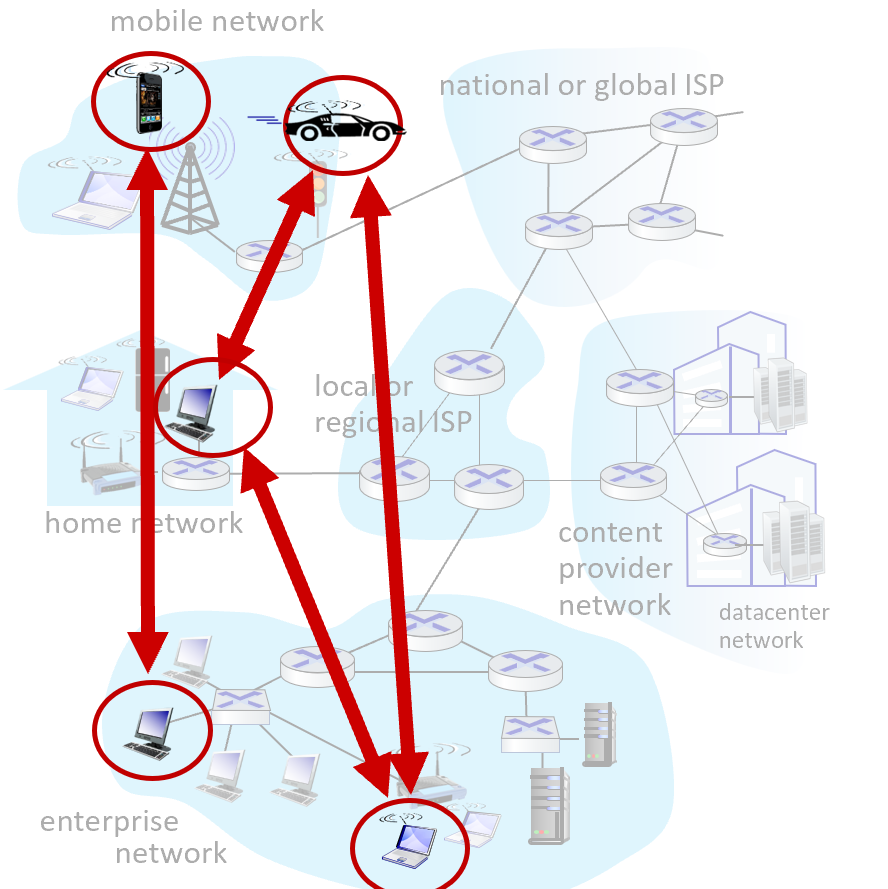

# 计算机网络-自顶向下

**@ author: Shuxin-Wang**

**@ time: 2022-09-18**


[TOC]

# 1 Introduction概述


## 1.1 Why computer network?


### 1.1.1 构建计算机网络的目的

> Purpose of constructing computer networks

- 促进信息交流；

> Facilitate information exchange


### 1.1.2 计算机网络的功能

> Functionality of computer networks

- 信息资源分享；
- 改变生活方式；

> - Information/resource sharing
> - Change our way of life


### 1.1.3 为什么要理解计算机网络

> Why should we understand computer networks

- 人们正处于信息时代；
- 计算机网络塑造我们的社会和我们自己；

> - The era of information
> - Computer networks shape our society and ourselves


## 1.2 计算机网络的结构组成

> The structure of computer networks


### 1.2.1 计算机网络概念

> Computer network structure

- 计算机网络，通常简称为网络，**是由==硬件组件和计算机==组成的集合，通过通信通道互连，从而实现资源和信息的共享**。如果一个设备中的至少一个进程能够向驻留在远程设备中的最少一个进程发送/接收数据，则称这两个设备位于网络中。

> A **computer network**, often simply referred to as a network, **is a collection of hardware components and computers interconnected by communication channels that allow sharing of resources and information**. Where at least one process in one device is able to send/receive data to/from at least one process residing in a remote device, then the two devices are said to be in a network. 


### 1.2.2 物理结构

> **Physical structure: a “nuts and bolts” view**


#### 结构组成

- Connected computing **devices**:
  - host(主机)=end systems(端系统)
  - running network apps at Internet's edge(在网络边缘运行应用程序)
- **Packet switches(分组交换机)**: forward packets(chunks of data)(转发数据包（数据块）)
  - routers(路由器)
  - switches(交换机)
- **Communication links(通信链路)**
  - fiber, copper, radio, satellite(光纤、铜缆、无线电、卫星)
  - transmission rate:bandwidth(传输速率：带宽)
- **Network(网络)**
  - collection of devices, routers, links: managed by an organization(设备、路由器、链接的集合：由组织管理)


#### Protocols(协议)

- 协议定义了网络实体之间发送和接收的消息的**格式**、**顺序**，以及在消息传输和接收上采取的**操作**；

> *Protocols* *define the* ***format***,***order*** *of* *messages sent and received* *among network entities, and* ***actions** taken* *on msg transmission, receipt* 


### 1.2.3 功能结构

> **Functional structure**


#### 结构组成

- **Network egde(网络边缘)**:
  - applications and hosts
  - Interface between end system and networks(端系统与网络间的接口)
- **Access networks(网络接入)**:
  - wired, wireless communication links(有线、无线通信链路)
  - Interface between network edge and network core(网络边缘和网络核心之间的接口)
- **Network core(网络核心)**:
  - Edge network(边缘网络)
  - Core/backbone network(核心/骨干网)


### 1.2.4 Functional structure-Network edge

- hosts: clients and servers
- servers often in data centers


### 1.2.5 Functional structure-Access networks

1. **Residential access nets(家庭接入网)**

   - cable-based access(基于电缆接入)

     - 频分复用（FDM）：在不同频带传输的不同信道

       > *frequency division multiplexing (FDM):* different channels transmitted in different frequency bands

     - HFC：混合光纤同轴电缆；不对称：高达40 Mbps–1.2 Gbs下行传输速率，30-100 Mbps上行传输速率

       > HFC: hybrid fiber coax; Asymmetric: up to 40 Mbps – 1.2 Gbs downstream transmission rate, 30-100 Mbps upstream transmission rate

     - 电缆、光纤网络将家庭连接到ISP路由器

       > network of cable, fiber attaches homes to ISP router

     - 电缆调制解调器接入网络

       > Cable modem access network

     - 电力线宽带接入网

       > Power line broadband access network

   - digital subscriber line (DSL)(数字用户线)

     - 使用现有电话线连接中央办公室DSLAM

       > use *existing* telephone line to central office DSLAM

2. **mobile access networks (WiFi, 4G/5G)(移动接入网络)**

   - Wireless local area networks(WLANs)无线局域网
     - typically within or around building (~100 ft)
     - 802.11b/g/n (WiFi): 11, 54, 450 Mbps transmission rate
   - Wide-area cellular access networks(广域蜂窝接入网)
     - provided by mobile, cellular network operator (10’s km)
     - 10’s Mbps 

3. **institutional access networks(机构介入网络)**

   - 混合使用有线、无线链路技术，连接混合的交换机和路由器；
     - 以太网：100Mbps、1Gbps、10Gbps有线接入；
     - WiFi：无线接入点速度为11、54、450 Mbps；

   > mix of wired, wireless link technologies, connecting a mix of switches and routers 
   >
   > - Ethernet: wired access at 100Mbps, 1Gbps, 10Gbps;
   > - WiFi: wireless access points at 11, 54, 450 Mbps; 


### 1.2.5 Functional structure-Network core

- 互连路由器网格
- 数据包交换：主机将应用层消息分成数据包
  - 将数据包从一个路由器转发到下一个路由器，在从源到目标的路径上通过链路；
  - 以全链路容量传输每个数据包；

> - Mesh of interconnected routers
> - Packet-switching: hosts break application-layer messages into *packets*
>   - forward packets from one router to the next, across links on path from source to destination;
>   - each packet transmitted at full link capacity;


### 1.2.6 Function structure-work flow


#### Host: sends packets of data

- 获取应用程序消息
- 分为更小的块，称为数据包，长度L位
- 以传输速率R将数据包传输到接入网络
  - 链路传输速率，即链路容量，即链路带宽

$$
T_{\text{packet transmission delay}}=\frac{L_{\text{bits}}}{R_{\text{bits/sec}}}
$$

> Host sending function:
>
> - Takes application message;
> - Breaks into smaller chunks, known as *packets*, of length *L* bits;
> - Transmits packet into access network at *transmission rate R*
>   - link transmission rate, aka link *capacity, aka link bandwidth*


#### Communication link: physical media

- 位(Bit)：在发射机/接收机对之间传播
- 物理链接(Physical link)：发射机和接收机之间的内容
- 导向介质(Guided media)：
  - 信号在固体介质中传播：铜、光纤、同轴电缆
- 非导向介质(Unguided media)：
  - 信号自由传播，例如无线电


***<u>导向介质：</u>***

1. 双绞线(Twisted pair)(TP)
   - 两条绝缘铜线
     - 5类：100 Mbps，1 Gbps以太网；
     - 6类：10Gbps以太网；
2. 同轴电缆(Coaxial cable)
   - 两根同心(concentric)铜导线
   - 双向(bidirectional)
   - 宽带(broadband)：
     - 电缆上的多个频率通道每通道100 Mbps
3. 光纤网线(Fiber optic cable)
   - 玻璃纤维携带光脉冲，每脉冲一位
   - 高速运转：
     - 高速点对点传输（10’s-100 Gbps）
   - 低错误率：
     - 中继器间隔很远
     - 对电磁噪音免疫


***<u>非导向介质：</u>***

- 电磁频谱中携带的信号

- 无物理“线”
- 广播和“半双工”（发送方到接收方）
- 传播环境影响：
  - 反射
  - 物体障碍物干扰
- 链接类型：
  - 地面微波(terrestrial)
    - 高达45 Mbps信道
  - 无线局域网（WiFi）(wireless LAN)
    - 高达100 Mbps
  - 广域（如蜂窝）4G蜂窝(wide-area)
    - ~10 Mbps
  - 卫星(stellite)
    - 高达45 Mps每信道
    - 270毫秒终端延迟
    - 地球同步与低地球轨道


#### Access networks

- 见1.2.4节


#### Network core

- **Routing(路由)：**
  - 全局操作：确定数据包采用的源目标路径
  - 路由算法
- **Forwarding(转发)：**
  - 本地操作：将到达的数据包从路由器的输入链路移动到适当的路由器输出链路


### 1.2.7 Packet switching分组交换


#### 存储转发

- 整个数据包必须到达路由器才能在下一链路上传输；

对于包(packet)数据长度为L，传输速率为R，通信链路条数为N，则：
$$
t_{\text{trans}}=N\frac{L}{R}
$$


#### 排队时延与分组丢失

如果链路的到达速率（bps）在一段时间内超过链路的传输速率（bps）：

- 数据包将排队等待在输出链路上传输;
- 如果路由器中的内存（缓冲区）已满，数据包可能会被丢弃（丢失）


### 1.2.8  Circuit switching线路交换


**分配给的终端资源，保留给源和目标之间的“调用”（缓存，链路传输速率）**

> End-end resources allocated to, reserved for “call” between source and destination

- 专用资源：无共享
  - 电路类（保证的）性能；
- 如果呼叫未使用，则电路段空闲（无共享）；
- 常用于传统电话网络；


#### 频分复用Frequency Division Multiplexing (FDM)

- 光、电磁频率被划分为（窄）频带；
- 每个呼叫分配自己的频带，可以以该窄带的最大速率传输；


#### 时分复用Time Division Multiplexing (TDM)

- 时间被划分为周期性时隙；
- 每个呼叫分配的周期时隙，可以以（更宽）频带的最大速率传输，但只能在其时隙内传输；


### 1.2.9 Circuit vs. Packet switching

- Circuit switching: PSTN( Public Switched Telephone Network )定义：公共交换电话网络，一种常用旧式电话系统。即我们日常生活中常用的电话网；
- Packet switching: Computer network

***动机不同：***

PSTN：稳定、恒定、稳定的流量；

计算机网络：突发流量；

数据包交换为计算机网络显示了更高的效率；同时允许更多的用户去使用网络；

***数据包交换的特点：***

- 非常适合“突发”数据——有时需要发送数据，但有时不需要；
- 可能出现过度拥塞：缓冲区溢出导致的数据包延迟和丢失：
  - 可靠数据传输、拥塞控制所需的协议；
- 传统上用于音频/视频应用的带宽保证来提供类电路行为；


### 1.2.10 Network core-network of networks

- 主机通过访问Internet服务提供商（ISP）；
  - 住宅，企业（公司、大学、商业）接入ISP；
- ISP必须相互连接；
  - 以便任何两台主机都可以相互发送数据包；
- 结果网络网络的演变非常复杂；
  - 这是由经济和国家政策驱动的；


### 1.2.11 服务结构

- 从源到目标的可靠数据传输（FTP、WWW）；
- “尽力而为(unreliable)”（不可靠）数据传输（Skype、Voice on IP）；


## 1.3 计算机网络性能评估

> To evaluate the performance of computer networks


- **服务品质Quality of service(QoS)**
  - Loss
  - Delay
  - Throughput
- **网络安全Network security**


路由器缓冲区中的数据包队列

- 数据包队列，等待输出；
- 到达率链路（暂时）超过输出链路容量：数据包丢失；


### 1.3.1 包延迟 Packet delay: four sources

$$
d_{\text{nodal}}=d_{\text{proc}}+d_{\text{queue}}+d_{\text{trans}}+d_{\text{prop}}
$$

$d_{proc}$: nodal processing

- 检查位错误；
- 确定输出链接；
- 通常<毫秒；


$d_{queue}$:queueing delay

- 输出链路等待传输的时间；
- 取决于路由器的拥塞级别；


# 2 Application layer应用层


## 2.1 应用层协议原理

> **Principles of network applications**

### 2.1.1 网络应用程序体系结构

> Network application structure

**应用程序体系结构（application architecture）**由应用程序研发者设计，规定了如何在各种端系统上组织该应用程序。现代网络应用程序中所使用的两种主流体系结构：

#### 客户-服务器体系结构

> Client-server architecture

1. Server

   - 总是在线（always on host）；
   - 永久的IP地址（permanent IP address）；
   - 配置在数据中心（often in data centers）；

2. Client

   - 与服务器沟通联系；
   - 被间歇性（intermittently）的连接；
   - 拥有动态地址；
   - 客户之间不直接联系；

   


#### P2P体系结构

> Peer-peer architecture

- 没有一直在线的服务器；
- 端与端之间直接进行连接；
- **自拓展性（self-scalability）**，每个对等方通过向其他对等方分发文件为系统提供服务能力；
- 对等方可间歇性的被连接并且可以改变IP地址；



### 2.1.2 进程通信

> Process communicating

用操作系统的术语来说，进行通信的实际上是**进程（process）**而不是程序；在两个不同端系统上的进程，通过跨越计算机网络交换**报文（message）**而相互通信。

#### 客户和服务器进程

- 客户进程：发起通信的进程；
- 服务进程：在会话开始时等待联系的进程；

#### 进程与计算机网络之间的接口

> Socket

进程通过一个称为**套接字（Sockets）**的软件接口向网络发送报文和从网络接受报文。由于该套接字是建立网络应用的可编程接口，因此套接字被称为应用程序和网络之间的**应用程序编程接口（Application Programming Interface，API）**。


#### 进程寻址

> Addressing processes

- 主机地址👉**IP地址（IP address）**标识；
- 目的主机指定**接受进程**的标识符👉目的地**端口号（port number）**；


### 2.1.3 可供应用程序使用的运输服务

> Transport service used in application

1. **可靠数据传输（reliable data transfer）**
   - 一些应用需要100%可靠数据传输；
   - 一些应用允许丢包（loss）；
2. **吞吐量（Throughout）**
   - 具有吞吐量要求是应用程序被称为**带宽敏感的应用（bandwidth-sensitive application）**；
   - **弹性应用（elastic application）**能够根据当时可用的带宽或多或少地利用可供使用的吞吐量；
3. **定时（Timing）**
   - **低延时（low delay）**要求；
4. **安全（Security）**
   - 加密技术（encryption）、数据完整性（data integrity）；

### 2.1.4 因特网提供的运输服务

> Transport protocols services

#### TCP服务

- 面向连接的服务（connection-oriented）：报文开始流动之前，TCP让客户和服务器互相交换运输层控制信息（握手阶段），握手阶段后，一条TCP连接（TCP connection）就在两条进程的套接字之间建立；
- 可靠的数据传送服务（reliable transport）：无差别、按适当顺序交付所有发送的数据；
- 拥塞控制机制（congestion control）；

**<u>*==TCP安全==：*</u>**

**安全套接字层（Secure Sockets Layer，SSL）**提供了关键的进程到进程的安全性服务。


我们平时上网冲浪时，网址前面的`http`与`https`的关系其实就是`http + SSL = https`🫡

#### UDP服务

- 提供一种不可靠数据传送服务（unreliable data transfer）；
- 当进程将报文发送至UDP套接字时，UDP并不能保证该报文将到达接收进程；

### 2.1.5 应用层协议

> Application-layer protocol

**应用层协议（Application-layer protocol）**定义了运行在不同端系统上的应用程序进程如何相互传递报文。

### 2.1.6 网络应用

- Web
- 电子邮件
- 目录服务
- 流式视频
- P2P
- 。。。


## 2.2 Web和HTTP

> **Web and http**

### 2.2.1 HTTP概况

> HTTP overview

Web的==应用层协议==是**超文本传输协议（HyperText Transfer Protocol，HTTP）**，它是Web的核心。。

- **Web页面（Web page）**（也叫文档）是由对象组成。一个对象（object）只是一个文件，诸如一个HTML文件、一个JPEG图片、一个Java小程序等等；
- 多数Web页面包含**HTML基本文件（base HTML）**以及几个引用对象；
- **Web浏览器（Web browser）**实现了HTTP的客户端；**Web服务器（Web server）**实现了HTTP的服务器端；
- HTTP使用TCP作为它的支撑运输协议；
- 因为HTTP服务器并不保存关于客户的任何信息，所以我们会说HTTP是一个无状态协议（stateless protocol）；


### 2.2.2 非持续连接和持续连接

> Non-persistent HTTP and Persistent HTTP

#### 非持续连接

1. TCP连接开启；
2. 最多一个对象通过该TCP连接发送；
3. 该TCP连接关闭；

#### 持续连接

1. TCP连接开启；
2. 多个对象通过该TCP连接发送；
3. 该TCP连接关闭；


- **往返时间（Round-Trip Time，RTT）**定义：该时间是指一个短分组从客户到服务器然后在返回客户所需要的时间；


### 2.2.3 HTTP报文格式

> HTTP message format

#### HTTP请求报文

```http
GET /index.html HTTP/1.1\r\n
Host: www-net.cs.umass.edu\r\n
User-Agent: Firefox/3.6.10\r\n
Accept: text/html,application/xhtml+xml\r\n
Accept-Language: en-us,en;q=0.5\r\n
Accept-Encoding: gzip,deflate\r\n
Accept-Charset: ISO-8859-1,utf-8;q=0.7\r\n
Keep-Alive: 115\r\n
Connection: keep-alive\r\n
\r\n
```

- 请求报文的第一行叫做**请求行（request line）**，其后继的行叫作**首部行（header line）**；
- 请求行有3个字段：方法字段、URL字段和HTTP版本字段；
  - 方法可取`GET,POST,HEAD,PUT,DELETE`；
- 首部行`HOST:`指明了对象所在的主机；首部行`User-Agent:`指明了用户代理，即浏览器类型；。。。

**<u>*HTTP请求报文通用格式：*</u>**


#### HTTP响应报文

```http
HTTP/1.1 200 OK\r\n
Date: Sun, 26 Sep 2010 20:09:20 GMT\r\n
Server: Apache/2.0.52 (CentOS)\r\n
Last-Modified: Tue, 30 Oct 2007 17:00:02 GMT\r\n
ETag: "17dc6-a5c-bf716880"\r\n
Accept-Ranges: bytes\r\n
Content-Length: 2652\r\n
Keep-Alive: timeout=10, max=100\r\n
Connection: Keep-Alive\r\n
Content-Type: text/html; charset=ISO-8859-1\r\n
\r\n
(data data data data data ... )
```

- 上例响应报文包括一个**初始状态行（status line）**，9个**首部行（header line）**，然后是**实体体（entity boby）**；
- 状态行有3个字段：协议版本字段、状态码和状态信息；
  - `200 OK`：请求成功；
  - `301 Moved Permanently`：请求对象以及被永久转移；
  - `400 Bad Request`：一个通用差错代码，该请求不能被服务器理解；
  - `404 Not Found`：被请求的文档不在服务器上；
  - `505 HTTP Version Not Support`：服务器不支持请求报文使用的HTTP协议版本；

### 2.2.4 用户与服务器的交互：cookie🍪

> Maintaining user/server state: cookies🍪

前面提到HTTP服务器为无状态的，而一个Web站点通常希望能够识别用户，可能是因为服务器希望限制用户的访问，或者因为它希望把内容与用户身份联系起来。为此，HTTP使用了cookie🍪。

cookie技术有4个组件：

- HTTP响应报文的cookie首部行；
- HTTP请求报文的cookie首部行；
- 用户端系统中保留一个cookie文行；
- 位于Web站点的一个后端数据库；


### 2.2.5 Web缓存

> Web cache(proxy server)

**Web缓存器（Web cache）**也叫**代理服务器（proxy server）**，它是能够代表**初始Web服务器（origin server）**来满足HTTP网络请求的实体。


请求过程：

1. 浏览器创建一个到Web缓存器的TCP连接，并向Web缓存器中的对象发送一个HTTP请求；
2. Web缓存器进行检查，看看本地是否存储该对象副本。如果有，Web缓存器向客户返回该对象；
3. 如果缓存器中没有该对象，它就打开一个与该对象的初始服务器的TCP连接。Web缓存器向初始服务器发送请求，并得到初始服务器的响应；
4. 当Web缓存器接受对象后，在本地创建给对象的副本，并向客户发送响应报文返回该对象；

通过使用**内容分发网络（Content Distribution Network，CDN）**，Web缓存器正在因特网中发挥着越来越重要的作用。

### 2.2.6 条件GET方法

> Conditional GET

尽管高速缓存器能减少用户感受到的响应时间，但引入了一个新的问题，即存放在缓存器中的副本可能陈旧的。

**条件GET方法：**

1. 请求报文使用`GET`方法；
2. 请求报文中包含一个`If-Modified-Since:`首部行；

响应报文中状态行为`304 Not Modified`表示缓存器可以使用该对象的副本。


## 2.3 因特网种的电子邮件

> E-mail

电子邮件三个主要组成部分：

- 用户代理（User agent）；
- 邮件服务器（mail server）；
- 简单邮件传输协议（Simple Mail Transfer Protocol，SMTP）；


用户代理

- 撰写、编辑、阅读邮件；
- 服务器上存储的传入和传出的消息；

邮件服务器

- 邮箱（mailbox）包括用户传入的消息；
- 报文队列（message queue）中为待发送的邮件报文；

SMTP协议

- 在邮箱服务器之间传输邮件报文；

### 2.3.1 SMTP

假设Alice想给Bob发送一封简单的ASCII报文：

1. Alice调用她的邮件代理程序并提供Bob的邮件地址，撰写报文，然后指示用户代理发送该报文；
2. Alice的用户代理把报文发给她的邮件服务器，在那里该报文被放在报文队列中；
3. 运行在Alice的邮件服务器上的**SMTP客户端**发现了该报文队列中的这个报文，它就创建一个到运行在Bob的邮件服务器上的SMTP服务器的**TCP连接**；
4. 经过一些**初始SMTP握手**后，SMTP客户通过该TCP连接发送Alice的报文；
5. 在Bob的邮件服务器上，**SMTP的服务器端**接受该报文。Bob的邮件服务器然后将该报文放入Bob的邮箱中；
6. 在Bob方便的时候，他调用用户代理阅读该报文；


- 如果Bob的邮件服务器没有开机，该报文会保留在Alice的邮件服务器上并等待进行新的尝试，这意味着邮件并**不在中间的某个邮件服务器存留**。

### 2.3.2 与HTTP对比

1. HTTP主要是一个**拉协议（pull protocol）**，TCP连接是由想==接受==文件的机器发起的；SMTP是一个**推协议（push protocol）**，TCP连接是由==发送==文件的机器发起；
2. SMTP要求报文采用7比特ASCII码格式，如果含有非7比特ASCII字符，则这些数据必须按照7比特ASCII码进行编码；HTTP不受这种限制；
3. HTTP把每个对象分别封装在不同的HTTP响应报文中；SMTP则把所有报文对象放在一个报文中；

### 2.3.3 邮件报文格式

```HTTP
To:发件人地址
From:收件人地址
Subject:邮件主题

...邮件正文
```

### 2.3.4 邮件访问协议

> Mail accss protocol

收件人的用户代理不能使用SMTP得到报文，因为取得报文是一个拉操作，而SMTP协议是一个推协议。通过引用一个特殊的邮件访问协议来解决这个问题，该协议将收件人邮件服务器上的报文传送给他的本地PC。目前有一些流行的邮件访问协议，包括第三版的邮局协议（Post Office Protocol-Version 3，POP3）（不常用）、因特网邮件访问协议（Internet Mail Access Protocol，IMAP）以及HTTP。


## 2.4 DNS：因特网的目录服务

> Domain Name System
> 

### 2.4.1 DNS提供的服务

> DNS:services

识别主机的两种方式：通过**主机名（hostname）**或者**IP地址（IP address）**。人们喜欢记忆主机名标识方式，而路由器喜欢定长的、有着层次结构的IP地址。域名系统的主要任务：==主机名到IP地址转换的目录服务==。

DNS是：

1. 一个由分层的**DNS服务器（DNS service）**实现的分布式数据库；
2. 一个使得主机能够查询分布式数据库的应用层协议；

DNS协议运行在`UDP`之下，使用`53`号端口；


DNS重要的服务：

- 主机名到IP地址的转换（hostname to IP address translation）；
- 主机别名（host aliasing）：应用程序调用DNS获取主机别名对应的**规范主机名（canonical hostname）**以及主机的IP地址；
- 邮件服务器别名（mail server aliasing）；
- 负载分配（load distribution）：繁忙的站点被**冗余分布在多台服务器**上，每台服务器运行在不同的端系统上，每个都有着不同的IP地址。由于这些冗余的Web服务器，一个==IP地址集合==于**一个规范主机名**相联系。当客户对映射到某处到某地址集合的名字发出一个DNS请求时，该服务器用IP地址的整个集合进行响应，但在每个回答中循环这些地址次序。因为客户通常**<u>总是向IP地址排在最前面的服务器发送HTTP请求报文</u>**，所以DNS就在所有这些冗余的Web服务器之间循环分配了负载；

### 2.4.2 DNS工作机理概述

> Overview of How DNS Works

集中式设计的问题包括：

- 单点故障（a single point of failure）；
- 通信容量（traffic volume）；
- 远距离的集中式数据库（distant centralized database）；
- 维护（maintenance）；

#### 分布式，层次数据库

分布式DNS服务器的层次结构：

- 根DNS服务器（root DNS servers）；
- 顶级域服务器（Top-Level Domain DNS servers）；
- 权威DNS服务器（authoritative DNS servers）；
- 本地服务器（local DNS servers）：不属于该服务器的层次结构，但它对DNS层次结构是至关重要的；


#### 查询方式

1. 递归查询（Recursive query）


2. 迭代查询（Iterative query）


==从请求主机到本地的DNS服务器的查询是**递归**的，其余的查询是**迭代**的。==

#### DNS缓存

在某一个请求链中，当某DNS服务器接收一个DNS回答，它能映射在本地存储器中。由于主机和主机名与IP地址的映射并不是永久的，DNS服务器在一段时间后将丢弃缓存的信息。

### 2.4.3 DNS记录和报文

> DNS Record and Protocol Message

#### DNS记录

所有DNS服务器存储了**资源记录（Resourse Record，RR）**，资源记录是一个包含了下列字段的4元组：

- `(Name, Value, Type, TTL)`

下面为不同类型`Type`的`Name`和`Value`：


#### DNS报文

DNS报文中各字段的语义如下：


## 2.5 P2P文件分发

> Peer-to-Peer File Distribution  

CS系统极大依赖于总是打开的基础设施服务器，P2P对总是打开的服务器有最小的（或者没有）依赖。

### P2P体系结构的扩展性

> Scalability of P2P Architectures

文件分发问题的示例图如下：


对于客户-服务器体系结构的分发时间如下：
$$
D_{cs}=\max\{\frac{NF}{u_s},\frac{F}{d_{min}}\}
$$
对于P2P体系结构分发时间如下：
$$
D_{P2P}=\max\{\frac{F}{u_s},\frac{F}{d_{min}},\frac{NF}{u_s+\sum^N_{i=1}u_i}\}
$$
P2P和客户-服务器体系结构的分发时间随用户数量变化如下：


### BitTorrent

参与一个特定文件分发的所有对等方的集合被称为一个**洪流（torrent）**。在一个洪流中的对等方彼此下载等长度的**文件块（chunk）** ，典型块长度为256KB。当一个对等方下载块时，也为其他对等方上载了多个块。每个洪流具有一个基础设施节点，称为**追踪器（tracker）**。当一个对等方加入某洪流时，它向追踪器注册自己，并周期性地通知追踪器它仍在该洪流中。


- 决定请求哪些块的过程：**最稀缺优先（rarest first）**技术；
- 决定响应哪个请求：根据当前能够以最高速率的**疏通（unchoked）**的对等方提供数据的邻居，给出优先权；


## 2.6 视频流和内容分发网

> Video Streaming and Content Distribution Networks

### 2.6.1 HTTP流和DASH

HTTP流所有客户接受到相同编码的视频，但对不同用户或者不同时间，客户可用的带宽大小有很大不同。**HTTP的动态适应性流（Dynamic Adaptive Streaming over HTTP，DASH）**：视频编码成几个不同的版本，其中每个版本具有不同的比特率，对应于不同的质量水平。客户动态地请求来自不同版本且长度为几秒的视频段数据块。

每个视频版本存储在HTTP服务器中，每个版本都有一个不同的URL。HTTP服务器也有一个**告示文件（manifest file）**，为每个版本提供了一个URL及其比特率。

### 2.6.2 内容分发网

为了应对向分布于全世界的用户分发巨量视频数据的挑战，几乎所有主要的视频流公司都利用**内容分发网（Content Distribution Network，CDN）**。CDN管理分布在多个地理位置上的服务器，在它的服务器中存储视频的副本，并且所有试图将每个用户请求定向到一个将提供最好的用户体验的CDN位置。CDN可以是**专用CDN（private CDN）**，即它由内容提供商自己所拥有；另一种CDN可以是**第三方CDN（third-party CDN）**，它代表多个内容提供商分发内容。

#### CDN操作

当客户请求一个特定视频时，CDN必须截获该请求，以便能够：

1. 确定此时适合用于该客户的CDN服务器集群；
2. 将客户的请求重定向到该集群的某台服务器；

CDN操作步骤如下：


## 2.7 套接字编程：生成网络应用

> Socket Programming: Creating Network Applications

### 2.7.1 UDP套接字编程


### 2.7.2 TCP套接字编程


# 3 Transport layer运输层


## 3.1 概述和运输层服务

> Introduction and Transport-Layer Services

运输层协议为运行在不同的主机上的应用进程之间提供了**逻辑通信（logic communication）**功能从应用程序的角度看，通过逻辑通信，运行不同进程的主机好像直接相连一样。逻辑通信的概念如下：


运输层协议是**在端系统中**而不是在路由器中实现。在发送端，运输层将从发送应用程序接收到的报文转换成传输层分组，用因特网术语来讲该分组称为运输层**报文段（segment）**。

### 3.1.1 运输层和网络层的关系

> Relationship Between Transport and Network Layers

在协议栈中，运输层刚好位于网络层之上。网络层提供了**主机之间**的逻辑通信，而运输层为运行在**不同主机上的进程之间**提供了逻辑通信。运输协议能够能够提供的服务常常受制于底层网络层协议的服务模型。如果网络层协议无法为主机之间发送的运输层报文段提供时延或带宽保证的话，运输层协议也就无法为进程之间发送的应用程序报文提供时延或带宽保证。

即使底层网络协议是不可靠的，也就是说网络层协议会使分组丢失、篡改和冗余，运输层协议也能为应用程序提供可靠的数据传输服务。另一方面，即使网络层不能保证运输层报文段的机密性，运输协议也能使用加密来确保应用程序报文不被入侵者读取。

### 3.1.2 因特网运输层概述

> Overview of the Transport Layer in the Internet

因特网提供两种不同的可用的运输层协议。**UDP（User Datagram Protocol）**，它为调用它的应用程序提供了一种不可靠、无连接的服务；**TCP（Transmission Control Protocol）**，它为调用它的应用程序提供了一种可靠的、面向连接的服务。

因特网网络层协议有一个名字叫IP（Internet Protocol），即网际协议，IP的服务模型是**尽力而为交付服务（best-effort delivery service）**，同时IP被称为**不可靠服务（unreliable service）**。

UDP和TCP最基本的责任是，将两个端系统间IP的交付服务扩展为运行在端系统上的两个进程之间的交付服务。将主机间交付扩展到进程间交付被称为**运输层的多路复用（transport-layer multiplexing）**与**多路分解（demultiplexing）**。


## 3.2 多路复用与多路分解

> Multiplexing and Demultiplexing

运输层的多路复用与多路分解，也就是将由网络层提供的主机到主机的交付服务延伸到为运行在主机上的应用程序提供进程到进程的服务。一个进程（作为网络应用的一部分）有一个或多个**套接字（socket）**，它相当于从网络向进程传递数据和从进程向网络传递数据的门户。下图为进程交付过程：


- 多路分解（Demultiplexing）：在接收端，运输层检查这些字段，标识出接收套接字，进而将报文段定向到该套接字，即将运输层报文段的数据交付到正确的套接字的工作；
- 多路复用（Multiplexing）：在源主机从不同套接字中收集数据块，并为每个数据块封装上首部信息（这将在以后用于分解）从而生成报文段，然后将报文传递到网络层；

运输层多路复用要求：

1. 套接字由唯一标识符；
2. 每个报文段有特殊字段来指示该报文段所要交付的套接字；

这些特殊字段是**源端口号字段（source port number field）**和**目的端口号字段（destination port number field）**，如下图所示：


端口号是一个16比特的数，其大小在`0~65535`之间。`0~1023`范围的端口号称为**周知端口号（well-know port number）**，是受限制的。

### UDP的socket表示

二元组表示👉`(源端口， 目的端口)`，具体过程如下图所示：


### TCP的socket表示

四元组表示👉`(源IP地址， 源端口号， 目的IP地址， 目的端口号)`，下图为两个客户使用相同的目的端口号（80）与同一个Web服务器应用通信：


