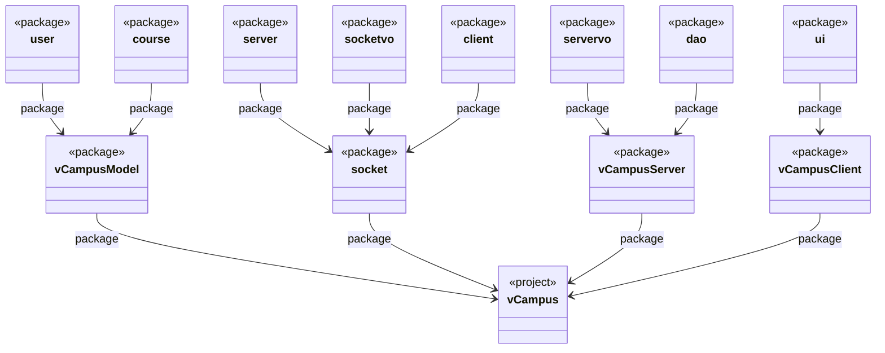

# `vCampus`
 虚拟校园管理系统

**@ author: Shuxin-Wang**

**@ time: 2022.08.10**

------

***目录：***

[TOC]

# 客户端vCampusClient

# 服务端vCampusServer

## 运行方法

- 第一种：java文件路径:`src/vCampusServer/ui/ServerMain.java`，运行`main`主函数；
- 第二种：java文件路径:`src/socket/server/ServerMain.java`，运行`main`主函数；

## 数据库公共方法BaseDao

- java文件路径:`src/vCampusServer/dao/BaseDao.java`

|                   函数                    |                      参数                      |              返回值               | 备注                                   |
| :---------------------------------------: | :--------------------------------------------: | :-------------------------------: | -------------------------------------- |
| `public void getConnect(String filePath)` | 数据库路径(不需要驱动前缀，就是文件相对路径！) |               null                | 连接数据库                             |
|        `public void getConnect()`         |                      null                      |               null                | 连接`src/data/vCampusDataBase`数据库   |
| `public ResultSet selectSQL(String sql)`  |            SQL***<u>查询</u>***语句            |           ResultSet对象           | 执行SQL查询语句                        |
| `public ResultSet selectSQL(String sql)`  |           SQL**<u>*增删改*</u>**语句           | int 成功返回增删改行号，失败返回0 | 执行SQL增删改语句                      |
|           `public disconnect()`           |                      null                      |               null                | 关闭数据库，使用完数据库记得关闭！！！ |

## Access数据库表介绍

- 数据库路径`src/data/vCampusDataBase.mdb`
- **为方便，数据库数据字段均为<u>短文本(String)</u>**

### 表users

|   表头   |                             备注                             |
| :------: | :----------------------------------------------------------: |
|   uid    |                         登陆ID(唯一)                         |
| password |                             密码                             |
| identity | 用户身份;0：访客；1：学生；2：老师；3：教务管理员；4：图书管理员；5：商店管理员；6：银行管理员； |

### 表usersInfo

|    表头     |     备注     |
| :---------: | :----------: |
|     uid     | 登陆ID(唯一) |
|  identity   |   用户身份   |
|    icon     |  头像文件名  |
|    uname    |   用户姓名   |
|     age     |     年龄     |
|     sex     |     性别     |
|   college   |     学院     |
|    email    |     邮箱     |
| phoneNumber |   电话号码   |
|   address   |     地址     |
|    major    |     专业     |
|    grade    |     年级     |
|   sClass    |     班级     |
|  position   |     职位     |

### 表course

|    表头     |      备注      |
| :---------: | :------------: |
|     cid     | 课程编号(唯一) |
|    cname    |    课程名称    |
| classHours  |      学时      |
|   credit    |      学分      |
|  classTime  |    上课时间    |
|  cCollege   |  课程开设学院  |
|  capacity   |    课程容量    |
| selectedNum |  已选课程人数  |
|     tid     |   任课老师ID   |

### 表courseChoose

| 表头 |  备注  |
| :--: | :----: |
| uid  | 用户ID |
| cid  | 课程ID |

### 表book

|   表头    |        备注        |
| :-------: | :----------------: |
|    bid    |    书籍ID(唯一)    |
|   bname   |      书籍名称      |
|   price   |        价格        |
|   time    |      出版时间      |
|  author   |        作者        |
| category  |      所属类别      |
|   icon    | 书籍封面图像文件名 |
|    sum    |      库存数量      |
| borrowNum |      出借数量      |

### 表bookBorrow

| 表头 |  备注  |
| :--: | :----: |
| uid  | 用户ID |
| bid  | 书籍ID |

### 表libraryRecords

|  表头   |          备注           |
| :-----: | :---------------------: |
|   uid   |         用户ID          |
|   bid   |         书籍ID          |
| operate | 操作，-1为借出，1为归还 |

### 表store

|   表头   |      备注      |
| :------: | :------------: |
|   pid    | 商品编号(唯一) |
|  pname   |    商品名称    |
| category |    商品类别    |
|  price   |      价格      |
|   num    |    商品库存    |
|   icon   |  商品图文件名  |

### 表storeConsumption

| 表头 |     备注     |
| :--: | :----------: |
| uid  |    用户ID    |
| pid  |    商品ID    |
| num  | 购买商品数量 |

### 表bank

|  表头   |   备注   |
| :-----: | :------: |
|   uid   |  用户ID  |
| balance | 账户余额 |

### 表bankRecords

|  表头   |            备注            |
| :-----: | :------------------------: |
|   uid   |           用户ID           |
| operate | 执行操作；1为支入，2为支出 |
| amount  |          操作金额          |
| remarks |          操作备注          |
| balance |          用户余额          |

# 公共模块vCampusModel

- 公共模块全部类为`JavaBean`模式；

## <package>user</package>

> 用户模块

### <class>User</class>

> 用户基类

- 继承
  - `Object`
- 实现
  - `Serializable`

- 属性

| 数据类型 | String |  String  |                             int                              |
| :------: | :----: | :------: | :----------------------------------------------------------: |
|   属性   |  uid   | password |                           identity                           |
|   备注   | 用户ID | 登陆密码 | 用户身份;0：访客；1：学生；2：老师；3：教务管理员；4：图书管理员；5：商店管理员；6：银行管理员； |

- 构造器
  - `+ User();`
  - `+ User(String uid);`
  - `+ User(String uid, String password);`
  - `+ User(String uid, String password, String identity);`

### <class>UserInfo</class>

> 用户基本信息类

- 继承
  - `User`
- 实现
  - `null`
- 属性

| 数据类型 |  String  | int  |               int                | String |   String    |  String  | String  | bytes[]  |
| :------: | :------: | :--: | :------------------------------: | :----: | :---------: | :------: | :-----: | :------: |
|   属性   |  uname   | age  |               sex                | email  | phoneNumber | address  | college |   icon   |
|   备注   | 用户姓名 | 年龄 | 性别;0：不确定；1：女性；2：男性 |  邮箱  |  电话号码   | 家庭住址 |  学院   | 用户头像 |

- 构造器
  - `+ UserInfo();`
  - `+ UserInfo(String uid, String uname, int age, int sex);`
  - `+ UserInfo(String uid, String uname, int age, int sex, String email, String phoneNumber, String address);`
  - `+ UserInfo(String uid, String uname, int age, int sex, String email, String phoneNumber, String address, String college, bytes[] icon);`

### <class>StudentInfo</class>

> 学生基本信息类

- 继承
  - `UserInfo`
- 实现
  - `null`
- 属性

| 数据类型 | String | String | String |
| :------: | :----: | :----: | :----: |
|   属性   | major  | grade  | sClass |
|   备注   |  专业  |  年级  |  班级  |

- 构造器
  - `+ StudentInfo();`
  - `+ StudentInfo(String uid, String uname, int age, int sex);`
  - `+StudentInfo(String uid, String uname, int sex, String college, String major, String grade, String sClass);`
  - `+ StudentInfo(String uid, String uname, int age, int sex, String email, String phoneNumber, String address, String college,bytes[] icon, String major, String grade, sClass);`

### <class>TeacherInfo</class>

> 教师基本信息类

- 继承
  - `UserInfo`
- 实现
  - `null`
- 属性

| 数据类型 |  String  |
| :------: | :------: |
|   属性   | position |
|   备注   |   职位   |

- 构造器
- `+ TeacherInfo();`
- `+ TeacherInfo(String uid, String uname, int age, int sex);`
- `+ TeacherInfo(String uid, String uname, int sex,String college, String email, String postion);`
- `+ TeacherInfo(String uid, String uname, int age, int sex, String email, String phoneNumber, String address, String college, bytes[] icon, String position);`

## <package>course</package>

> 课程模块

### <class>Course</class>

> 课程基本信息类

- 继承
  - `Object`

- 实现
  - `Serializable`

- 属性

| 数据类型 |  String  |  String  |    int     | double |  String   |    String    |   int    |     int      |   Teacher    |
| :------: | :------: | :------: | :--------: | :----: | :-------: | :----------: | :------: | :----------: | :----------: |
|   属性   |   cid    |  cname   | classHours | credit | classTime |   cCollege   | capacity | selectedNum  |   teacher    |
|   备注   | 课程编号 | 课程名称 |    学时    |  学分  | 上课时间  | 课程开设学院 | 课程容量 | 已选课程人数 | 任课老师对象 |

- 构造器
  - `+ Course();`
  - `+ Course(String uid);`
  - `+ Course(String cid, String cname, int classHours, double credit, String classTime, String tid);`
  - `+ Course(String cid, String cname, int classHours, double credit, String classTime, Teacher teacher);`

### <class>CourseChoose</class>

> 课程选择类

- 继承
  - `Object`

- 实现
  - `Serializable`

- 属性

| 数据类型 | String |  Course  |
| :------: | :----: | :------: |
|   属性   |  uid   |  course  |
|   备注   | 用户ID | 所选课程 |

- 构造器
  - `+ CourseChoose();`
  - `+ CourseChoose(String uid, Course course);`

## <package>library</package>

> 图书管理模块

### <class>Book</class>

> 图书信息类

- 继承
  - `Object`

- 实现
  - `Serializable`

- 属性

| 数据类型 |  String  |  String  | double |  String  | String |  String  |   int    | bytes[]  |    int    |
| :------: | :------: | :------: | :----: | :------: | :----: | :------: | :------: | :------: | :-------: |
|   属性   |   bid    |  bname   | price  |   time   | author | category |   sum    |   icon   | borrowNum |
|   备注   | 书籍编号 | 书籍名称 |  价格  | 出版时间 |  作者  | 所属类别 | 拥有数量 | 书籍封面 | 借出数量  |

- 构造器
  - `+ Book();`
  - `+ Book(String bid);`
  - `+ Book(String bid, String bname, double price, String time, String author);`
  - `+ Book(String bid, String bname, double price, String time, String author, int sum， ,bytes[] icon);`

### <class>BookBorrow</class>

> 图书管理类

- 继承
  - `Object`

- 实现
  - `Serializable`

- 属性

| 数据类型 | String |        int        |   Book   |
| :------: | :----: | :---------------: | :------: |
|   属性   |  uid   |      operate      |   book   |
|   备注   | 用户ID | -1为借出，1为归还 | 书籍对象 |

- 构造器
  - `+ BookBorrow();`
  - `+ BookBorrow(String uid);`
  - `+ BookBorrow(String uid, int operate, Book book);`

## <package>shop</package>

> 商店管理模块

### <class>Product</class>

> 产品基本信息类

- 继承
  - `Object`

- 实现
  - `Serializable`

- 属性

| 数据类型 | String |  String  | double | int  |  String  | bytes[]  |
| :------: | :----: | :------: | :----: | :--: | :------: | :------: |
|   属性   |  pid   |  pname   | price  | num  | category |   icon   |
|   备注   | 商品ID | 商品名称 |  价格  | 数量 | 产品类别 | 产品图标 |

- 构造器
  - `+ Product();`
  - `+ Product(String pid);`
  - `+ Product(String pid, String pname, double price, int num, String category, bytes[] icon);`

### <class>StoreConsumption</class>

> 商店消费记录类

- 继承
  - `Object`

- 实现
  - `Serializable`

- 属性

| 数据类型 | String | Product  |
| :------: | :----: | :------: |
|   属性   |  uid   | product  |
|   备注   | 用户ID | 购买产品 |

- 构造器
  - `+ StoreConsumption();`
  - `+ StoreConsumption(String uid);`
  - `+ StoreConsumption(String uid, Product product);`

## <package>bank</package>

> 银行管理模块

### <class>BankManage</class>

> 银行用户操作管理类

- 继承
  - `Object`

- 实现
  - `Serializable`

- 属性

| 数据类型 | String |           int            |  double  |  String  |
| :------: | :----: | :----------------------: | :------: | :------: |
|   属性   |  uid   |        operation         |  amount  | remarks  |
|   备注   | 用户ID | 收入或支出；1收入，2支出 | 操作金额 | 操作备注 |

- 构造器
  - `+ BankManage();`
  - `+ BankManage(String uid);`
  - `+ BankManage(String uid, int operation, double amount, String remarks);`

### <class>BankRecord</class>

> 银行用户操作管理类

- 继承
  - `BankManage`

- 实现
  - `null`

- 属性

| 数据类型 |  double  |
| :------: | :------: |
|   属性   | balance  |
|   备注   | 剩余金额 |

- 构造器
  - `+ BankManage();`
  - `+ BankManage(String uid, int operation, double amount, String remarks, double balance);`

## <package>vo</package>

> 其他公共模块

### <class>SelectManage</class>

> 关键词筛选类

- 继承
  - `Object`

- 实现
  - `Serializable`

- 属性

| 数据类型 |   String   |  String  |     String     |
| :------: | :--------: | :------: | :------------: |
|   属性   |   table    |   key    |     value      |
|   备注   | 数据库表命 | 查询键值 | 查询键值对应值 |

- 构造器
  - `+ SelectManage();`
  - `+ SelectManage(String key, String value)`
  - `+ SelectManage(String table, String key, String value);`

### <class>IdMapping</class>

> ID映射类

- 继承
  - `Object`
- 实现
  - `Serializable`
- 属性

| 数据类型 | String | String |
| :------: | :----: | :----: |
|   属性   |  mId   |  sIds  |
|   备注   |  主ID  | 映射ID |

- 构造器
  - `+ IdMapping();`
  - `+ IdMapping(String mId);`
  - `+ IdMapping(String mId, String sId);`

### <class>ServerResult</class>

> 数据库相关操作结果类

- 继承
  - `Object`
- 实现
  - `Serializable`
- 属性

| 数据类型 |                             int                              |    Object    |
| :------: | :----------------------------------------------------------: | :----------: |
|   属性   |                          errorCode                           |     data     |
|   备注   | 错误代码；运行成功为0；数据库连接，sql语句语法错误等流程错误为-1；其他自定义 | 结果对象数据 |

- 构造器
  - `+ ServerResult();`
  - `+ ServerResult(int errorCode, Object data);`

# 通信端socket

## 通信消息类

### <class>Message</class>

> 服务端与客户端间传输类

- 继承
  - `Object`
- 实现
  - `Serializable`
- 属性

| 数据类型 | boolean  |    int    |    Object    |
| :------: | :------: | :-------: | :----------: |
|   属性   |  state   |   type    |     data     |
|   备注   | 传输状态 | C→S命令ID | 传输对象数据 |

- 构造器
  - `+ Message();`
  - `+Message(boolean state, int type, Object data);`

## 客服端调用

- 调用类`ClientMain`中方法`Object request(int type, boolean state, Object data)`

## 服务端添加功能

- 在类`ServerProcess`中方法`void run()`中对客户端消息`Message`进行分析并调用相应的服务端数据库相关函数

# 传输规则

- ***<u>表说明如下：</u>***

|     type:命令ID      |              C-S               |          函数名称          |              S-C               |   功能说明   |                      errorCode:错误代码                      |
| :------------------: | :----------------------------: | :------------------------: | :----------------------------: | :----------: | :----------------------------------------------------------: |
| 命令ID，由客户端发出 | 客户端向服务端传输数据对象类别 | 服务端数据库相关操作函数名 | 服务端向客户端传输数据对象类别 | 命令功能说明 | 错误代码，由服务端发出；**0代表运行正常，-1代表服务端发生系统错误，此两种情况不再说明**，其他情况自定义进行说明 |

- <u>*UserInfo</u> → UserInfo或继承其的类；
- <u>XXX*</u> → 表示该类的属性信息并不全面；

## 用户注册登陆

| type:命令ID |     C-S     | 函数名称 |   S-C   |           功能说明           | errorCode:错误代码 |
| :---------: | :---------: | :------: | :-----: | :--------------------------: | :----------------: |
|      0      |    User     |  signIn  |  *User  | 用户登陆，根据ID判断用户身份 |   1:登录ID不存在   |
|             |             |          |         |                              |     2:密码错误     |
|             |             |          |         |                              |                    |
|      1      | *UserInfo\* |  signUp  | Boolean |  注册用户，返回是否注册成功  |   1:用户ID已存在   |

## 用户通用功能

| type:命令ID |     C-S      |      函数名称      |          S-C           |                      功能说明                      |    errorCode:错误代码    |
| :---------: | :----------: | :----------------: | :--------------------: | :------------------------------------------------: | :----------------------: |
|     10      |     User     |    viewUserInfo    |       *UserInfo        |         查看用户信息，根据身份返回相应类别         |            -             |
|             |              |                    |                        |                                                    |                          |
|     11      |  *UserInfo   |   alterUserInfo    |        Boolean         |           修改用户信息，返回是否修改成功           |            -             |
|             |              |                    |                        |                                                    |                          |
|     20      |     User     |   viewAllCourse    |  ArrayList\<Course*>   |                    查看所有课程                    |            -             |
|             |              |                    |                        |                                                    |                          |
|     30      |     User     |    viewAllBook     |    ArrayList\<Book>    |                    查看所有书籍                    |            -             |
|             |              |                    |                        |                                                    |                          |
|     31      |     User     |  viewBorrowedBook  |    ArrayList\<Book>    |                 用户查看已借阅书籍                 |            -             |
|             |              |                    |                        |                                                    |                          |
|     32      |  IdMapping   |     borrowBook     |        Boolean         |                    选择借出书籍                    |   1:所借书籍数目剩余0    |
|             |              |                    |                        |                                                    |                          |
|     33      |  IdMapping   |     returnBook     |        Boolean         |                      归还书籍                      |            -             |
|             |              |                    |                        |                                                    |                          |
|     40      |     User     |   viewAllProduct   |  ArrayList\<Product>   |                    查看所有商品                    |            -             |
|             |              |                    |                        |                                                    |                          |
|     41      |  IdMapping   |  purchaseProduct   |        Boolean         |                      购买商品                      |    1:购买商品库存为0     |
|             |              |                    |                        |                                                    |                          |
|     42      |     User     | viewPurchaseRecord |    StoreConsumption    |                  用户查看购买记录                  |            -             |
|             |              |                    |                        |                                                    |                          |
|     50      |     User     |    viewBalance     |         Double         | 查看用户余额，若账户不存在，自动创建余额为0.的账户 |            -             |
|             |              |                    |                        |                                                    |                          |
|     51      |  BankManage  |   operateBalance   |         Double         |           进行支入支出操作，返回账户余额           | 1:支出大于余额，操作失败 |
|             |              |                    |                        |                                                    |                          |
|     52      |     User     |     viewRecord     | ArrayList\<BankRecord> |                查看用户支入支出记录                |            -             |
|             |              |                    |                        |                                                    |                          |
|     60      | SelectManage |    queryFuction    |     ArrayList\<T>      |                      查询功能                      |            -             |

## 学生端功能

| type:命令ID |    C-S    |      函数名称      |        S-C         |          功能说明          | errorCode:错误代码 |
| :---------: | :-------: | :----------------: | :----------------: | :------------------------: | :----------------: |
|     110     | IdMapping |    addStuCourse    |      Boolean       | 添加课程，返回是否添加成功 |    1:课程已选择    |
|             |           |                    |                    |                            |   2:课程人数已满   |
|             |           |                    |                    |                            |                    |
|     111     |   User    | viewSelectedCourse | ArrayList\<Course> |       查看已选择课程       |         -          |
|             |           |                    |                    |                            |                    |
|     112     | IdMapping |     delCourse      |      Boolean       |          删除课程          |         -          |

## 老师端功能

| type:命令ID |   C-S   |    函数名称     |           S-C            |        功能说明        | errorCode:错误代码 |
| :---------: | :-----: | :-------------: | :----------------------: | :--------------------: | :----------------: |
|     210     |  User   | viewTeachCourse |   ArrayList\<Course*>    |      查看任教课程      |         -          |
|             |         |                 |                          |                        |                    |
|     211     | Course* | viewStuOfCourse | ArrayList\<StudentInfo*> | 查看具体课程的选课名单 |         -          |

## 教务管理员

| type:命令ID |     C-S      |     函数名称     |           S-C            |              功能说明              | errorCode:错误代码 |
| :---------: | :----------: | :--------------: | :----------------------: | :--------------------------------: | :----------------: |
|     310     |     User     |   viewStudent    | ArrayList\<StudentInfo>  |          查看所有学生信息          |         -          |
|             |              |                  |                          |                                    |                    |
|     311     | StudentInfo  |    addStudent    |         Boolean          |     添加学生，返回是否操作成功     |  1:学生ID已经存在  |
|             |              |                  |                          |                                    |                    |
|     312     | StudentInfo* |    delStudent    |         Boolean          |     删除学生，返回是否操作成功     |         -          |
|             |              |                  |                          |                                    |                    |
|     320     |     User     |   viewTeacher    | ArrayList\<TeacherInfo>  |          查看所有老师信息          |         -          |
|             |              |                  |                          |                                    |                    |
|     321     | TeacherInfo  |    addTeacher    |         Boolean          |     添加老师，返回是否操作成功     |   1:老师ID已存在   |
|             |              |                  |                          |                                    |                    |
|     322     | TeacherInfo* |    delTeacher    |         Boolean          |     删除老师，返回是否操作成功     |         -          |
|             |              |                  |                          |                                    |                    |
|     331     |   Course*    |    addCourse     |         Boolean          | 总课表中添加课程，返回是否操作成功 |  1:课程编号已存在  |
|             |              |                  |                          |                                    |                    |
|     332     |   Course*    |    delCourse     |         Boolean          | 总课表中删除课程，返回是否操作成功 |         -          |
|             |              |                  |                          |                                    |                    |
|     333     |   Course*    |   alterCourse    |         Boolean          |            修改课程信息            |         -          |
|             |              |                  |                          |                                    |                    |
|     334     |     User     | viewCourseRecord | ArrayList\<CourseChoose> |          查看所有选课记录          |         -          |

## 图书管理员

| type:命令ID |  C-S  |     函数名称     |          S-C           |            功能说明            | errorCode:错误代码 |
| :---------: | :---: | :--------------: | :--------------------: | :----------------------------: | :----------------: |
|     410     | Book  |     addBook      |        Boolean         |   添加图书，返回是否添加成功   |         -          |
|             |       |                  |                        |                                |                    |
|     411     | Book* |     delBook      |        Boolean         |   删除图书，返回是否删除成功   |         -          |
|             |       |                  |                        |                                |                    |
|     412     | Book  |    alterBook     |        Boolean         | 修改图书信息，返回是否修改成功 |         -          |
|             |       |                  |                        |                                |                    |
|     413     | User  | viewBorrowedBook | ArrayList\<BookBorrow> |        查看所有借书记录        |         -          |

## 商店管理员

| type:命令ID |   C-S    |    函数名称     |             S-C              |          功能说明          | errorCode:错误代码 |
| :---------: | :------: | :-------------: | :--------------------------: | :------------------------: | :----------------: |
|     510     | Product  |   addProduct    |           Boolean            | 添加商品，返回是否添加成功 |         -          |
|             |          |                 |                              |                            |                    |
|     511     | Product* |   delProduct    |           Boolean            |   删除商品，返回是否成功   |         -          |
|             |          |                 |                              |                            |                    |
|     512     | Product  |   alterProdct   |           Boolean            |        修改商品信息        |         -          |
|             |          |                 |                              |                            |                    |
|     513     |   User   | viewConsumption | ArrayList\<StoreConsumption> |        修改商品信息        |         -          |

## 银行管理员

| type:命令ID | C-S  |    函数名称     |          S-C           |         功能说明         | errorCode:错误代码 |
| :---------: | :--: | :-------------: | :--------------------: | :----------------------: | :----------------: |
|     610     | User | viewBankRecords | ArrayList\<BankRecord> | 查看所有账户支入支出记录 |         -          |

 

# 模块视图

## 软件包

